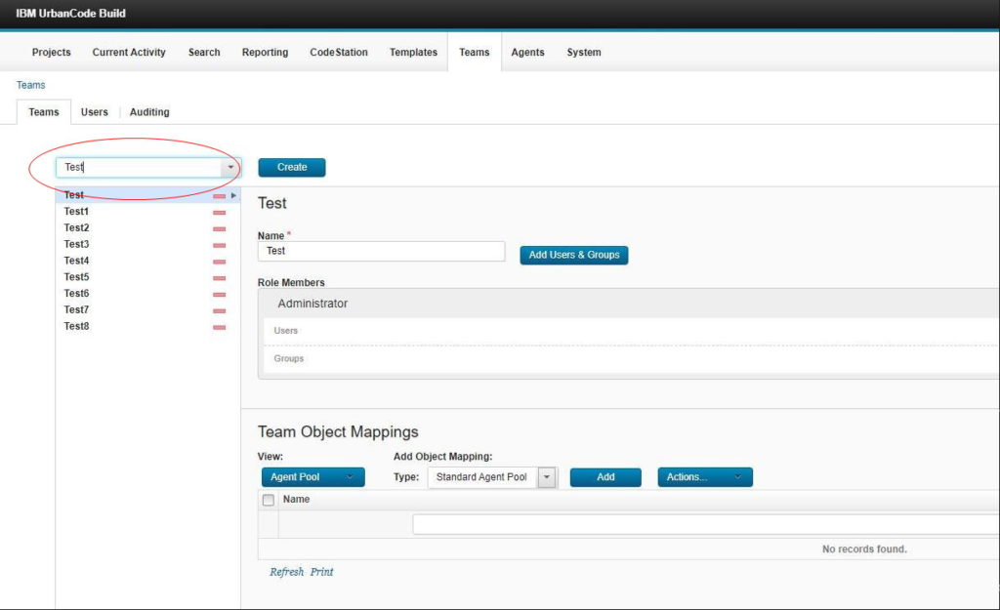
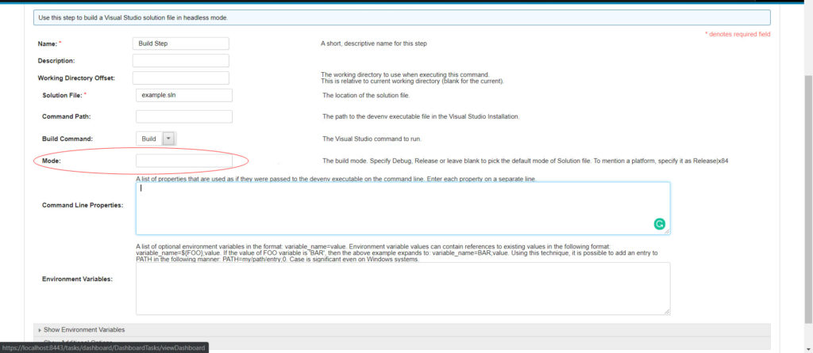

6.1.6.1

**This article was originaly published in 2020.03.17**

6.1.6.1
=======

This release of IBM UrbanCode Build is a maintenance release and includes various bug fixes and enhancements. This release is recommended for all customers.
New features
------------

### User interface enhancement

On the Team page, selecting a team from the list is faster. Instead of scrolling for a team name, you can filter the list to narrow your search using the text box above the list of teams.

### Enhancement to the Visual Studio plug-in

The Mode property in the Visual Studio plug-in has been changed to allow custom values. Prior to this enhancement, the only values were Release and Debug.

### Support for automatic Agent upgrade on z/OS

When upgrading UrbanCode Build, agents residing on a z/OS system can be automatically upgraded as part of the install process.

### Java version check

Java Version 8 or later is required to run the UrbanCode Build server. A verification check is done when the UrbanCode Build server is started. An error message is displayed if Java Version 8 or later is not detected

### Software upgrades

The UrbanCode Build server runs on Apache Tomcat. The integrated Apache Tomcat level has been upgraded to version 8.5.51.Release Summary
---------------

  
* Filter teams selection enhanced
* Java version verified
* Apache Tomcat version upgraded
* Various bug fixes

Release Notes
-------------

  
For information on documentation and support resources, software and hardware requirements and installation steps, click the **Getting Started** tab.

### New features and enhancements

* Improved user interface on the Teams page to add a filterable combo box for selecting a Team (RFE 140493)
* The VisualStudio plug-in now allows custom values for the Mode field (RFE 129112)
* Support for automatic Agent upgrade on z/OS systems
* Java version check during server start up
* Removed obsoleted Web Resources/Files
* Compiler used for UrbanCode Build upgraded to Java 8
* Improved user interface for Additional Options section of step configuration
* Fix issue when expanded the Job trace in the build life dashboard so it does not jump to the top of the page
* Added `server-ajp.xml` file to provide the option of using AJP protocol with Apache HTTPD

### Fixes

|  |  |
| --- | --- |
| [PH22427](http://www.ibm.com/support/docview.wss?uid=swg1PH22427) | UCB does not save property during job iterations |
| [PH23223](http://www.ibm.com/support/docview.wss?uid=swg1PH23223) | Creating a new team should be restricted to users with the right privilege |

### Additional fixes

* Fix for CWE-521: Weak Password Requirements
* Fix for CWE-209: HTTP Error responses can shows the Apache Tomcat version
* Removed unnecessary SecurityAdmin permissions requirement for user creation
* New plug-in steps do not save environment variables
* Rendering codestation projects table fails
* Minor alignment issue in the user interface when there is a single process in Review Context
* Downgrade warning while upgrading to iFix releases
* Fixed issue with rendering codestation projects table
* Fixed an issue that prevented resizing of text-area on steps
* Fixed an issue in the user interface with copying steps between jobs
* Fixed an issue where Job Settings popup displays incorrect Agent Pool selection
* Apache Tomcat upgraded to 8.5.51
* Enabled copying of steps between jobs

To search for additional post-release issues that IBM Rational Support documented, visit the [IBM Support portal.](https://www-947.ibm.com/support/entry/myportal/support?brandind=Rational)

Getting Started
---------------

  
Plan and Prepare
----------------

For supported platforms and requirements, see the reports that can be dynamically generated using the [Software Product Compatibility Reports (SPCR)](https://www.ibm.com/software/reports/compatibility/clarity/index.html) tool.

**Note:** Some supported plug-ins have system requirements that vary from the core product. Information on system requirements for individual plug-ins is available on the download page for that plug-in.

To get started quickly, IBM UrbanCode Build is shipped with an Apache Derby database. Apache Derby is not supported for production environments. As you plan your production topology, review the product documentation.

IBM UrbanCode Build supports integrations with many different tools in the form of job steps. Each IBM UrbanCode Build plug-in is a separate download and installation available on our [plug-in page](https://urbancode.github.io/IBM-UCx-PLUGIN-DOCS/).

### Learn

To learn more about new enhancements in this release, click the **What’s New** tab.

To learn more about IBM UrbanCode Build, see the product [documentation](https://www.ibm.com/support/knowledgecenter/SS8NMD).

For help installing or using IBM UrbanCode Build, post your questions in the [forums](https://developer.ibm.com/answers?community=urbancode) or contact  [support](http://www-947.ibm.com/support/entry/portal/support?brandind=Rational).

To suggest an enhancement to the product, visit the [RFE Community](http://www.ibm.com/developerworks/rfe/execute?use_case=submitRfe).

### Get support

For information from support, including FAQs, visit the [IBM Support portal.](http://www-947.ibm.com/support/entry/portal/support?brandind=Rational) You can configure the support portal to view information about specific products.

