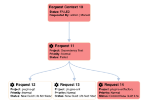
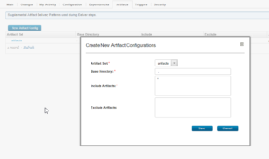

6.1.6

**This article was originaly published in 2019.12.17**

6.1.6
=====

This release of UrbanCode Build is a maintenance release and contains a number of new features, feature enhancements and bug fixes. This release is recommended for all customers. 

New Features
------------

### Agent Workspace viewer

Use the View Workspace feature to view the contents of an agent's workspace related to a job for a build. The workspace viewer displays real-time content of a agent directory structure and files. You can expand directory structures and view individual file contents. There is no need to use another tool such as Remote Connect to view files on the agent. 

Visual request context view
---------------------------

The Request Context page displays information about related process requests. Displayed is the tree view of the build requests in a single context. Child nodes can be hidden, by clicking on the parent node. When nodes are hidden, a black border is shown on the parent node. Click the parent node to expand its child nodes.

### Define artifacts at build process level

Build artifacts can now be configured on a build process in addition to a process template. Configuring artifacts for a build process on templates provides for standardization across build processes. However, there are times when a more specific configuration is needed for a given project. Configuring artifacts on the build process allows for this specialization. The artifacts configured at the build process level are combined with those defined at the process template level and applied to the relevant build.

