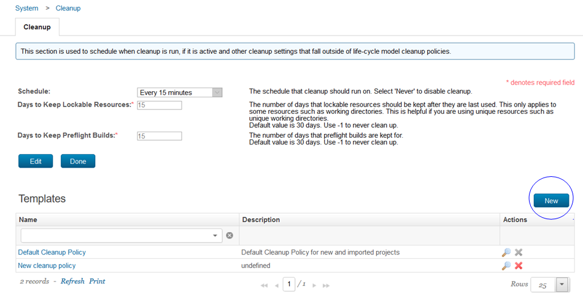

6.1.7.0

**This article was originaly published in 2020.09.24**

6.1.7.0
=======

This release of IBM UrbanCode Build is a maintenance release and includes various bug fixes and enhancements. This release is recommended for all customers.

New Features
------------

### User interface improvement

​
The drag and drop feature now applies to all template types. 

### New System Setting

The **Audit User** system setting added to the Security settings. When enabled user logon and logout events are recorded in the audit log.

### Cleanup Policy

Multiple cleanup policies can be created. Policies that you create can be deleted and the default policy can be disabled.

### Agent and Agent Pool enhancements

The location of the agent CodeStation cache is now configurable. You can specify the location to use instead of the default location.

A new section **In Use by** has been added to the detail window for an agent pool to view the projects attached to the pool. 

The detail page for a build life now includes the agent used by the build processes.

### Nested properties

You can nest properties to create more specific output. Create a nested property by combining multiple properties. 

### Support added to use configuration file as a job step

The new Job as Code plug-in allows you to configure a job step as a JSON or YAML file.

Release Summary
---------------

  
* Nested properties supported
* Multiple clean-up policies added
* Configure job step as YAML or Json file
* Security enhancements

Release Notes
-------------

  
For information on documentation and support resources, software and hardware requirements and installation steps, click the **Getting Started** tab.

### New features and enhancements

### Fixes

|  |  |
| --- | --- |
| [PH26798](http://www.ibm.com/support/docview.wss?uid=swg1PH26798) | Fixed the improper listing of branch names in SonarQube plugin. |
| [PH27529](http://www.ibm.com/support/docview.wss?uid=swg1PH27529) | Fixed the restart issue with a secondary process. |
| [PH27962](http://www.ibm.com/support/docview.wss?uid=swg1PH27962) | Fixed the issue under Miscellaneous step type to save checkbox field changes.​ |
| [PH29017](http://www.ibm.com/support/docview.wss?uid=swg1PH29017) | Popup overflow during the report creation, due to resolution overflow |

### RFEs

* RFE 143018 - Job-as-Code: Load and execute job steps defined in a JSON/YAML file
* RFE 143150 - Flexible sorting of Project Properties
* RFE 142349 - Move workflows between projects
* RFE 138970 - Project level cleanup policies
* RFE 135144 - Show which projects use an agent for builds (identify idle agents)
* RFE 92796 - Support for specifying Agent’s CodeStation cache directory
* RFE 118437 - Nested property resolution
* RFE 84650 - Option to control whether step fails due to missing artifact sets while
* RFE 133677 - Included user logon and logout events in audit logs
* Build Containers on Demand: A new type of Agent pool where the server can spin up a container as UrbanCode Build Agent for performing build tasks

### Improvements

* Security: Introduced account-lockout policy to restrict mutiple failed login attempts (CWE-307)
* Security: Added a support to configure secret key for AJP Connector (CVE-2020-1938)
* Improved Agent UI, to show the number of jobs run by an Agent
* Provided a checkbox in the Git plug-in step to disable build requests for draft pull requests
* Improved JUnit plug-in to prevent out-of-memory error by parsing only the required data into DOM

Getting Started
---------------

  
Plan and Prepare
----------------

For supported platforms and requirements, see the reports that can be dynamically generated using the [Software Product Compatibility Reports (SPCR)](https://www.ibm.com/software/reports/compatibility/clarity/index.html) tool.

**Note:** Some supported plug-ins have system requirements that vary from the core product. Information on system requirements for individual plug-ins is available on the download page for that plug-in.

To get started quickly, IBM UrbanCode Build is shipped with an Apache Derby database. Apache Derby is not supported for production environments. As you plan your production topology, review the product documentation.

IBM UrbanCode Build supports integrations with many different tools in the form of job steps. Each IBM UrbanCode Build plug-in is a separate download and installation available on our [plug-in page](https://urbancode.github.io/IBM-UCx-PLUGIN-DOCS/).

### Learn

To learn more about new enhancements in this release, click the **What’s New** tab.

To learn more about IBM UrbanCode Build, see the product [documentation](https://www.ibm.com/support/knowledgecenter/SS8NMD).

For help installing or using IBM UrbanCode Build, post your questions in the [forums](https://developer.ibm.com/answers?community=urbancode) or contact  [support](http://www-947.ibm.com/support/entry/portal/support?brandind=Rational).

To suggest an enhancement to the product, visit the [RFE Community](http://www.ibm.com/developerworks/rfe/execute?use_case=submitRfe).

### Get support

For information from support, including FAQs, visit the [IBM Support portal.](http://www-947.ibm.com/support/entry/portal/support?brandind=Rational) You can configure the support portal to view information about specific products.

