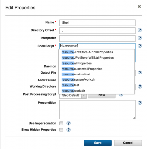
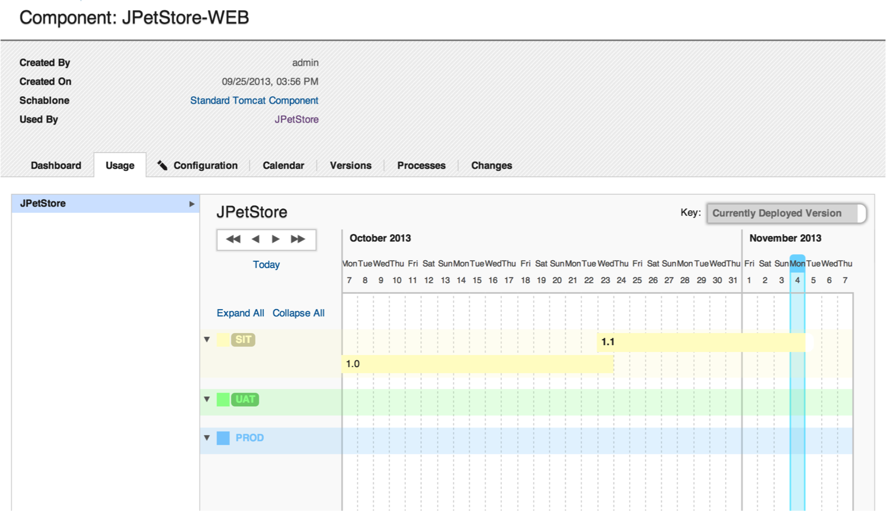
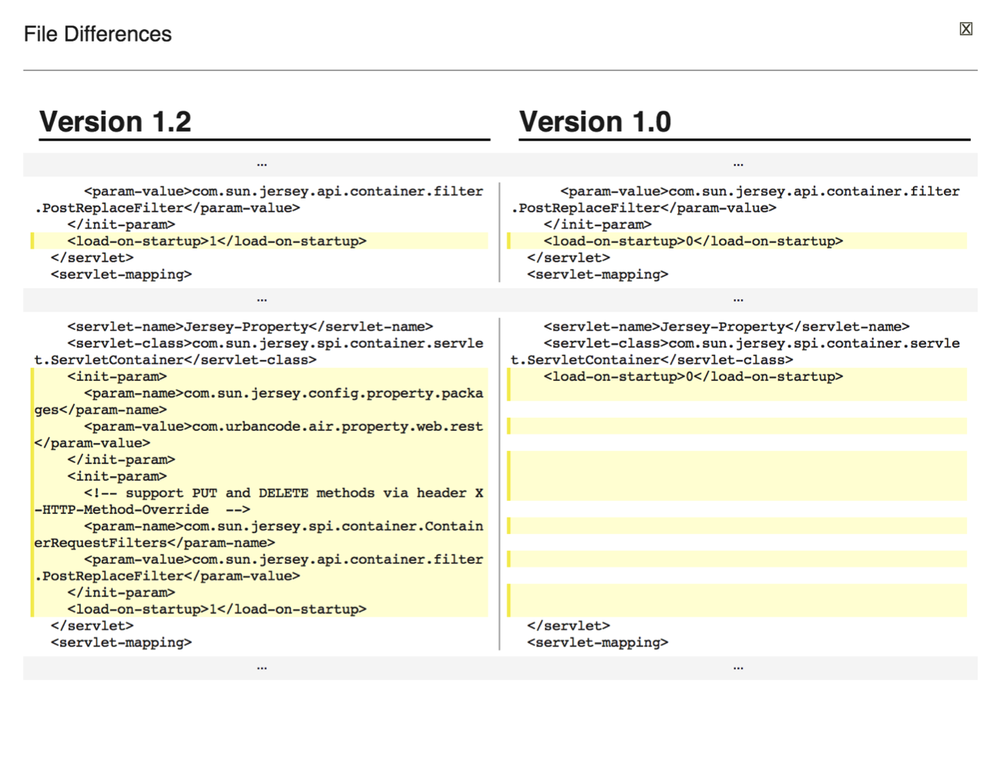

6.0.1

**This article was originaly published in 2013.11.27**

6.0.1 - November 27, 2013
=========================

IBM UrbanCode Deploy 6.0.1, formally uDeploy, provides a number of key new features and capabilities alongside significant usability enhancements.

New and Updated Integrations
----------------------------

* **z/OS support**: This release is begins our work integrating UrbanCode Deploy with z/OS. This expanded z/OS support using Rexx scripts to extend deployable target environments of your multi-tier applications
* **More flavors of WebSphere:**Portal, BPM, and Liberty Profile plugins were all released alongside updates to the core WebSphere Application Server plugin.
* **WebSphere Configuration:** A new plugin delivers capabilities focused on capturing, comparing and promoting WebSphere configuration alongside applications.
* ****Other notable updated integrations:****JBoss, ServiceNow, Windows Failover Clusters, and Rational Team Concert (Work Items) integrations all received updates.

Property Autocomplete
---------------------

In UrbanCode Deploy, properties are a big deal. They help us parameterize things so that a process works on various targets or environment or versions. Ever forget the capitalization used in the property name? Or its scope? Or whether words were separated by a dash or period?

Now you don’t have to worry about typos or forgetting the name of something. With autocomplete, simply start typing a reference to a property and a number of suggestions will appear. This is simple, and very nice change to the experience of using UrbanCode Deploy.

Historical Inventory
--------------------

What was in QA last week? Answering that question used to take a bit of snooping around. You would basically look at the history of deployments into QA and could reverse engineer the state at any time.

The IBM UrbanCode Team thought that the tool could do that work for you and provide a clear historical view of what versions of any component where in which application environments when. It looks like this:

  
 This view can always provide some insights into how versions tend to flow through environments. Altogether less work than piecing it together yourself.

More and Better Comparisons
---------------------------

A big focus in IBM UrbanCode Deploy is keeping track of what is where. Our clients love to compare various elements and we are regularly adding more comparisons views. 6.0.1 brings the latest batch of new view.

When comparing environments or snapshots, it’s now easier to view differences in properties at various scopes. The deeper property comparisons extends to deployment previews as well. It’ll now show which properties on which resources (deployment targets) will be updated as part of the deployment.

Finally, we’ve taken the environment level File comparison to the next level. While it’s identified which files changed in the past, UrbanCode Deploy will now provide a graphical diff for text files.

Tagging support for applications, components, and agents
--------------------------------------------------------

To provide additional flexibility to your deployments, we have now enhanced UrbanCode Deploy to allow for tags to be added to applications, components and agents. You can then define your process to deploy based on applied tags. For more ideas on how to leverage this capability, [review this doc](https://developer.ibm.com/urbancode/docs/blue-green-deployments-using-tags-ibm-urbancode-deploy/).

Artifact Sources are now Plugins
--------------------------------

We’re excited that now the “source configs” that define how IBM UrbanCode Deploy discovers and imports files to deploy are now plugins just like automation steps. The easy wins are the standard plugin benefits. New versions of the integrations can be loaded without upgrading the application or restarting and our customers can create their own source types. The work of checking for new versions of components has also been offloaded away from the master server and onto the agents.

Release Summary
---------------

  
* Autocomplete properties
* Visualize the historical inventory of environments
* z/OS deployments leveraging Rexx scripts
* And so much more...

Release Notes
-------------

  

This release of UrbanCode Deploy 6.0.1 contains new features, quality improvements, and updates to supported platforms, as described in the [system requirements](http://www-01.ibm.com/support/docview.wss?uid=swg27038801)

For information on documentation and support resources, software and hardware requirements and installation steps, see the [Getting Started](https://www.ibm.com/cloud/urbancodewhats-new/whats-new-6-0-1/#getting-started) page.

This release has been superseded. We recommend installing the latest fix pack to ensure you have all known fixes.

Behavioral Changes
Source configs have been extracted from the server and now run on the agents. Most continue to be installed by default with the server, but to ensure you have the latest fixes, review the  [Plug-ins page](http://developer.ibm.com/urbancode/plugins/ibm-urbancode-deploy/) for the latest versions.

When upgrading from IBM UrbanCode Deploy v6.0, the install topology now requires the IBM License Key Server. Please see the installation documentation for this release for details.

Fixes in this Release
A cumulative list of fixes in this release, and any future fix packs can be found [in this document](http://www-01.ibm.com/support/docview.wss?uid=swg27038759#601).

| APAR | Description |
| [PI04903](http://www.ibm.com/support/docview.wss?uid=swg1PI04903) | CreateEnvironmentProperty requires the application even with environment ID |
| 17602 | Attempts to change (add, edit, delete) teams for top level resource groups are not saved |
| 17926 | Error "Javax.net.ssl.sslpeerunverifiedexception: peer not authenticated" after upgrade |
| 18066 | Attempts to expand the approvals on the approval process tab results in the approvals not expanding |
| 18474 | Security configuration does not propagate to resources in the group |
| 18489 | Attempts to deploy a file whose name consists of double byte characters results in garbled file name |
| 19392 | Running a report results in null pointer exception |
| 19491 | Resource group read and execute permissions are not inherited by resources in the group |
| 19914 | Attempts to open a template component process after upgrading to uDeploy 5.0 results in a null pointer exception |
| 26008 | User without read permissions on resource sees "An error has occurred" on dashboard when generic process is running |
| 26030 | Deleting a role required to make an approval breaks work items tab |
| 26978 | Prompting unnecessarily for non-required properties |
| 27619 | Clean up results in java exception errors "Error removing reference for SHA-256{DF8448DFB2\*\*\*C7D820} |
| 28349 | Windows failover clusters v.3.343297 reports success even when cluster resource fails to come online |
| 28373 | Environment component properties are being set to default value during import of application |
| 28375 | Download artifacts throws "Blob not found for HASH SHA-XXXXXXXXXX |
| 28391 | Attempts to view a component's property results in the properties current value being returned, not the value during deployment |
| 28470 | Even if the preference is selected as UK for the locale settings, date format stays in the US format |
| 28526 | DS\_SA\_message constraint violation |
| 28527 | Servers in HA can't handle version file import session failover |
| 28529 | Removing a user is somehow deleting the row instead of setting the ghosted date |
| 28584 | Two lockable objects can be created with the same name |
| 28591 | Resource property inheritance is incorrect |
| 28621 | The output of a component export is incomplete |
| 28721 | Agent status reported incorrectly when an agent relay goes offline |
| 28722 | CLI requestapplicationprocess command cannot schedule for 12:00 PM to 1:00 PM |
| 28733 | Duplicate emails being sent for application process success |
| 29252 | Component template process design configuration tab missing options to configure basic process settings |
| 29356 | uDeploy starts up but web UI service ports intermittently not showing up on uDeploy server |
| 29411 | Special characters in fields prevent components and environments from loading |
| 29570 | Role configuration is not persistent |
| 29775 | Exporting a component template that contains the run component process step causes a null pointer exception |
| 30877 | Application process runs indefinitely after rejecting manual task |
| 31073 | Clicking on the audit link causes java out of memory errors |

Known Problems and Workarounds
Some upgrade issues have been identified and fixed in later fixpacks. If you are starting to plan your upgrade, please select the latest fixpack.

To search for additional post-release issues that IBM Rational Support documented, visit the [IBM Support portal.](https://www-947.ibm.com/support/entry/myportal/support?brandind=Rational)Getting Started
---------------

  

Plan & Prepare
For fixes contained in this release, and any known issues, review the [release notes](https://www.ibm.com/cloud/urbancodewhats-new/whats-new-6-0-1/#release-notes).

For supported platforms and requirements, see the [system requirements](http://www-01.ibm.com/support/docview.wss?uid=swg27038801). Note that some supported plug-ins have system requirements that vary from the core product. Information on system requirements for individual plug-ins is available on the download page for that plug-in.

To get started quickly to try the software, IBM UrbanCode Deploy is shipped with an Apache Derby database. Apache Derby deployments are not supported for production environments. As you plan your production topology, review the [installation guide](http://pic.dhe.ibm.com/infocenter/ucdeploy/v6r0m1/index.jsp)

For advanced enterprise deployments that require high availability, review our options in the [information center.](http://pic.dhe.ibm.com/infocenter/ucdeploy/v6r0m1/index.jsp)

IBM UrbanCode Deploy supports integrations with many different tools available from both IBM as well as other vendors in the form of component process steps. Each IBM UrbanCode Deploy plug-in is a separate download and installation available on our [plug-in page](https://urbancode.github.io/IBM-UCx-PLUGIN-DOCS/UCD).

Install the server
This release is available for download for Passport Advantage and Passport Advantage Express clients, requiring authentication. This download is [available here.](https://www-112.ibm.com/software/howtobuy/softwareandservices/passportadvantage)

Information for installing the server, see the [Installing servers and agents](http://pic.dhe.ibm.com/infocenter/ucdeploy/v6r0m1/topic/com.ibm.udeploy.install.doc/topics/install_ch.html) section in the product documentation.

For information on installing and managing licenses, see [Managing licenses](http://pic.dhe.ibm.com/infocenter/ucdeploy/v6r0m1/topic/com.ibm.udeploy.install.doc/topics/licenseManage.html)

Learn
To learn more about new enhancements in this release, see [What’s New](https://www.ibm.com/cloud/urbancodewhats-new/whats-new-6-0-1/#whats-new) 
To learn more about IBM UrbanCode Deploy, see the  [documentation](http://pic.dhe.ibm.com/infocenter/ucdeploy/v6r0m1/index.jsp)

For help installing or using IBM UrbanCode Deploy, post your questions in the [forums](https://developer.ibm.com/answers?community=urbancode) or contact  [support](http://www-947.ibm.com/support/entry/portal/support?brandind=Rational)

To suggest an enhancement to the product, visit the [RFE Community](http://www.ibm.com/developerworks/rfe/execute?use_case=submitRfe)

Get support
For information from support, including FAQs, visit the [IBM Support portal.](http://www-947.ibm.com/support/entry/portal/support?brandind=Rational) You can configure the support portal to view information about specific products.

