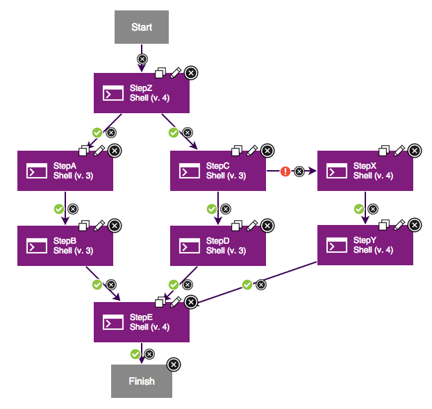

6.1.0.2.ifix01

**This article was originaly published in 2014.09.02**

6.1.0.2.ifix01 - September 2, 2014
==================================

This release of IBM UrbanCode Deploy is a maintenance release and includes various bug fixes and performance enhancements. This release is recommended for all customers.Release Summary
---------------

  
* Recommended fixes for UrbanCode Deploy 6.1

Release Notes
-------------

  

For information on documentation and support resources, software and hardware requirements and installation steps, see the [Getting Started](../getting-started) page. 

Behavioral Changes
 Upgrading from 6.0
-------------------

UrbanCode Deploy 6.1 introduced scalability enhancements to agent/server communication. All agent relays must be upgraded before running any deployments. All existing agents will continue to work without an upgrade, but they should be upgraded using the Upgrade action on the agent list in the web UI as soon as possible after upgrading. Any newly installed agents must be version 6.1. The latest agent and agent relay installers will be available on your UrbanCode Deploy server’s Tools page (in the Help menu) after the server is upgraded.

UrbanCode Deploy 6.1 also includes a more scalable artifact storage system. After upgrading your server, a background process will migrate artifacts into the new format. You can continue to access and deploy artifacts during this process, but there will need to be at least as much free disk space in the server’s var/repository directory as is currently being used by that directory. (If you currently have 25GB of artifacts, you need 25GB of additional free disk space.) The extra disk space is no longer needed after all artifacts have been migrated.

 Workflow changes
-----------------

This release includes some changes to how workflows are processed. The goal of these changes was to address what had been an outstanding defect for several years. In this scenario:

You’d expect that only when both branches (Step A/B and C/D) finish successfully, StepE runs. But in fact, if one branch fails, StepE would still run when the second branch finishes. For example, if StepA and B pass but StepC fails, StepE will still run after StepB. To fix this, in 6.1.0.2, if any part of a branch becomes invalid, the entire branch is considered invalid, and if there’s some place in the workflow where the branch joins with another branch, it won’t go past there unless all of both branches have actually passed.

A consequence of that change is that joining behavior becomes more strict. In order to minimize impact on existing configuration, we’ve also added detection of “mutually exclusive” branches – when you go on one branch if a step fails, and another if it succeeds. Since there is no condition where both of these branches will be run, we need to only require one of them to come through.

In the above scenario, StepE will run as long as one of the two branches leading into it have successfully executed. We detect conditions like this by examining both branches and finding the step where they separated (StepZ, in this case). If the arrows leading out of that step are mutually exclusive (at least one “On Success” and at least one “On Failure”), we will only require one of the branches to have passed before we execute the step which joins them.

There is currently a limitation to this behavior, though. In cases where branches are created in multiple locations but join at the same step, the new logic will only find the first point at which the branches were created. Consider the following:

Step D and Step X/Y are mutually exclusive, but they join with a third branch (Step A/B) which was created higher in the workflow. The server will see StepZ as the point where branches were created, and since its outgoing arrows are not mutually exclusive, it will require all three branches to have passed before executing StepE. This will never happen, so the workflow will fail.

Additional enhancements to this logic are planned so that the server will be able to detect multiple branching points more accurately, but until that becomes available, the workaround is to add an intermediate step to join each set of mutually exclusive branches. In our scenario here, adding StepW will do the trick:

Because StepW connects these two branches without being affected by the outcome of the branch with Step A/B, it will properly detect that they are mutually exclusive. The step used here can be any step other than the explicit “Join” step, as the “Join” step requires all incoming paths to be valid every time. In this case, StepW is a shell plugin which simply runs “ls”.

Fixes in this Release
A cumulative list of fixes in this release, and any future fix packs can be found [in this document](http://www-01.ibm.com/support/docview.wss?uid=swg27038759).

|  |  |
| --- | --- |
| APAR
 | Description
 |
| [PI12564](http://www.ibm.com/support/docview.wss?uid=swg1PI12564) | “DEPLOY CREATES ADDITIONAL RCL\_API\_LOG\_SAMPLE\_X\_X\_XXXX\_X.XML IN |
| [PI19791](http://www.ibm.com/support/docview.wss?uid=swg1PI19791) | “NULLPOINTEREXCEPTIONS SHOWN IN LOG WHEN VIEWING REQUESTS WITHOUT |
| [PI21105](http://www.ibm.com/support/docview.wss?uid=swg1PI21105) | ERROR AQUIRING LOCK |
| [PI21177](http://www.ibm.com/support/docview.wss?uid=swg1PI21177) | “AFTER UPGRADE TO 6.1 FROM 6.0, YOU SEE A “500 INTERNAL SERVER
ERROR JAVA.IO.IOEXCEPTION: UNACCEPTABLE RESPONSE: POST” ERROR” |
| [PI21243](http://www.ibm.com/support/docview.wss?uid=swg1PI21243) | OUTPUT OF STEP ONLY SHOWN ONCE THE STEP IS COMPLETED |
| [PI21304](http://www.ibm.com/support/docview.wss?uid=swg1PI21304) | “DOCUMENTATION SHOULD MENTION THAT AGENTS SHOULD BE ACTIVE BEFORE
UPGRADING” |
| [PI21520](http://www.ibm.com/support/docview.wss?uid=swg1PI21520) | UNABLE TO PERFORM A PROPER SYNC OPERATION |
| [PI21591](http://www.ibm.com/support/docview.wss?uid=swg1PI21591) | UNZIP PLUGIN IN UCD 6.1.0.1 DOES NOT SUPPORT DBCS |
| [PI21979](http://www.ibm.com/support/docview.wss?uid=swg1PI21979) | UPGRADE FROM 4.8.1 TO 5.0.0.2 FAILS |
| [PI22025](http://www.ibm.com/support/docview.wss?uid=swg1PI22025) | “FULL VERIFICATION OPTION IN IBM URBANCODE DEPLOY VERSIONED FILE
STORAGE PLUGIN DOESN’T WORK AS EXPECTED” |
| [PI22078](http://www.ibm.com/support/docview.wss?uid=swg1PI22078) | “INCORRECTLY DELETED ENVIRONMENTS CAUSES UI ERROR IN APPLICATION
CHANGES” |
| [PI22120](http://www.ibm.com/support/docview.wss?uid=swg1PI22120) | “SWITCH STATEMENT FAILS IF OUTGOING EDGES HAVE PROPERTIES AS
VALUES” |
| [PI22138](http://www.ibm.com/support/docview.wss?uid=swg1PI22138) | APPLICATION UI UNUSABLE WHILE LOADING ENVIRONMENTAL COMPLIANCY |
| [PI22166](http://www.ibm.com/support/docview.wss?uid=swg1PI22166) | FAILED VERSION IMPORT AFFECTS VERSION CLEANUP |
| [PI22184](http://www.ibm.com/support/docview.wss?uid=swg1PI22184) | CAN’T COPY COMPONENTS AFTER UPGRADE TO 6.0.1.5 |
| [PI22226](http://www.ibm.com/support/docview.wss?uid=swg1PI22226) | “UPGRADE FAILS WITH STRINGINDEXOUTOFBOUNDS WHEN LOADING SECURITY
SCHEMA” |
| [PI22271](http://www.ibm.com/support/docview.wss?uid=swg1PI22271) | MDHA SSL CONFIGURATION IS MISSING |
| [PI22362](http://www.ibm.com/support/docview.wss?uid=swg1PI22362) | “OUTPUT LOG NOT GETTING POPULATED TILL AFTER THE PROCESS IS
FINISHED” |
| [PI22470](http://www.ibm.com/support/docview.wss?uid=swg1PI22470) | THERE NEEDS TO BE AN OPTION TO DISABLE HTTPFAILOVERHANDLING |
| [PI22529](http://www.ibm.com/support/docview.wss?uid=swg1PI22529) | DEPLOY FAILS TO ACQUIRE LOCK |
| [PI22559](http://www.ibm.com/support/docview.wss?uid=swg1PI22559) | DESCRIPTION OF RESOURCE TEMPLATE AND BLUEPRINT NOT VISIBLE |
| [PI22600](http://www.ibm.com/support/docview.wss?uid=swg1PI22600) | “./AGENT STOP : JDK COULD NOT BE FOUND. NOT PRODUCING THREAD DUMP
AND HEAP DUMP. ON AGENT STOP” |
| [PI22612](http://www.ibm.com/support/docview.wss?uid=swg1PI22612) | “APPLICATION PROCESSES CAN TAKE A LONG TIME TO CONTINUE AFTER THE
COMPONENT PROCESS FINISHES” |
| [PI22618](http://www.ibm.com/support/docview.wss?uid=swg1PI22618) | “THREAD SAFETY ISSUE WHEN PERFORMING RESOLVE ARTIFACT PROCESS
STEP.” |
| [PI22649](http://www.ibm.com/support/docview.wss?uid=swg1PI22649) | “COMPONENT MAPPINGS TO AGENT POOLS INSIDE RESOURCE GROUPS ARE NOT
MIGRATED” |
| [PI22776](http://www.ibm.com/support/docview.wss?uid=swg1PI22776) | “ERROR MESSAGE INVALID OPTION WHEN STARTING THE AGENT SERVICE
TWICE” |
| [PI22809](http://www.ibm.com/support/docview.wss?uid=swg1PI22809) | “WHEN USING THE HEAD METHOD WITH THE WEB UTILS PLUGIN, TEST STEP
FAILS” |
| [PI22849](http://www.ibm.com/support/docview.wss?uid=swg1PI22849) | “AGENTS NOT STARTING ON SOLARIS 5.10 GETTING ERROR ” ./AGENT:
SYNTAX ERROR AT LINE 131: `WORKER\_PROC\_ID=$’ UNEXPECTED”” |
| [PI22900](http://www.ibm.com/support/docview.wss?uid=swg1PI22900) | IMPORTING USERS FROM LDAP USING WILDCARD FAILS |
| [PI22937](http://www.ibm.com/support/docview.wss?uid=swg1PI22937) | [UPGRADE] APPLYING 4.8 CHANGE: 37 – REMOVE OLD TRACE TABLES |
| [PI22979](http://www.ibm.com/support/docview.wss?uid=swg1PI22979) | “EVEN IF “ARCHIVE PATH” IS EMPTY, VERSIONS ARE ARCHIVED IN THE
BIN FOLDER” |
| [PI22981](http://www.ibm.com/support/docview.wss?uid=swg1PI22981) | “ERROR MESSAGE “JDK COULD NOT BE FOUND” WHEN STOPPING AGENT
SERVICE” |
| [PI22987](http://www.ibm.com/support/docview.wss?uid=swg1PI22987) | “AGENTHOME/BIN/INIT/AGENT INCORRECTLY REFERS FOR SCRIPT TO
IBM-UCDAGENT AND NOT AGENT” |
| [PI23254](http://www.ibm.com/support/docview.wss?uid=swg1PI23254) | OPERATIONAL PROCESSES SHOW SUCCESS WHEN NO AGENTS ARE ONLINE |
| [PI23514](http://www.ibm.com/support/docview.wss?uid=swg1PI23514) | “LOADING THE RESOURCE TREE TAKES 10 SECONDS OR LONGER FOR A
COMPLEX TREE STRUCTURE” |
| [PI23607](http://www.ibm.com/support/docview.wss?uid=swg1PI23607) | “WHEN USING A CUSTOM KEYSTORE AND ATTEMPTING TO UPGRADE AN AGENT,
YOU GET “UNABLE TO CREATE KEYSTORE” ERROR” |
| [PI23618](http://www.ibm.com/support/docview.wss?uid=swg1PI23618) | UNABLE TO CREATE A VERSION USING THE CLI |
| [PI23619](http://www.ibm.com/support/docview.wss?uid=swg1PI23619) | APPROVAL CREATED STEP FAILS TO SEND A NOTIFICATION WHEN CREATED. |
| [PI23637](http://www.ibm.com/support/docview.wss?uid=swg1PI23637) | CODESTATION GOT CORRUPTED AFTER UPGRADING FROM 60 TO 61 |
| [PI24033](http://www.ibm.com/support/docview.wss?uid=swg1PI24033) | UNABLE TO REMOVE TEAM FROM A GENERIC PROCESS |
| [PI24095](http://www.ibm.com/support/docview.wss?uid=swg1PI24095) | “USER DEFINED AGENT PROPERTIES DISAPPEAR (NOT STORED) IN THE
LATEST VERSION OF AGENT PROPERTIES AFTER RESTARTING THE AGENT” |
| [PI24173](http://www.ibm.com/support/docview.wss?uid=swg1PI24173) | “”NO ROW WITH THE GIVEN IDENTIFIER EXISTS:
[COM.URBANCODE.SECURITY.SECURITYUSER#22….]” |
| [PI24474](http://www.ibm.com/support/docview.wss?uid=swg1PI24474) | “LOADING GENERIC PROCESS HISTORY CAN TAKE EXCESSIVELY LONG OR
CAUSE OUT-OF-MEMORY ERRORS” |
| [PI17679](http://www.ibm.com/support/docview.wss?uid=swg1PI17679) | RUN PROCESS DIALOG ONLY SHOWS “LOADING…” FOR PROCESS SELECTION |
| [PI18568](http://www.ibm.com/support/docview.wss?uid=swg1PI18568) | “SNAPSHOT ADVANCED SETTINGS REFRESH TAKES LONGER THAN A COUPLE
MINUTES” |
| [PI18869](http://www.ibm.com/support/docview.wss?uid=swg1PI18869) | LOOPS WITHIN COMPONENT PROCESS LEAD TO SERVER HANGS |
| [PI19093](http://www.ibm.com/support/docview.wss?uid=swg1PI19093) | “SYNTAXERROR WHEN EXECUTING A JACL SCRIPT VIA EXECUTE WSADMIN
SCRIPT STEP” |
| [PI19454](http://www.ibm.com/support/docview.wss?uid=swg1PI19454) | AGENT GETS NULLPOINTEREXCEPTION WHEN RESTARTED AFTER REBOOT STEP |
| [PI19548](http://www.ibm.com/support/docview.wss?uid=swg1PI19548) | THE IMPORTVERSIONS TEMPLATE IS NOT CLEAR ON REQUIRED PARAMETERS |
| [PI19611](http://www.ibm.com/support/docview.wss?uid=swg1PI19611) | THE WORK ITEMS SECTION OF UDEPLOY IS NOT VISIBLE. |
| [PI20186](http://www.ibm.com/support/docview.wss?uid=swg1PI20186) | “URBANCODE DEPLOY LEAKS MEMORY WHEN CREATING AND DELETING
ENVIRONMENTS IN SMART CLOUD ORCHESTRATOR” |
| [PI20323](http://www.ibm.com/support/docview.wss?uid=swg1PI20323) | UNABLE TO VIEW WORK ITEMS TAB |
| [PI20412](http://www.ibm.com/support/docview.wss?uid=swg1PI20412) | UNABLE TO REMOVE A CUSTOM AUTHORIZATION REALM |
| [PI20664](http://www.ibm.com/support/docview.wss?uid=swg1PI20664) | “ATTEMPTS TO CALL A COMPONENT PROCESS FROM ANOTHER COMPONENT
PROCESS FAIL” |
| [PI20891](http://www.ibm.com/support/docview.wss?uid=swg1PI20891) | AUTOMATIC CLEANUPS ARE FAILING |
| [PI21096](http://www.ibm.com/support/docview.wss?uid=swg1PI21096) | “CANNOT RENAME RESOURCE’S TOP-LEVEL GROUP: ILLEGAL CHARACTER
RANGE NEAR INDEX 8″ |
| [PI21172](http://www.ibm.com/support/docview.wss?uid=swg1PI21172) | “ARTIFACT UPGRADE STATUS BAR DOES NOT SHOW 100% EVEN THOUGH
ARTIFACT MIGRATION COMPLETED.” |
| [PI21274](http://www.ibm.com/support/docview.wss?uid=swg1PI21274) | “UNABLE TO UPLOAD LOGS TO SERVER AT …… :
JAVA.LANG.ILLEGALARGUMENTEXCEPTION” |
| [PI21794](http://www.ibm.com/support/docview.wss?uid=swg1PI21794) | AGENT ONLINE EVENTS CAN CAUSE A TRANSACTION TO BE LEFT OPEN |
| [PI23002](http://www.ibm.com/support/docview.wss?uid=swg1PI23002) | “URBANCODE DEPLOY PENDING APPROVAL NOTICES NOT SENT FOR ANYTHING
OTHER THAN STANDARD APPLICATION” |
| [PI23036](http://www.ibm.com/support/docview.wss?uid=swg1PI23036) | “FILTER TEXT BOXES DISAPPEAR ON RESOURCE TREE WITH
JAVA.LANG.NEGATIVEARRAYSIZEEXCEPTION” |
| [PI23061](http://www.ibm.com/support/docview.wss?uid=swg1PI23061) | RUN COMPONENT PROCESS STEP GETS SET TO “UNDEFINED” |
| [PI23088](http://www.ibm.com/support/docview.wss?uid=swg1PI23088) | RESTARTED AGENT SHOWS CONNECTED, NOT ONLINE |
| [PI23257](http://www.ibm.com/support/docview.wss?uid=swg1PI23257) | CAN’T SAVE APPLICATION PROCESS THAT REFERENCES A DELETED PROCESS |
| [PI23448](http://www.ibm.com/support/docview.wss?uid=swg1PI23448) | “LARGE GENERIC PROCESSES MAY TAKE LONGER THAN EXPECTED TO RUN
THEIR FIRST STEP” |
| [PI23485](http://www.ibm.com/support/docview.wss?uid=swg1PI23485) | “COMPONENT PROCESS SECURED PROPERTIES ARE DISPLAYED IN PLAIN TEXT
IN THE OUTPUT.LOG” |
| [PI23611](http://www.ibm.com/support/docview.wss?uid=swg1PI23611) | “PROPERTY VALUES ARE NOT SAVED FOR PLUGIN STEPS ON URBANCODE
DEPLOY 6.0.1.5″ |
| [PI23732](http://www.ibm.com/support/docview.wss?uid=swg1PI23732) | “USER IN TEAMA CANNOT CREATE A CHILD RESOURCE USING
TEAM-INHERITANCE FOR TEAMA AND TEAMB” |
| [PI23782](http://www.ibm.com/support/docview.wss?uid=swg1PI23782) | “CANNOT SAVE AN APPLICATION PROCESS WITH MULTIPLE INSTALL
MULTIPLE COMPONENTS.” |
| [PI23822](http://www.ibm.com/support/docview.wss?uid=swg1PI23822) | “URBANCODE DEPLOY AGENT LEAKS FILE DESCRIPTORS OVER TIME ON JAVA
6″ |
| [PI24084](http://www.ibm.com/support/docview.wss?uid=swg1PI24084) | “RUNNING A GENERIC PROCESS FROM A STEP AGAINST AN OFFLINE AGENT
 CAUSES THE PROCESS TO RUN FOREVER” |

Known Problems and Workarounds

To search for additional post-release issues that IBM Rational Support documented, visit the [IBM Support portal.](https://www-947.ibm.com/support/entry/myportal/support?brandind=Rational)

Getting Started
---------------

  

Plan & Prepare
For fixes contained in this release, and any known issues, review the [release notes](../release-notes).

For supported platforms and requirements, see the [system requirements](http://www-01.ibm.com/support/docview.wss?uid=swg27038801). Note that some supported plug-ins have system requirements that vary from the core product. Information on system requirements for individual plug-ins is available on the download page for that plug-in.

To get started quickly to try the software, IBM UrbanCode Deploy is shipped with an Apache Derby database. Apache Derby deployments are not supported for production environments. As you plan your production topology, review the [installation guide](https://www.ibm.com/docs/en/urbancode-deploy/7.2.3?topic=installing)

For advanced enterprise deployments that require high availability, review our options in the [information center.](http://www-01.ibm.com/support/knowledgecenter/SS4GSP_6.1.0)

IBM UrbanCode Deploy supports integrations with many different tools available from both IBM as well as other vendors in the form of component process steps. Each IBM UrbanCode Deploy plug-in is a separate download and installation available on our [plug-in page](https://urbancode.github.io/IBM-UCx-PLUGIN-DOCS/UCD).

If you’re upgrading from 6.0…
UrbanCode Deploy 6.1 introduced scalability enhancements to agent/server communication. **All agent relays must be upgraded before running any deployments.** All existing agents will continue to work without an upgrade, but they should be upgraded using the Upgrade action on the agent list in the web UI as soon as possible after upgrading. **Any newly installed agents must be version 6.1.** The latest agent and agent relay installers will be available on your UrbanCode Deploy server’s Tools page (in the Help menu) after the server is upgraded.

UrbanCode Deploy 6.1 also includes a more scalable artifact storage system. After upgrading your server, a background process will migrate artifacts into the new format. You can continue to access and deploy artifacts during this process, but **there will need to be at least as much free disk space in the server’s var/repository directory as is currently being used by that directory**. (If you currently have 25GB of artifacts, you need 25GB of additional free disk space.) The extra disk space is no longer needed after all artifacts have been migrated.

Install the server
This release is available for download from Fix Central, requiring authentication. This download is [available here.](http://www.ibm.com/support/fixcentral/swg/quickorder?parent=ibm~Rational&product=ibm/Rational/IBM+UrbanCode+Deploy&release=6.1.0.0&platform=All&function=all&source=fc)

Information for installing the server, see the [Installing servers and agents](https://www.ibm.com/docs/en/urbancode-deploy/7.2.3?topic=installing) section in the product documentation.

For information on installing and managing licenses, see [Managing licenses](http://www-01.ibm.com/support/knowledgecenter/SS4GSP_6.1.0/com.ibm.udeploy.install.doc/topics/licenseManage.html)

Learn
To learn more about new enhancements in this release, see [What’s New](..) 

To learn more about IBM UrbanCode Deploy, see the  [documentation](http://www-01.ibm.com/support/knowledgecenter/SS4GSP_6.1.0)

For help installing or using IBM UrbanCode Deploy, post your questions in the [forums](https://developer.ibm.com/answers?community=urbancode) or contact  [support](http://www-947.ibm.com/support/entry/portal/support?brandind=Rational)

To suggest an enhancement to the product, visit the [RFE Community](http://www.ibm.com/developerworks/rfe/execute?use_case=submitRfe)

Get support
For information from support, including FAQs, visit the [IBM Support portal.](http://www-947.ibm.com/support/entry/portal/support?brandind=Rational) You can configure the support portal to view information about specific products.

