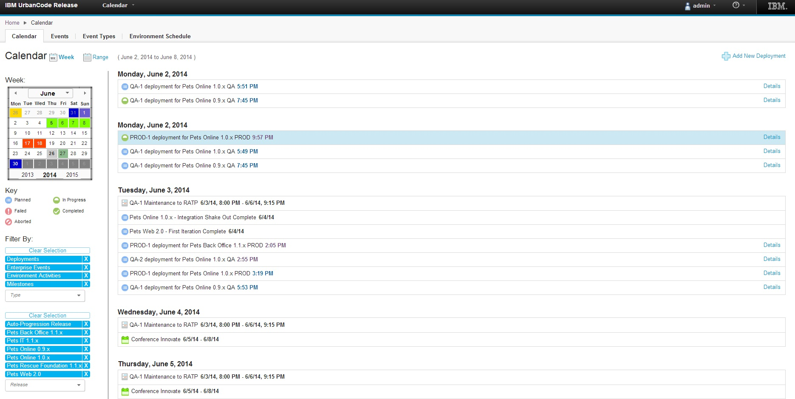
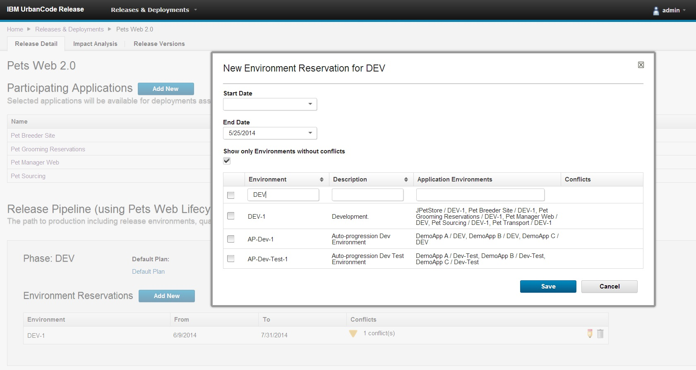
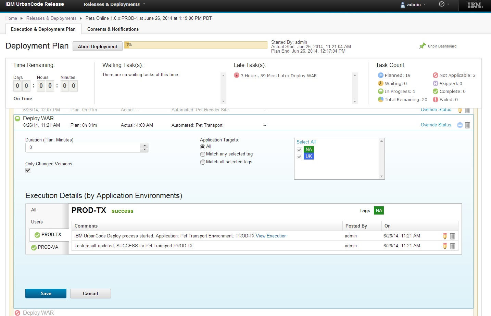
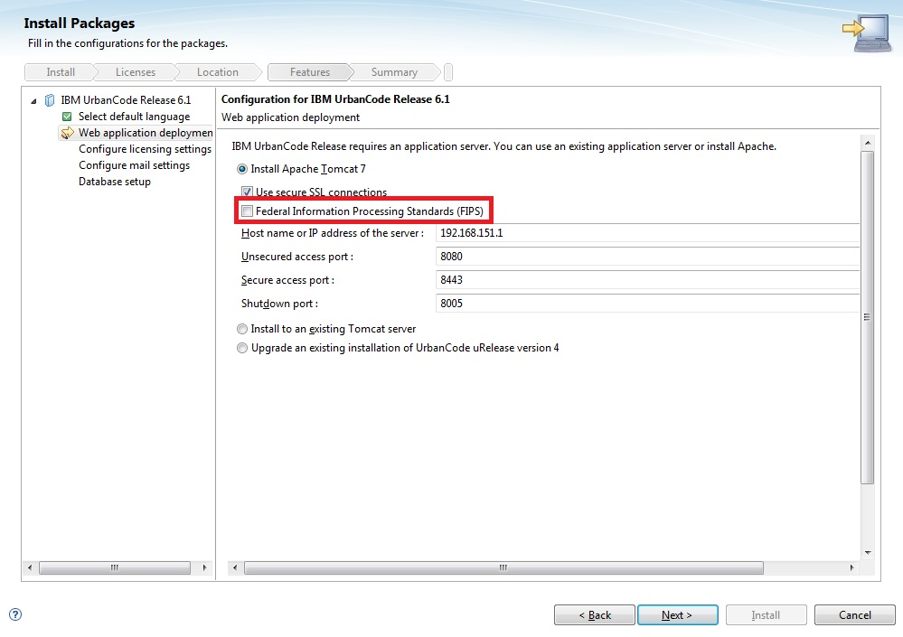

6.1

**This article was originaly published in 2014.06.12**

6.1 - June 12, 2014
===================

IBM UrbanCode Release 6.1 delivers new capabilities for enterprise release planning and execution. This release also includes features added in the previous fix pack releases 6.0.1.1 through 6.0.1.4.

For a video demo of the new features from 6.0 through 6.1, please view the [What’s New in UrbanCode Release webinar](https://developer.ibm.com/urbancode/docs/whats-new-ibm-urbancode-release/).

Schedule events on a single, enterprise release calendar
--------------------------------------------------------

The ability to schedule and publish financial black-out dates, holidays, and enterprise release dates as well as custom event types in a single calendar enable users to create a cadence for software delivery across multiple lines of business. Clients can quickly display event details and filter the calendar by release, environment, or event types to provide more flexibility while analyzing and reporting on release and deployment activities.

Environment reservation capabilities to better manage environment usage across multiple release efforts and activities
----------------------------------------------------------------------------------------------------------------------

Users can quickly identify available environments and reserve one or more for a specific phase of a release or activities, such as testing or infrastructure maintenance over a range of dates. If a conflict is detected for a reservation, a warning will be displayed to the user, detailing the potential conflicts. Real-time status of environment availability and dependencies among release efforts will improve control of utilization and help minimize unnecessary delays caused by environment contention across project teams and release.

Reuse process checklist templates to efficiently plan multiple releases
-----------------------------------------------------------------------

  

In many cases, organizations will have standard checkpoints that are applicable to more than one release and want to easily define and apply to multiple releases at a time. Templates are introduced to allow release process checkpoints to be harvested and reused across multiple releases without repeat data entry thus minimizing the amount of manual rework needed to setup releases across the entire enterprise.

Improved task comments log
--------------------------

Comments for a task in a deployment process can now be filtered to show only log statements related to automation. Log statements are now displayed based on the UrbanCode Deploy application environment to which they apply.

JIRA integration improvements
-----------------------------

The JIRA integration has been rewritten to use the JIRA REST API rather than the older JIRA SOAP API. Various usability and logging improvements have also been made.

Support high availability through clustering
--------------------------------------------

As clients deploy many thousands of users, high availability becomes more critical. UrbanCode Release 6.1 now supports the ability to set up multiple servers in a clustered configuration through the use of a load balancer to distribute traffic between the servers.

Full multicultural and translation support
------------------------------------------

UrbanCode Deploy and UrbanCode Release 6.1 are available in the following languages: English, Traditional Chinese, Simplified Chinese, French, German, Italian, Japanese, Korean, Brazilian Portuguese, Russian, and Spanish.

FIPS Compliance
---------------

UrbanCode Release can now be installed using security standards that meet Federal Information Processing Standards (FIPS).

DB2 Support
-----------

IBM DB2 is now a supported database for use with UrbanCode Release 6.1.

