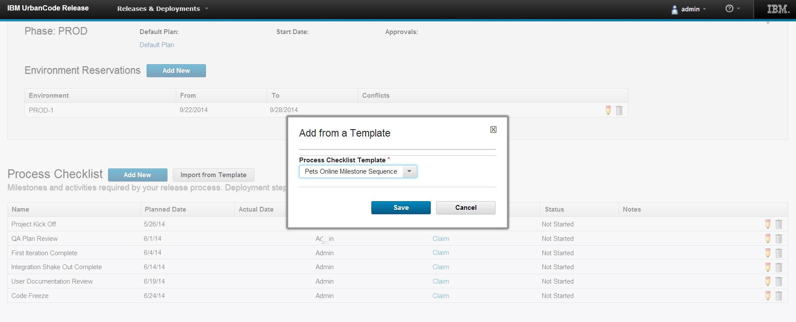

6.1

**This article was originaly published in 2014.06.12**

6.1 - June 12, 2014
===================

IBM UrbanCode Release 6.1 delivers new capabilities for enterprise release planning and execution. This release also includes features added in the previous fix pack releases 6.0.1.1 through 6.0.1.4.

For a video demo of the new features from 6.0 through 6.1, please view the [What’s New in UrbanCode Release webinar](https://developer.ibm.com/urbancode/docs/whats-new-ibm-urbancode-release/).

Schedule events on a single, enterprise release calendar
--------------------------------------------------------

The ability to schedule and publish financial black-out dates, holidays, and enterprise release dates as well as custom event types in a single calendar enable users to create a cadence for software delivery across multiple lines of business. Clients can quickly display event details and filter the calendar by release, environment, or event types to provide more flexibility while analyzing and reporting on release and deployment activities.

Environment reservation capabilities to better manage environment usage across multiple release efforts and activities
----------------------------------------------------------------------------------------------------------------------

Users can quickly identify available environments and reserve one or more for a specific phase of a release or activities, such as testing or infrastructure maintenance over a range of dates. If a conflict is detected for a reservation, a warning will be displayed to the user, detailing the potential conflicts. Real-time status of environment availability and dependencies among release efforts will improve control of utilization and help minimize unnecessary delays caused by environment contention across project teams and release.

Reuse process checklist templates to efficiently plan multiple releases
-----------------------------------------------------------------------

  

In many cases, organizations will have standard checkpoints that are applicable to more than one release and want to easily define and apply to multiple releases at a time. Templates are introduced to allow release process checkpoints to be harvested and reused across multiple releases without repeat data entry thus minimizing the amount of manual rework needed to setup releases across the entire enterprise.

Improved task comments log
--------------------------

Comments for a task in a deployment process can now be filtered to show only log statements related to automation. Log statements are now displayed based on the UrbanCode Deploy application environment to which they apply.

JIRA integration improvements
-----------------------------

The JIRA integration has been rewritten to use the JIRA REST API rather than the older JIRA SOAP API. Various usability and logging improvements have also been made.

Support high availability through clustering
--------------------------------------------

As clients deploy many thousands of users, high availability becomes more critical. UrbanCode Release 6.1 now supports the ability to set up multiple servers in a clustered configuration through the use of a load balancer to distribute traffic between the servers.

Full multicultural and translation support
------------------------------------------

UrbanCode Deploy and UrbanCode Release 6.1 are available in the following languages: English, Traditional Chinese, Simplified Chinese, French, German, Italian, Japanese, Korean, Brazilian Portuguese, Russian, and Spanish.

FIPS Compliance
---------------

UrbanCode Release can now be installed using security standards that meet Federal Information Processing Standards (FIPS).

DB2 Support
-----------

IBM DB2 is now a supported database for use with UrbanCode Release 6.1.

Release Summary
---------------

  
* Globally distributed artifact caching
* Full z/OS deployment support
* More specific permissions control
* Exporting complete applications and snapshots
* And so much more...

Release Notes
-------------

  

This release of UrbanCode Deploy contains new features, quality improvements, and updates to supported platforms, as described in the [system requirements](http://www-01.ibm.com/support/docview.wss?uid=swg27038801)

For information on documentation and support resources, software and hardware requirements and installation steps, see the [Getting Started](../getting-started) page.

Behavioral Changes
All agents and agent relays will need to be upgraded in order to take advantage of improved agent/server communication scalability and artifact distribution techniques. Otherwise, all existing configuration will continue to function as-is – no manual updates are required.

Fixes in this Release
A cumulative list of fixes in this release, and any future fix packs can be found [in this document](http://www-01.ibm.com/support/docview.wss?uid=swg27038759#601).

|  |  |
| --- | --- |
| APAR | Description |
| [PI09997](http://www.ibm.com/support/docview.wss?uid=swg1PI09997) | ATTEMPTS TO USE AN ARTIFACT ID WITH .(DOTS) THE MAVEN RESOLVE |
| [PI13094](http://www.ibm.com/support/docview.wss?uid=swg1PI13094) | MISSING DOC ON HOW TO MODIFY UCDEPLOY CONTEXT ROOT |
| [PI13811](http://www.ibm.com/support/docview.wss?uid=swg1PI13811) | RUNNING UDCLIENT RESULTS IN DISPLAYING A JSON REPRESENTATION WIT |
| [PI13910](http://www.ibm.com/support/docview.wss?uid=swg1PI13910) | THE DOCUMENTATION OF THE COMMAND PROVISIONENVIRONMENT MISSING
INFORMATION |
| [PI15103](http://www.ibm.com/support/docview.wss?uid=swg1PI15103) | GRAY ENVIRONMENT COLOR MAKES IT HARD TO SEE TWISTIE ON LEFT |
| [PI15316](http://www.ibm.com/support/docview.wss?uid=swg1PI15316) | DOCUMENTATION FOR INIT.D NEEDS CHKCONFIG –ADD |
| [PI15408](http://www.ibm.com/support/docview.wss?uid=swg1PI15408) | DEPLOYMENT AVERAGE DURATION REPORT RUNS VERY SLOWLY |
| [PI15531](http://www.ibm.com/support/docview.wss?uid=swg1PI15531) | THE SCROLLBAR IS NOT RENDERING PROPERLY IN THE DEPLOYMENT COUNT
WINDOW WHEN THERE ARE MANY ENTRIES |
| [PI15877](http://www.ibm.com/support/docview.wss?uid=swg1PI15877) | INSTALLER FAILS WHEN DATABASE PASSWORD CONTAINS A $ |
| [PI16249](http://www.ibm.com/support/docview.wss?uid=swg1PI16249) | THE TABLE PL\_SOURCE\_CONFIG\_EXECUTION KEEPS INCREASING IN SIZE |
| [PI16732](http://www.ibm.com/support/docview.wss?uid=swg1PI16732) | STEPS SHOW MULTIPLE TIMES IN EXECUTION LOG WHEN REFRESHING |
| [PI16878](http://www.ibm.com/support/docview.wss?uid=swg1PI16878) | HOW TO ADD A TEAM TO AN APPLICATION IS NOT DOCUMENTED. THE PERM
ISSIONS REQUIRED TO PERFORM THE ACTION IS NOT IN THE INFOCENTER. |
| [PI18145](http://www.ibm.com/support/docview.wss?uid=swg1PI18145) | DOCUMENT THE USE OF PROPERTIES IN THE COMMAND CREATECOMPONENT |
| [PI18166](http://www.ibm.com/support/docview.wss?uid=swg1PI18166) | MISSING HIBERNATE POOL SIZE INFORMATION |
| [PI18784](http://www.ibm.com/support/docview.wss?uid=swg1PI18784) | CONTENTS OF THE VAR/CONFIG DIRECTORY HAS BEEN MIGRATED TO THE
DATABASE SERVER |

Known Problems and Workarounds

To search for additional post-release issues that IBM Rational Support documented, visit the [IBM Support portal.](https://www-947.ibm.com/support/entry/myportal/support?brandind=Rational)

Getting Started
---------------

  

Plan & Prepare
For fixes contained in this release, and any known issues, review the [release notes](../release-notes).

For supported platforms and requirements, see the [system requirements](http://www-01.ibm.com/support/docview.wss?uid=swg27038801). Note that some supported plug-ins have system requirements that vary from the core product. Information on system requirements for individual plug-ins is available on the download page for that plug-in.

To get started quickly to try the software, IBM UrbanCode Deploy is shipped with an Apache Derby database. Apache Derby deployments are not supported for production environments. As you plan your production topology, review the [installation guide](https://www.ibm.com/docs/en/urbancode-deploy/7.2.3?topic=installing)

For advanced enterprise deployments that require high availability, review our options in the [information center.](http://www-01.ibm.com/support/knowledgecenter/SS4GSP_6.1.0)

IBM UrbanCode Deploy supports integrations with many different tools available from both IBM as well as other vendors in the form of component process steps. Each IBM UrbanCode Deploy plug-in is a separate download and installation available on our [plug-in page](https://urbancode.github.io/IBM-UCx-PLUGIN-DOCS/UCD).

Install the server
This release is available for download for Passport Advantage and Passport Advantage Express clients, requiring authentication. This download is [available here.](https://www-112.ibm.com/software/howtobuy/softwareandservices/passportadvantage)

Information for installing the server, see the [Installing servers and agents](https://www.ibm.com/docs/en/urbancode-deploy/7.2.3?topic=installing) section in the product documentation.

For information on installing and managing licenses, see [Managing licenses](http://www-01.ibm.com/support/knowledgecenter/SS4GSP_6.1.0/com.ibm.udeploy.install.doc/topics/licenseManage.html)

Learn
To learn more about new enhancements in this release, see [What’s New](..) 

To learn more about IBM UrbanCode Deploy, see the  [documentation](http://www-01.ibm.com/support/knowledgecenter/SS4GSP_6.1.0)

For help installing or using IBM UrbanCode Deploy, post your questions in the [forums](https://developer.ibm.com/answers?community=urbancode) or contact  [support](http://www-947.ibm.com/support/entry/portal/support?brandind=Rational)

To suggest an enhancement to the product, visit the [RFE Community](http://www.ibm.com/developerworks/rfe/execute?use_case=submitRfe)

Get support
For information from support, including FAQs, visit the [IBM Support portal.](http://www-947.ibm.com/support/entry/portal/support?brandind=Rational) You can configure the support portal to view information about specific products.

