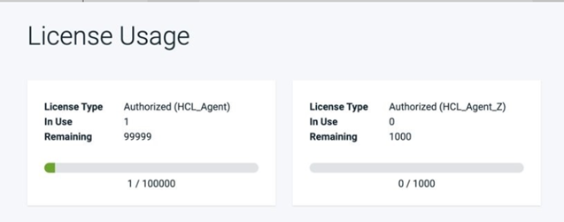

7.1.1.0.ifix01

**This article was originaly published in 2020.11.06**

7.1.1.0.iFix01
==============

This release replaces the Urbancode Deploy version 7.1.1.0 release. It includes all updates made in the 7.1.1..0 release. Version 7.1.1.0 has been removed and not available to download. If you have installed version 7.1.1.0, install this iFix to prevent potential problems.

Loading component table
The following error message is displayed when the component table attempts to load information about a component that is currently importing a version.

`com.urbancode.ds.web.rest.mappers.RuntimeExceptionMapper -
java.lang.String cannot be cast to [Ljava.lang.Object;
java.lang.ClassCastException: java.lang.String cannot be cast to
[Ljava.lang.Object;
 at
com.urbancode.ds.subsys.deploy.config.ComponentFactory.getCompon
entDetails(ComponentFactory.java:578)
 at
com.urbancode.ds.web.rest.config.ComponentResource.getComponents
WithDetails(ComponentResource.java:386)
 at
com.urbancode.ds.web.rest.config.ComponentResource_$$_jvst492_3.
_d44getComponentsWithDetails(ComponentResource_$$_jvst492_3.java
)
 at sun.reflect.NativeMethodAccessorImpl.invoke0(Native Method)` 

7.1.1.0
-------

Version 7.1.1.0 release is a maintenance release and includes the following bug fixes and enhancements. 

### Key Features and Enhancements

Processes as code
Application and component processes can now be modeled in the new custom Process as Code (PAC) format.

You can use the bundled Process-as-Code Compiler to convert existing processes into the PAC format and then modify them using your text editor. The modified PAC files can then be translated and uploaded back into the server for use in your deployments.

The PAC utility, which includes a detailed guide to the new syntax, can be downloaded from the dashboard. Click **Help** > **Tools** > **Process-as-code Compiler** to download.

Tag management
The **Settings** tab now includes a Tag page that facilitates central management of all tags that have been created on the UrbanCode Deploy server. Users with the new **Manage Tags** permission can edit the name, color, and description of existing tags. When a tag is modified from the Tag page it is modified on all objects that are tagged with the tag.
Email approvals
Users who are assigned to an approval task can follow a URL in the email notification they receive to approve the task. The URL links to a mobile responsive page that allows the user to only review, and approve or reject the specified task.
CLI enhancements
This release continues the extension of the CLI API began in previous releases. Several actions that previously could only be done in the web UI can now be done using the API. These actions includes activities like importing and exporting objects, deleting objects, and removing users from roles.
**Redesign of the Get Started page**
The revised Get Started page can now be accessed from the **Help** menu or by clicking the UrbanCode Deploy segment of the navigation bar. This page includes quick links to documentation, tutorials, release notes, and more.
**License usage improvements**
License configuration has moved from the System Settings view into a new License Management page. The new License Management page is where the license server connection and automatic agent license type can be configured. After a connection is made, information is displayed about the available licenses and license consumption.
Usage metrics for a license server now includes consumed versus available metrics.

Release Summary
---------------

  
* Required fix
* Processes as code
* Tag management enhancements
* Email approvals
* License usage improvements
* CLI enhancements

Release Notes
-------------

  
Fixes
-----

A cumulative list of fixes in this release, and any future fix packs can be found in the [Fixlist](https://www.urbancode.com/whats-new/deployfixlist/) document.

### 7.1.1.0.iFix01

| [PH31361](http://www.ibm.com/support/docview.wss?uid=swg1PH31361) | COMPONENT LIST WILL NOT LOAD IF A COMPONENT THAT WOULD SHOW UP
ON THE TABLE IS CURRENTLY IMPORTING A VERSION. |

### 7.1.1.0

|  |  |
| --- | --- |
| [PH29644](http://www.ibm.com/support/docview.wss?uid=swg1PH29644) | AUTH TOKENS ARE NOT ACCEPTED FOR REST METHODS WITH DUPLICATE QUERY PARAMETERS. |
| [PH28841](http://www.ibm.com/support/docview.wss?uid=swg1PH28841) | SNAPSHOT NOT DEPLOYING CORRECTLY WHEN APPLICATION VERSION PRESET IS SPECIFIED |
| [PH27920](http://www.ibm.com/support/docview.wss?uid=swg1PH27920) | UCD SERVER INCORRECTLY SHOWS UNLICENSED DESPITE THE LICENSE SERVER HOSTING AN 'IBMUCD\_SS\_AGENT\_Z' LICENSE |
| [PH26573](http://www.ibm.com/support/docview.wss?uid=swg1PH26573) | THE DATABASE PASSWORD IS VISIBLE ON CONSOLE DURING UCD INSTALLATION AND MIGRATING DB FROM DERBY TO OTHER DATABASES. |
| [PH24278](http://www.ibm.com/support/docview.wss?uid=swg1PH24278) | FROM AN APPLICATION PROCESS, A RUN COMPONENT PROCESS'S IGNORE FAILURE PROPERTY MAY DISPLAY UNCHECKED EVEN WHEN CHECKED |
| [PH20874](http://www.ibm.com/support/docview.wss?uid=swg1PH20874) | MAINFRAME (ZOS) AGENT IN DIFFERENT TIMEZONE THAN SERVER INCORRECTLY REPORTS LASTMODIFIED TIMESTAMP OF RESOURCES |

#### RFEs

* Tag details displayed for CLI resources
* API Command for Exporting/Importing Components and Applications
* API to edit description fields of system properties and agents
* CLI to modify PropDefs in component templates
* CLI to Remove a Role from team member
* CLI to delete application and component
* CLI to retrieve properties associated with an Application Process Request
* CLI to set and change the basic properties on Component
* Update tags and central management location for tags

Known problems and workarounds
------------------------------

To search for additional post-release issues that IBM Rational Support documented, visit the [IBM Support portal.](https://www-947.ibm.com/support/entry/myportal/support?brandind=Rational)Getting Started
---------------

  
For supported platforms and requirements, see the reports that can be dynamically generated using the [Software Product Compatibility Reports (SPCR)](https://www.ibm.com/software/reports/compatibility/clarity/index.html) tool.

**Note:** Some supported plug-ins have system requirements that vary from the core product. Information on system requirements for individual plug-ins is available on the download page for that plug-in.

To get started quickly, IBM UrbanCode Deploy is shipped with an Apache Derby database. Apache Derby deployments are not supported for production environments. As you plan your production topology, review the [Fix Central](https://www.ibm.com/support/fixcentral/swg/selectFixes?parent=ibm~Rational&product=ibm/Rational/IBM+UrbanCode+Deploy&release=All&platform=All&function=all), requiring authentication.

Information for installing the server, see the [Installing server](http://www-01.ibm.com/support/knowledgecenter/SS4GSP_7.1.1/com.ibm.udeploy.install.doc/topics/install_ch.html) section in the product documentation.

For information on installing licenses, see [Managing Licenses](https://www.ibm.com/support/knowledgecenter/SS4GSP_7.1.1/com.ibm.udeploy.doc/topics/licenseManage.html).
### Learn

To learn more about IBM UrbanCode Deploy, see the [documentation](http://www-01.ibm.com/support/knowledgecenter/SS4GSP_7.1.1/com.ibm.udeploy.doc/ucd_version_welcome.html).

For help installing or using IBM UrbanCode Deploy, post your questions in the [forums](https://community.ibm.com/community/user/middleware/communities/community-home?CommunityKey=9adfe6b6-2e23-4895-8b27-38b93b5e152c) or contact [support](http://www-947.ibm.com/support/entry/portal/support?brandind=Rational).

To suggest an enhancement to the product, visit the [RFE Community](http://www.ibm.com/developerworks/rfe/execute?use_case=submitRfe).
### Get support

For information from support, including FAQs, visit the [IBM Support portal.](https://www.ibm.com/support/home) You can configure the support portal to view information about specific products.

