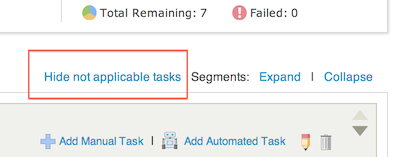
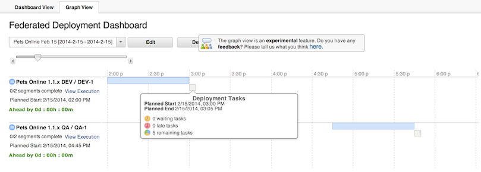

6.0.1.1

**This article was originaly published in 2014.02.13**

6.0.1.1 - February 13, 2014
===========================

This release of IBM UrbanCode Release is a maintenance release containing bug fixes and a few minor enhancements. This release is recommended for all customers.

Automatically Select Versions and/or Start Manually Scheduled Deployments
-------------------------------------------------------------------------

Deployments that are requested manually can now be configured to automatically select deployment contents using the latest application versions that pass quality criteria, also known as “gates” on the lifecycles page, or via a matching pattern on version names. It is also possible to start the deployment automatically at the selected start time. These features were previously available only for deployments created via recurring deployment rules.

Copy Releases
-------------

It is now possible to copy an existing release from the release list page. Copied releases are configured with the same applications, release environments, approvals, deployment plans, and milestones as the original release. Milestone are reset to the “Not Started” status.

Hide Tasks that are Not Applicable
----------------------------------

Hide all tasks that are not applicable to the current environment or selected deployment contents with a single click on the deployment details page.

Improved Integration Performance with UrbanCode Deploy
------------------------------------------------------

For customers with large installations, data will synchronize from UrbanCode Deploy to UrbanCode Release in significantly less time than with past releases. Note that this improvement also requires the use of UrbanCode Deploy 6.0.1.1 or higher.

Improved Performance on the All Deployments Tab
-----------------------------------------------

Performance of the “All” tab in the Deployments section has been significantly improved.

More Editing Operations
-----------------------

Applications that were created within UrbanCode Release can now be edited and deleted. (However, applications synchronized with UrbanCode Deploy cannot be deleted within UrbanCode Release.) Deployment plans can be deleted, if they are not actively being used in a release phase or a scheduled deployment that has not yet been started.

Experimental Features
=====================

The following features are experimental, and are available only if a special product configuration is enabled. They are offered for testing and feedback, without support, and are not guaranteed to continue in any form in a future release. Please consider enabling these features in a testing environment and provide feedback via the developerWorks Q&A forum.

{Experimental} New Segment Dependency Graph View in Federated Deployment Dashboards
-----------------------------------------------------------------------------------

Federated deployment dashboards can now have an alternate view, which displays segments on a timeline similar to a Gantt chart. Status information about segments and tasks is available via color, position, and a detail box displayed on mouse hover.

To enable this feature for testing, add this line to the server.properties file in the UrbanCode Release product configuration directory:

feature.segment.dependency.graph.enabled=yes

{Experimental} Release Target Date & Milestone Sequences
--------------------------------------------------------

With this experimental feature enabled, releases can now be configured with a target date, e.g. for the expected date of production deployment.

Milestone sequences allow release milestones to be reused across multiple releases without repeat data entry. A milestone sequence is composed of milestone templates, and each milestone template can be scheduled for a specified number of days before or after the release target date. 

A lifecycle can be configured to include a milestone sequence, and each new release created with the lifecycle will automatically be configured with the full milestone sequence. 

A milestone sequence can also be applied to a release on the release detail page.

To enable this feature for testing, add this line to the server.properties file in the UrbanCode Release product configuration directory:

feature.milestone.template.enabled=yes

{Experimental} Environment Reservations & Active Release for Environment
------------------------------------------------------------------------

This experimental feature allows a release environment to be reserved for use for a specific phase of a release over a range of dates. More than one reservation can be placed, allowing for multiple date ranges. If a conflict is detected for a release environment reservation, a warning will be displayed to the user, detailing the potential conflicts.

In addition to the new user interface, this feature also provides a new integration with UrbanCode Deploy. Using a new plugin for UrbanCode Deploy, a component deployment process can be configured to detect the currently-active release for the destination application environment of the deployment. This information can then be used for other component process steps, such as creating a snapshot with a name that includes the targeted release name.

To enable this feature for testing, add this line to the server.properties file in the UrbanCode Release product configuration directory:

feature.environment.reservation.enabled=yes

Release Summary
---------------

  
* Recommended fixes for UrbanCode Release 6.0.1
* Automatically Select Versions For Deployments
* Copy Releases
* Hide Not Applicable Tasks
* Improved Integration with UrbanCode Deploy
* New Experimental Features...

Release Notes
-------------

  

For information on documentation and support resources, software and hardware requirements and installation steps, see the [Getting Started](http://developer.ibm.com/urbancode/products/urbancode-release/whats-new/whats-new-in-urbancode-release-6-0-1-1/#getting-started) page.

This release has been superseded. We recommend installing the latest fix pack to ensure you have all known fixes.

Behavioral Changes
A deployment plan that contains a failed task is now considered to be in progress until explicitly
aborted. Deployments that are configured to start automatically will retain the previous behavior,
in which the plan as a whole is considered to be failed if any task within it has failed.

The lifecycles page now uses a horizontal master-detail layout similar to the applications page,
rather than the previous vertical layout.

It is no longer possible to create more than one deployment plan for the same release with the same
name.

Fixes in this Release
A cumulative list of fixes in this release, and any future fix packs can be found [in this document](http://www-01.ibm.com/support/docview.wss?uid=swg27039116).

|  |  |
| --- | --- |
| APAR  | Description  |
| [PI11314](http://www.ibm.com/support/docview.wss?uid=swg1PI11314) | ATTEMPTS TO VIEW REQUESTS RESULTS IN THE PAGE NOT LOADING |
| [PI10952](http://www.ibm.com/support/docview.wss?uid=swg1PI10952) | IF APPLICATION ENVIRONMENT IS RENAMED IN DEPLOY, DATA SYNC WITH RELEASE WILL FAIL |
|  | Customer reported issues when using SQL Server 2012 database |
|  | Inactive UCD Applications should not be imported as UCR Applications |
|  | Inactive UCD Environments should not be imported as UCR Application Environments |
|  | Duplicate Application Versons are being created by UCR-UCD integration |
|  | Sequential enforced status is not exported for segments |
|  | Tasks that become n/a after the segment starts are never closed |
|  | When opening the notifications form, role drop down should not be visible |
|  | Incorrect help link in Release 6.0.1 |
|  | Can not retrieve RTC timelines if more there are more than 100 are present |
|  | Associating Application with a new Team causes JavaScript error |
|  | UCR allows you to duplicate a deployment plan using same name and same release. |
|  | Status Detail page breaks when attachment is not given a description |
|  | Menu bar displayed incorrect section text on status details page |

  

