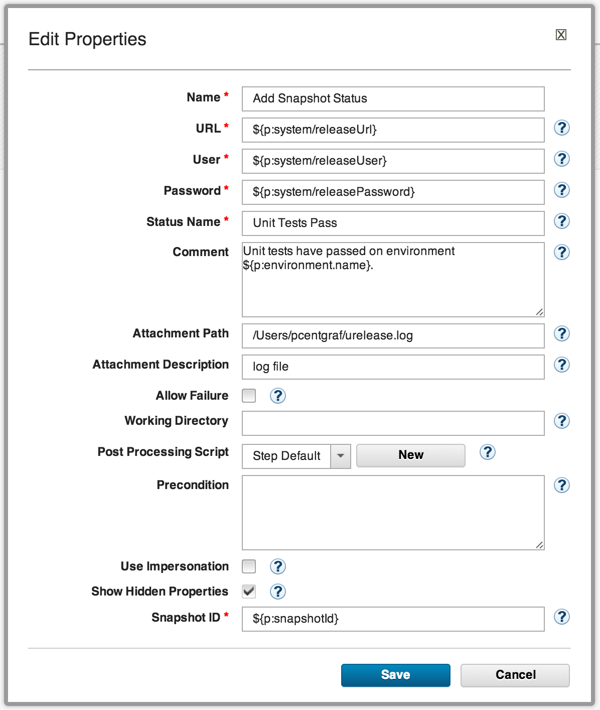
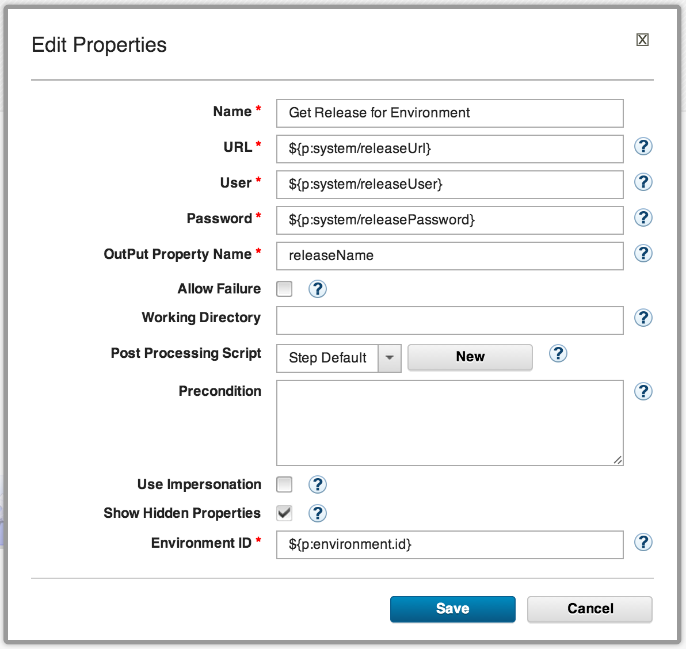

6.0.1.2

**This article was originaly published in 2014.02.17**

6.0.1.2 - February 17, 2014
===========================

This release of IBM UrbanCode Release is a maintenance release containing bug fixes and a few minor enhancements. This release is recommended for all customers.

Support for new UrbanCode Release plugin for UrbanCode Deploy
-------------------------------------------------------------

A new plugin is available for UrbanCode Deploy to support specific integration scenarios with UrbanCode Release, driven from component processes in Deploy. Two plugin steps are currently available:

### Add Snapshot Status

This step allows a process to mark a snapshot or component version with a specific status and optionally upload an attachment or add a comment to the status in UrbanCode Release.

### Get Release for Environment

This step works with the experimental Environment Reservation feature introduced in [UrbanCode Release 6.0.1.1](https://www.ibm.com/docs/en/urbancode-releasewhats-new/whats-new-urbancode-release-6-0-1-1/). Using this step, a Deploy process can query UrbanCode Release to determine the name of the release for which the current application environment is assigned. This name can then be used in other steps in the process, e.g. as part of a snapshot name or to perform branching logic within the process.

Release Summary
---------------

  
* Recommended fixes for UrbanCode Release 6.0.1.1
* New UCD Plugin steps:
* Add Snapshot Status
* Get Release for Environment

Release Notes
-------------

  

For information on documentation and support resources, software and hardware requirements and installation steps, see the [Getting Started](http://developer.ibm.com/urbancode/products/urbancode-release/whats-new/whats-new-in-urbancode-release-6-0-1-2/#getting-started) page.

This release has been superseded. We recommend installing the latest fix pack to ensure you have all known fixes.

Behavioral Changes
There are no known behavioral changes.

Fixes in this Release
A cumulative list of fixes in this release, and any future fix packs can be found [in this document](http://www-01.ibm.com/support/docview.wss?uid=swg27039116).

|  |  |
| --- | --- |
| APAR  | Description  |
|  | In case of communication failure between UrbanCode Release and UrbanCode Deploy, some data corruption was possible. This has now been corrected, and no customer data loss has been reported. |

Known Problems and Workarounds
When integrated with UrbanCode Deploy 6.0.1.1 or later, the pipeline view may fail to display current installed versions for all environments.

To search for additional post-release issues that IBM Rational Support documented, visit the [IBM Support portal.](https://www-947.ibm.com/support/entry/myportal/support?brandind=Rational)Getting Started
---------------

  

Plan & Prepare
For fixes contained in this release, and any known issues, review the [release notes](http://developer.ibm.com/urbancode/products/urbancode-release/whats-new/whats-new-in-6-0-1/#release-notes).

For supported platforms and requirements, see the [system requirements](http://www-01.ibm.com/support/docview.wss?uid=swg27039115). 

To get started quickly to try the software, IBM UrbanCode Release is shipped with an Apache Derby database. Apache Derby deployments are not supported for production environments. As you plan your production topology, review the [installation guide](http://pic.dhe.ibm.com/infocenter/ucrel/v6r0m1/topic/com.ibm.urelease.doc/topics/install_ch.html)

Install the server
This release requires IBM Installation Manager version 1.7 or later for installation. See [download document](http://www-01.ibm.com/support/docview.wss?uid=swg24034941) for details on this download.

This release is available for download for Passport Advantage and Passport Advantage Express clients, requiring authentication. This download is [available here.](https://www.ibm.com/software/howtobuy/softwareandservices/passportadvantage)

Information for installing the server, see the [Installing server](http://pic.dhe.ibm.com/infocenter/ucrel/v6r0m1/topic/com.ibm.urelease.doc/topics/install_intro.html) section in the product documentation.

Learn
To learn more about new enhancements in this release, see [What’s New](http://developer.ibm.com/urbancode/products/urbancode-release/whats-new/whats-new-in-6-0-1/#whats-new) 

To learn more about IBM UrbanCode Release, see the  [documentation](http://pic.dhe.ibm.com/infocenter/ucrel/v6r0m1/topic/com.ibm.urelease.doc/topics/c_node_overview.html)

For help installing or using IBM UrbanCode Release, post your questions in the [forums](https://developer.ibm.com/answers?community=urbancode) or contact  [support](http://www-947.ibm.com/support/entry/portal/support?brandind=Rational)

To suggest an enhancement to the product, visit the [RFE Community](http://www.ibm.com/developerworks/rfe/execute?use_case=submitRfe)

Get support
For information from support, including FAQs, visit the [IBM Support portal.](http://www-947.ibm.com/support/entry/portal/support?brandind=Rational) You can configure the support portal to view information about specific products.

