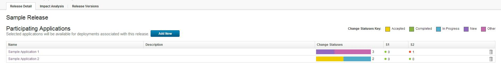
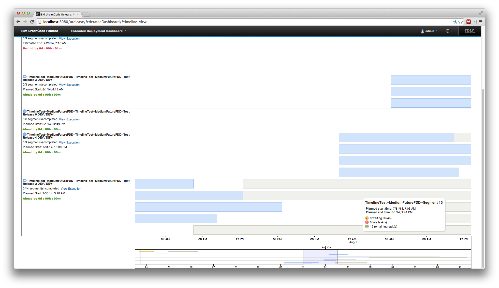

6.1.0.2

**This article was originaly published in 2014.09.05**

6.1.0.2 - September 5, 2014
===========================

This release of IBM UrbanCode Release is a maintenance release containing bug fixes and experimental features. This release is recommended for all customers.

Improved Performance
--------------------

Improved speed of assigning Application Environments to Release Environments.

Improved loading speed for dropdowns used for bulk updates to changes

Improved load time of Initiatives page.

Improved Calendar Page load speed.

Display Change progress for each Application in a Release
---------------------------------------------------------

It’s easier to track what changes are associated with each Application in your Release in the Application Table at the top of the Release Detail page.

Experimental Features
=====================

The following features are experimental, and are available only if a special product configuration is enabled. They are offered for testing and feedback, without support, and are not guaranteed to continue in any form in a future release. Please consider enabling these features in a testing environment and provide feedback via the developerWorks Q&A forum.

{Experimental} Third-party Plugin Support
-----------------------------------------

We have a new and improved system for building your own plug-ins to work with UrbanCode Release!

To enable this feature for testing, add this line to the server.properties file in the UrbanCode Release product configuration directory: `feature.integration.plugin=yes`

If you are familiar with writing plug-ins for IBM UrbanCode Deploy, writing plug-ins for IBM UrbanCode Release will be straight forward. It consists of defining the UI and steps in a plugin.xml and use groovy scripts to handle the integration.

A demo plug-in is available as an example here: [Google Calendar Demo Plug-in for IBM UrbanCode Release](com.urbancode.plugin.google.calendar_1.zip)

This plug-in can be uploaded as it is (zip) on the Integration Provider page by clicking on the Upload Plug-in button. Once imported you can select the plug-in as an Integration Provider type when creating a new Integration.

The IBM Installation Manager provides Groovy 2.1.9 which is necessary to write your own plug-ins.

**/!\** For some linux environments an extra manual step might be needed to setup the GROOVY\_HOME on the environment path:

It can be done by running the following command => export GROOVY\_HOME=$GROOVY\_HOME: /ucr…location*/*UCRelease/groovy-2.1.9/

In the /ucr..location*/*UCRelease/groovy-2.1.9/bin/startGroovy script, make sure that the line #270  includes the argument  $JAVA\_OPTS  and looks like the following   exec “$JAVACMD” $JAVA\_OPTS \

Make sure that the Groovy folder has executable permissions: `chmod -R 755 groovy-2.1.9/`

{Experimental} RTC integration synchronizes defect severity
-----------------------------------------------------------

You can now synchronize Severities in RTC to track Severity 1 or Severity 2 defects in UrbanCode Release.  The count of S1 and S2 defects associated with an Application on a Release can now be seen on the release detail page.

To enable this feature for testing, add this line to the server.properties file in the UrbanCode Release product configuration directory: `feature.severity.rtc.integration=yes`

{Experimental} Map RTC Work Items to Initiatives
------------------------------------------------

When setting up an integration with RTC, you can choose work item types that you want to be synchronized as Initiatives, rather than Changes, in UrbanCode Release.  Work Items that are children of Work Items that are integrated as Initiatives will become Changes assigned to those Initiatives in UrbanCodeRelease.

To enable this feature for testing, add this line to the server.properties file in the UrbanCode Release product configuration directory: `feature.initiative.rtc.integration=yes`

{Experimental} Updated Timeline View
------------------------------------

Timeline view has been updated to show a navigational overview of all deployments, with adjustable detail view to show any length of time within that span.

To enable this feature for testing, add this line to the server.properties file in the UrbanCode Release product configuration directory: `feature.segment.dependency.graph.enabled=yes`

Release Summary
---------------

  
* Bug Fixes and Improved Performance: Initiatives, Environments, Changes & more...
* Experimental Features:
* Applications in a Release now show development progress
* RTC Integration now syncs Initiatives and Defect Severity

Release Notes
-------------

  

For information on documentation and support resources, software and hardware requirements and installation steps, see the [Getting Started](http://developer.ibm.com/urbancode/products/urbancode-release/whats-new/whats-new-urbancode-release-6-1-0-2/getting-started/) page.

Behavioral Changes
There are no known behavioral changes.

Fixes in this Release
A cumulative list of fixes in this release, and any future fix packs will be available.

|  |  |
| --- | --- |
| APAR | Description |
| PI15606 | ENVIRONMENTS PAGE LOCKS UP WHEN ADDING OR REMOVING SEVERAL APP ENVIRONMENTS FOR A RELEASE ENVIRONMENT |
| PI24583 | PERFORMANCE ISSUES COPYING A LARGE NUMBER OF APPLICATION ENVIRONMENTS TO A RELEASE ENVIRONMENT |
| PI24721 | INCORRECT HANDLING OF TASK STATUS WHEN EDITED BY MULTIPLE USERS |
| PI24764 | DATABASE ERROR ON DB2 ON STARTUP |
| PI24962 | PERFORMANCE ISSUE WHEN ACCESSING https:///INITIATIVES |
|  | Fixed Task Status Reverting When Edited by Multiple Users |
|  | Integration halts on Integration Provider Frequency Change |
|  | Add Automated Task dialog shows tasks’ Applications |
|  | Change fields populated through an integration are now protected from user edits |

Known Problems and Workarounds
To search for additional post-release issues that IBM Rational Support documented, visit the [IBM Support portal.](https://www-947.ibm.com/support/entry/myportal/support?brandind=Rational)

Getting Started
---------------

  

Plan & Prepare
For fixes contained in this release, and any known issues, review the [release notes](http://developer.ibm.com/urbancode/products/urbancode-release/whats-new/whats-new-urbancode-release-6-1-0-2/release-notes/). For supported platforms and requirements, see the [system requirements](http://www-03.ibm.com/software/products/en/ucrel#tab_othertab1). To get started quickly to try the software, IBM UrbanCode Release is shipped with an Apache Derby database. Apache Derby deployments are not supported for production environments. As you plan your production topology, review the [installation guide](http://www-01.ibm.com/support/knowledgecenter/SS4GCC_6.1.0/com.ibm.urelease.doc/topics/install_ch.html)

Install the server
This release requires IBM Installation Manager version 1.7.2 or later for installation. See [download document](http://www-01.ibm.com/support/docview.wss?uid=swg24036814) for details on this download. This release is available for download on Fix Central for current customers, requiring authentication. This download is [available here.](http://www-933.ibm.com/support/fixcentral/swg/selectFixes?parent=ibm~Rational&product=ibm/Rational/UrbanCode+Release&release=All&platform=All&function=all) Information for installing the server, see the [Installing server](http://www-01.ibm.com/support/knowledgecenter/SS4GCC_6.1.0/com.ibm.urelease.doc/topics/install_intro.html) section in the product documentation.

Learn
To learn more about new enhancements in this release, see [What’s New](../)To learn more about IBM UrbanCode Release, see the [documentation](http://www-01.ibm.com/support/knowledgecenter/SS4GCC_6.1.0/com.ibm.urelease.doc/ucr61_welcome.html) For help installing or using IBM UrbanCode Release, post your questions in the [forums](https://developer.ibm.com/answers?community=urbancode) or contact [support](http://www-947.ibm.com/support/entry/portal/support?brandind=Rational) To suggest an enhancement to the product, visit the [RFE Community](http://www.ibm.com/developerworks/rfe/execute?use_case=submitRfe)

Get support
For information from support, including FAQs, visit the [IBM Support portal.](http://www-947.ibm.com/support/entry/portal/support?brandind=Rational) You can configure the support portal to view information about specific products.

