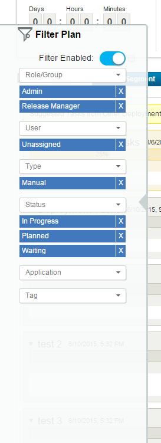

6.1.1.10

**This article was originaly published in 2015.08.07**

6.1.1.10 - August 7, 2015
=========================

This release of IBM UrbanCode Release is a maintenance release containing bug fixes and new features.

Task Filtering
--------------

Tasks can be filtered on the scheduled deployment page.  

Tasks can be filtered by role/group, user, type, status, application, or tag.

You can enable this feature by adding the following line to your server.properties file: feature.filter.tasks.enabled=yes

Scheduled Deployment Caching
----------------------------

Data from scheduled deployments is now cached on the server. This greatly improves performance when a large number of users are viewing the same deployment simultaneously.  

You can adjust the lifespan of the cache with the following property in your server.properties: caching.deployment.execution.lifespan=  

The default lifespan is 60 seconds.

Task Tags can now be imported from a .CSV
-----------------------------------------

When importing a deployment plan, you can now include existing task tags with each task.

Notification Emails Include Links to Specific Tasks
---------------------------------------------------

The link in each notification email will now expand the related task and collapse other tasks. This makes it far easier to find the task mentioned in an email.

Release Summary
---------------

  
* Task Filtering
* Deployment Caching
* Task Tag Import
* Direct Task Links in Notifications
* Bug fixes

Release Notes
-------------

  

 For information on documentation and support resources, software and hardware requirements and installation steps, see the [Getting Started](../getting-started/) page.

Installation Notes
No new installation notes.

Behavioral Changes
No major behavioral changes.

Fixes in this Release
A cumulative list of fixes in this release, and any future fix packs will be available.

|  |  |
| --- | --- |
| APAR/defect | Description |
| [PI46597](http://www.ibm.com/support/docview.wss?uid=swg1PI46597) | UCR PLUGIN SYNC SNAPSHOT STEP FOR UCD DOES NOT SYNC COMPONENT VERSION STATUSES |
| [PI45480](http://www.ibm.com/support/docview.wss?uid=swg1PI45480) | EDITING INTERNAL AUTHORIZATION REALM COULD LOCK OUT ALL INTERNAL USERS |
| [PI45766](http://www.ibm.com/support/docview.wss?uid=swg1PI45766) | USERS CAN ADD THE SAME GATE MULTIPLE TIMES ON A PHASE |
| [PI46602](http://www.ibm.com/support/docview.wss?uid=swg1PI46602) | APPLICATION VERSIONS ARE NOT SORTED BY CREATED DATE |
| [PI46599](http://www.ibm.com/support/docview.wss?uid=swg1PI46599) | CANNOT REMOVE TARGET TAGS FROM APPLICATION TARGETS |
| [PI46671](http://www.ibm.com/support/docview.wss?uid=swg1PI46671) | CHANGES CREATED FROM AN INITIATIVE ARE NOT MAPPED TO IT |
| [PI46676](http://www.ibm.com/support/docview.wss?uid=swg1PI46676) | JAVA\_HOME ENVIRONMENT VARIABLE NOT SET WHILE RUNNING PLUGIN ON LINUX |
|  | IMPORTING A PLAN FROM A .CSV DOES NOT IMPORT SEGMENT PREREQUISITES |
|  | MULTIPLE EVENT TYPES, TASK TAGS, OR TARGET TAGS CAN BE CREATED WITH THE SAME NAME |
|  | DELETING A ROLE THAT IS IN USE MAY PREVENT OTHER PAGES FROM LOADING PROPERLY |
|  | ADDING A STATUS TO A VERSION ON THE APPLICATION VERSION PAGE APPEARS TO ADD MULTIPLE STATUSES |

Known Problems and Workarounds
To search for additional post-release issues that IBM Rational Support documented, visit the [IBM Support portal.](https://www-947.ibm.com/support/entry/myportal/support?brandind=Rational)

Getting Started
---------------

  

Plan & Prepare
For fixes contained in this release, and any known issues, review the [release notes](../release-notes/). For supported platforms and requirements, see the [system requirements](http://www-03.ibm.com/software/products/en/ucrel#tab_othertab1). To get started quickly to try the software, IBM UrbanCode Release is shipped with an Apache Derby database. Apache Derby deployments are not supported for production environments. As you plan your production topology, review the [installation guide](http://www-01.ibm.com/support/knowledgecenter/SS4GCC_6.1.1/com.ibm.urelease.doc/topics/install_ov.html)

Install the server
This release requires IBM Installation Manager version 1.8.0 or later for installation. See [download document](http://www-01.ibm.com/support/docview.wss?uid=swg24036814) for details on this download. This release is available for download on Fix Central for current customers, requiring authentication. This download is [available here.](http://www-933.ibm.com/support/fixcentral/swg/downloadFixes?parent=ibm%7ERational&product=ibm/Rational/UrbanCode+Release&release=All&platform=All&function=fixId&fixids=6.1.1.10-UrbanCode-Release&includeRequisites=1&includeSupersedes=0&downloadMethod=http) Information for installing the server, see the [Installing server](http://www-01.ibm.com/support/knowledgecenter/SS4GCC_6.1.1/com.ibm.urelease.doc/topics/install_ov.html) section in the product documentation.

Learn
To learn more about new enhancements in this release, see [What’s New](../) To learn more about IBM UrbanCode Release, see the [documentation](http://www-01.ibm.com/support/knowledgecenter/SS4GCC_6.1.1/com.ibm.urelease.doc/ucr61_welcome.html) For help installing or using IBM UrbanCode Release, post your questions in the [forums](https://developer.ibm.com/answers?community=urbancode) or contact [support](http://www-947.ibm.com/support/entry/portal/support?brandind=Rational) To suggest an enhancement to the product, visit the [RFE Community](http://www.ibm.com/developerworks/rfe/execute?use_case=submitRfe)

Get support
For information from support, including FAQs, visit the [IBM Support portal.](http://www-947.ibm.com/support/entry/portal/support?brandind=Rational) You can configure the support portal to view information about specific products.

