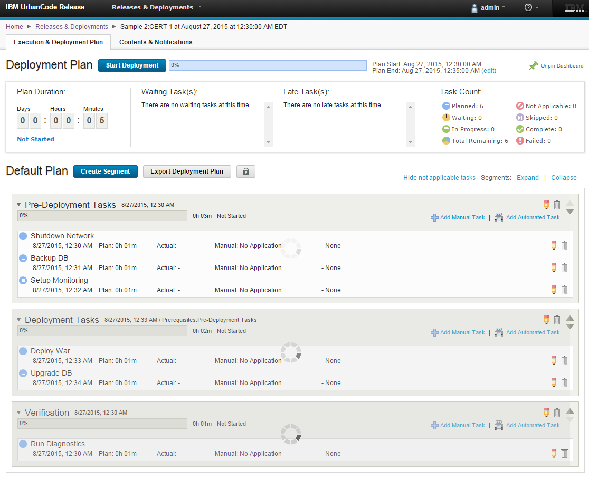

6.1.1.11

**This article was originaly published in 2015.08.31**

6.1.1.11 - August 31, 2015
==========================

This release of IBM UrbanCode Release is a maintenance release containing bug fixes and performance improvements.

Improved Scheduled Deployments Caching Strategy (Server Side)
-------------------------------------------------------------

Scheduled Deployments are cached on the server side and will load faster. The first load of a scheduled deployment will load the data from the database and save it in the cache. Subsequent loads should get the data from the cache. Any changes made to the plan will trigger a refresh of the cache and all users will load the new version of the scheduled deployment plan directly from the cache.  

Now even plans with hundreds of tasks should load quickly and UCR will scale far better for large number of users. This will significantly improve the user experience and save resources by limiting expensive load of data.

 

Faster Load of Scheduled Deployments (Client Side)
--------------------------------------------------

Segments are now drawn asynchronously in order to display scheduled deployment plans faster.

 

Release Summary
---------------

  
* Performance Improvements
* Bug fixes

Release Notes
-------------

  
For information on documentation and support resources, software and hardware requirements and installation steps, see the [Getting Started](../getting-started/) page.

Installation Notes
No new installation notes.

Behavioral Changes
No major behavioral changes.

Fixes in this Release
A cumulative list of fixes in this release, and any future fix packs will be available.

|  |  |
| --- | --- |
| APAR/defect | Description |
| [PI47644](http://www.ibm.com/support/docview.wss?uid=swg1PI47644) | UPDATING THE RECURRING RULE TIME WON’T BE REFLECTED ON THE CALENDAR |
| [PI47634](http://www.ibm.com/support/docview.wss?uid=swg1PI47634) |  EDITING THE PHASE NAME OR DESCRIPTION FOR A LIFECYCLE CAN CHANGE THE ORDER OF THE PHASES |
| [PI47639](http://www.ibm.com/support/docview.wss?uid=swg1PI47639) | ADDING A GATE ON A NEWLY CREATED PHASE ON A LIFECYCLE CAN ADD PHASES FROM OTHER LIFECYCLES TO THE CURRENT LIFECYCLE |
|  | PERFORMANCE IMPROVED ON APPLICATION PROCESS IMPORT WITH THE DEPLOY INTEGRATION PLUGIN |
|  | IF AN APPLICATION PROCESS USED IN SOME DEPLOYMENTS HAS BEEN REMOVED IN DEPLOY, THEY WILL BE DISPLAYED AS NOT APPLICABLE AND WON’T BE RUNNABLE ANYMORE |

Known Problems and Workarounds
To search for additional post-release issues that IBM Rational Support documented, visit the [IBM Support portal.](https://www-947.ibm.com/support/entry/myportal/support?brandind=Rational)

Getting Started
---------------

  

Plan & Prepare
For fixes contained in this release, and any known issues, review the [release notes](../release-notes/). For supported platforms and requirements, see the [system requirements](http://www-03.ibm.com/software/products/en/ucrel#tab_othertab1). To get started quickly to try the software, IBM UrbanCode Release is shipped with an Apache Derby database. Apache Derby deployments are not supported for production environments. As you plan your production topology, review the [installation guide](http://www-01.ibm.com/support/knowledgecenter/SS4GCC_6.1.1/com.ibm.urelease.doc/topics/install_ov.html)

Install the server
This release requires IBM Installation Manager version 1.8.0 or later for installation. See [download document](http://www-01.ibm.com/support/docview.wss?uid=swg24036814) for details on this download. This release is available for download on Fix Central for current customers, requiring authentication. This download is [available here.](http://www-933.ibm.com/support/fixcentral/swg/downloadFixes?parent=ibm%7ERational&product=ibm/Rational/UrbanCode+Release&release=All&platform=All&function=fixId&fixids=6.1.1.11-UrbanCode-Release&includeRequisites=1&includeSupersedes=0&downloadMethod=http) Information for installing the server, see the [Installing server](http://www-01.ibm.com/support/knowledgecenter/SS4GCC_6.1.1/com.ibm.urelease.doc/topics/install_ov.html) section in the product documentation.

Learn
To learn more about new enhancements in this release, see [What’s New](../) To learn more about IBM UrbanCode Release, see the [documentation](http://www-01.ibm.com/support/knowledgecenter/SS4GCC_6.1.1/com.ibm.urelease.doc/ucr61_welcome.html) For help installing or using IBM UrbanCode Release, post your questions in the [forums](https://developer.ibm.com/answers?community=urbancode) or contact [support](http://www-947.ibm.com/support/entry/portal/support?brandind=Rational) To suggest an enhancement to the product, visit the [RFE Community](http://www.ibm.com/developerworks/rfe/execute?use_case=submitRfe)

Get support
For information from support, including FAQs, visit the [IBM Support portal.](http://www-947.ibm.com/support/entry/portal/support?brandind=Rational) You can configure the support portal to view information about specific products.

