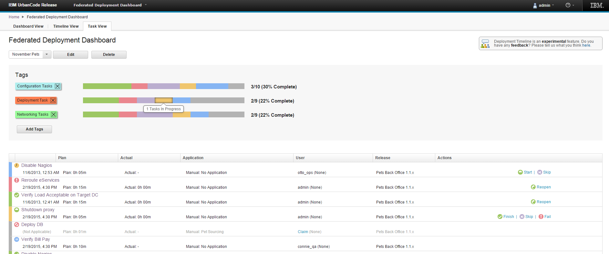

6.1.1.4

**This article was originaly published in 2015.02.17**

6.1.1.4 - February 17, 2015
===========================

This release of IBM UrbanCode Release is a maintenance release containing performance improvements and [bug fixes](./release-notes/).

Performance Improvement
-----------------------

* Pipeline loads scheduled deployments and version inventory much more quickly.

Experimental Feature: Task View
-------------------------------

 This view located in the Federated Deployment Dashboard allows you to view and execute tasks in a release event where multiple business units are participating, each with their own scheduled deployment. Enterprise release managers can view status of specific types or groups of tasks, such as installation or quality assurance activities happening within many different application teams and business units.This view helps visualize like tasks across multiple deployments based on tag filtering.  

To activate this feature place the property **feature.task.view.enabled=yes** in the server.properties file.

