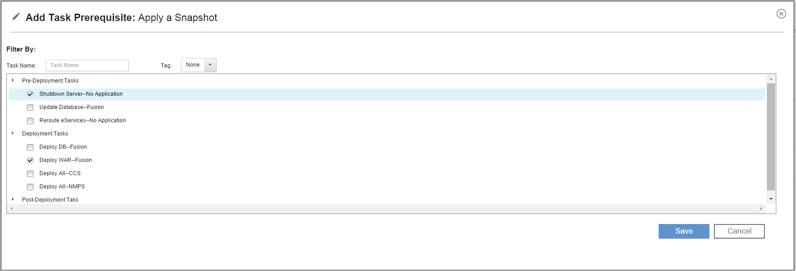

6.1.2.0

**This article was originaly published in 2015.09.15**

6.1.2.0 - September 15, 2015
============================

IBM UrbanCode Release 6.1.2.0 is a major release containing new features, improvements, and fixes. This release is recommended for all customers.

Task Level Dependencies
-----------------------

Previously you could only set prerequisites for segments but now you can also set a task as a prerequisite for another task within the same scheduled deployment. You can add both prerequisites and dependents of a task. This works in conjunction with segment prerequisites and the segments execution pattern.  

 

New UI for Scheduled Deployments and Deployment Plans
-----------------------------------------------------

There is a new UI to accompany the task level dependencies that allows for more tasks to be displayed in the window. This also includes a new task dialog box which replaces the task drop down.

###  New UI

###  New Task Dialog

 

Task Filtering
--------------

You can now filter tasks on the scheduled deployments page so that you don’t have to go through the whole plan to find tasks that are pertinent to you. You can filter based on any combination of Role/Group, User, Type of Task(Manual/Automated), Status of the task, application, or task tags.  

 

Release Summary
---------------

  
* Direct Task Dependencies
* New Scheduled Deployment UI
* Task Filtering
* Bug fixes

Release Notes
-------------

  
For information on documentation and support resources, software and hardware requirements and installation steps, see the [Getting Started](../getting-started/) page.

Installation Notes
No new installation notes.

Behavioral Changes
No major behavioral changes.

Fixes in this Release
A cumulative list of fixes in this release, and any future fix packs will be available.

|  |  |
| --- | --- |
| APAR/defect | Description |
|  | DEPRECATION OF THE BUILT-IN IBM URBANCODE DEPLOY INTEGRATION |
|  | FIXED LIFECYCLES SO THE PHASES DO NOT SHIFT ON EDIT |
|  | FIXED FILTERING BY PHASE IN THE ENTERPRISE VIEW |

Known Problems and Workarounds
To search for additional post-release issues that IBM Rational Support documented, visit the [IBM Support portal.](https://www-947.ibm.com/support/entry/myportal/support?brandind=Rational)

Getting Started
---------------

  

Plan & Prepare
For fixes contained in this release, and any known issues, review the [release notes](../release-notes/). For supported platforms and requirements, see the [system requirements](http://www-03.ibm.com/software/products/en/ucrel#tab_othertab1). To get started quickly to try the software, IBM UrbanCode Release is shipped with an Apache Derby database. Apache Derby deployments are not supported for production environments. As you plan your production topology, review the [installation guide](http://www-01.ibm.com/support/knowledgecenter/SS4GCC_6.1.2/com.ibm.urelease.doc/topics/install_ov.html)

Install the server
This release requires IBM Installation Manager version 1.8.0 or later for installation. See [download document](http://www-01.ibm.com/support/docview.wss?uid=swg24036814) for details on this download. This release is available for download on Fix Central for current customers, requiring authentication. This download is [available here.](http://www-933.ibm.com/support/fixcentral/swg/downloadFixes?parent=ibm%7ERational&product=ibm/Rational/UrbanCode+Release&release=All&platform=All&function=fixId&fixids=6.1.2.0-UrbanCode-Release&includeRequisites=1&includeSupersedes=0&downloadMethod=http) Information for installing the server, see the [Installing server](http://www-01.ibm.com/support/knowledgecenter/SS4GCC_6.1.2/com.ibm.urelease.doc/topics/install_ov.html) section in the product documentation.

Learn
To learn more about new enhancements in this release, see [What’s New](../) To learn more about IBM UrbanCode Release, see the [documentation](http://www-01.ibm.com/support/knowledgecenter/SS4GCC_6.1.2/com.ibm.urelease.doc/ucr61_welcome.html) For help installing or using IBM UrbanCode Release, post your questions in the [forums](https://developer.ibm.com/answers?community=urbancode) or contact [support](http://www-947.ibm.com/support/entry/portal/support?brandind=Rational) To suggest an enhancement to the product, visit the [RFE Community](http://www.ibm.com/developerworks/rfe/execute?use_case=submitRfe)

Get support
For information from support, including FAQs, visit the [IBM Support portal.](http://www-947.ibm.com/support/entry/portal/support?brandind=Rational) You can configure the support portal to view information about specific products.

