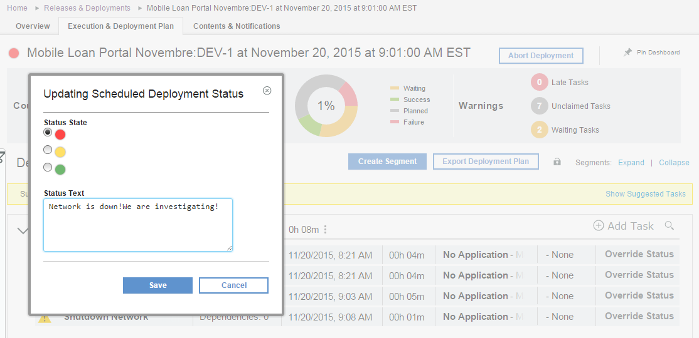
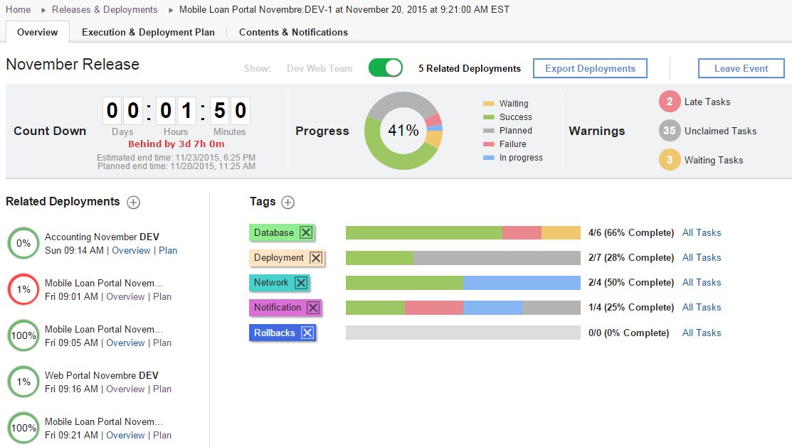
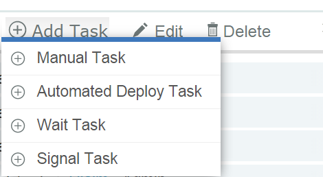
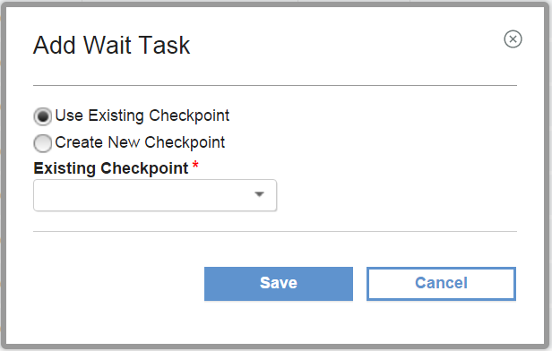

6.1.2.2

**This article was originaly published in 2015.11.25**

6.1.2.2 - November 25, 2015
===========================

IBM UrbanCode Release 6.1.2.2 is a Fix Pack release containing fixes and a new beta feature: **Cross Plan Dependencies**

New Scheduled Deployment Dashboard
----------------------------------

There is a new deployment dashboard containing new widgets to help visualize the deployment’s progress.

– A widget that shows the progress of the deployment as well as the proportion of tasks sorted by status. This widget is clickable and will show a detailed list of tasks when the user clicks on one of the colored portions.

– Warning widgets have been added to show tasks in a specific state like: **Late Tasks, Unclaimed Tasks or Waiting Tasks**. The same way those widgets are clickable and will provide more details about those tasks.

It is now possible to add a status to a deployment.

Beta Feature “Cross Plan Dependencies”
--------------------------------------

This feature can be enabled by adding the following flag to the server.properties:  

**feature.crossplan.dependency.enabled=yes**

### Enterprise Deployment Events

Enterprise Deployment Events can be created from the collaborative calendar.

An Enterprise Deployment Event can contain multiple related deployments that will be part of a major release deployment.

On the Enterprise Related Deployment Dashboard users can then see the progress of all scheduled deployments participating in the event.

The dashboard also provides widgets that will help to filter and view tasks by tags or status across all of the deployments involved in that event.

### Cross Plan Dependencies

In IBM UrbanCode Release 6.1.2.0 task level dependencies within the plan were made available. In IBM UrbanCode Release 6.1.2.2 it is possible to manage dependencies across deployments within an event.

There are two new types of tasks: Wait Tasks and Signal Tasks. Multiple plans can then depend (Wait) on a task that has to be completed in another plan.

Signal Tasks will automatically notify other plans that its activity is complete. Task waiting on that signal will be unable to start until all tasks signalling that activity within the event are complete.

**Signal tasks** are associated with a checkpoint and will notify other plans when that checkpoint is completed.

**Waiting tasks** are also associated a checkpoint and will be listening on notifications from signal tasks from other plans to know when that checkpoint has been completed.

**Checkpoints** can be reusable and will be available from any plans.

Signal and Waiting tasks can be added to the deployment plan and then be reusable from one release to another.

Release Summary
---------------

  
* Experimental Feature: Cross Plan Dependencies
* Bug fixes

Release Notes
-------------

  
For information on documentation and support resources, software and hardware requirements and installation steps, see the [Getting Started](../getting-started/) page.

Installation Notes
No new installation notes.

Behavioral Changes
No major behavioral changes.

Fixes in this Release
A cumulative list of fixes in this release, and any future fix packs will be available.

|  |  |
| --- | --- |
| APAR/defect | Description |
|  | The pipeline view still shows release versions that have been removed |
|  | Error when closing the snapshot detail dialog on the pipeline view |
|  | The pipeline view is not showing all the newest available snapshots |
|  | Issues with assigning security roles when displaying users who are in more than 500 roles |

Known Problems and Workarounds
To search for additional post-release issues that IBM Rational Support documented, visit the [IBM Support portal.](https://www-947.ibm.com/support/entry/myportal/support?brandind=Rational)

Getting Started
---------------

  

Plan & Prepare
For fixes contained in this release, and any known issues, review the [release notes](../release-notes/). For supported platforms and requirements, see the [system requirements](http://www-03.ibm.com/software/products/en/ucrel#tab_othertab1). To get started quickly to try the software, IBM UrbanCode Release is shipped with an Apache Derby database. Apache Derby deployments are not supported for production environments. As you plan your production topology, review the [installation guide](http://www-01.ibm.com/support/knowledgecenter/SS4GCC_6.1.1/com.ibm.urelease.doc/topics/install_ov.html)

Install the server
This release requires IBM Installation Manager version 1.8.0 or later for installation. See [download document](http://www-01.ibm.com/support/docview.wss?uid=swg24036814) for details on this download. This release is available for download on Fix Central for current customers, requiring authentication. This download is [available here.](http://www-933.ibm.com/support/fixcentral/swg/downloadFixes?parent=ibm%7ERational&product=ibm/Rational/UrbanCode+Release&release=All&platform=All&function=fixId&fixids=6.1.2.2-UrbanCode-Release&includeRequisites=1&includeSupersedes=0&downloadMethod=http) Information for installing the server, see the [Installing server](http://www-01.ibm.com/support/knowledgecenter/SS4GCC_6.1.2/com.ibm.urelease.doc/topics/install_ov.html) section in the product documentation.

Learn
To learn more about new enhancements in this release, see [What’s New](../) To learn more about IBM UrbanCode Release, see the [documentation](http://www-01.ibm.com/support/knowledgecenter/SS4GCC_6.1.2/com.ibm.urelease.doc/ucr61_welcome.html) For help installing or using IBM UrbanCode Release, post your questions in the [forums](https://developer.ibm.com/answers?community=urbancode) or contact [support](http://www-947.ibm.com/support/entry/portal/support?brandind=Rational) To suggest an enhancement to the product, visit the [RFE Community](http://www.ibm.com/developerworks/rfe/execute?use_case=submitRfe)

Get support
For information from support, including FAQs, visit the [IBM Support portal.](http://www-947.ibm.com/support/entry/portal/support?brandind=Rational) You can configure the support portal to view information about specific products.

