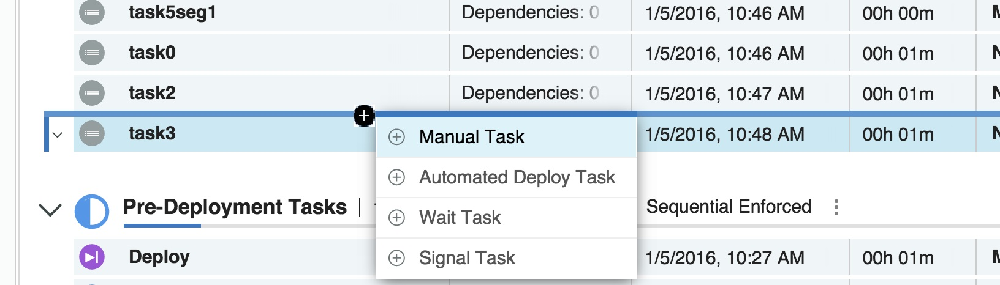
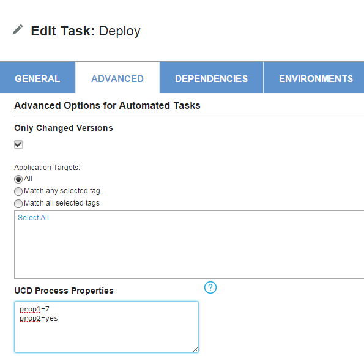
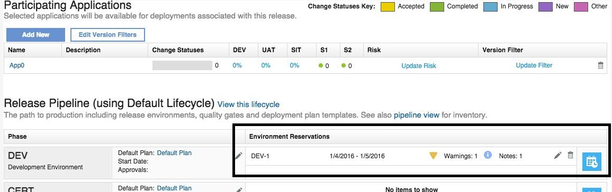

6.2.0.0

**This article was originaly published in 2016.01.04**

6.2.0.0 - January 4, 2016
=========================

IBM UrbanCode Release 6.2.0.0 is a Major release containing fixes and new features

Modifications on Permissions
----------------------------

The permissions associated with user’s roles have been updated to offer more fine-grain controls on specific actions performed across UrbanCode Release.

Scheduled Deployment Version Detail
-----------------------------------

An application’s current version and component versions are now displayed in the scheduled deployment contents tab.

–    An application’s version can be found to the right of an application’s name within a task row.  

–    Version details, including application name, version, components and quality statuses, are displayed in a dialog. This dialog shows when an application with a version is selected within a task row.

A user can now view an application’s current task progress and version components from a scheduled deployment’s Content & Notifications page.  

–    A progress bar is used to represent an application’s task progress. The bar shows the number of tasks within each state as well as the number of total tasks.

 

Insert Tasks and Segments
-------------------------

New segments and tasks can now be created inline within a deployment plan.  

–  An icon appears above or below an existing task that allows a new task to be created in the specified location.  

–  The same icon that is displayed for the insertion of tasks also appears above or below segments to create a new segment in the specified location

Insert Tasks

Insert Segments

Auto-start Segments
-------------------

As long as a segment doesn’t have any prerequisites and there is no role or override start time assigned to a segment the segment will automatically start once the deployment plan is started. Additionally, if there is no role assigned but there is an override start time the segment will start at that given time.

 

UCD Process Properties on Automated Tasks
-----------------------------------------

Users can now set UCD process properties from UCR tasks. At the bottom of the advanced tab on an automated task, there is a text box titled “UCD Process Properties.” Here you can enter properties in the following format:

Property name 1 = value  

Property name 2 = value  

etc.

These properties will be copied from a deployment plan to new scheduled deployments but will not affect other existing deployments. This allows the user to use the deployment plan as a template by setting the property names but leaving the values blank. When creating a new deployment, the property names will appear and the user can set the values. Any changes made to the scheduled deployment will not affect the deployment plan or any other deployment.

To enable this feature, the following feature flag in your server.properties:

**feature.ucd.task.properties.enabled=yes**  

 

A task associated to an application can run without having selected a version
-----------------------------------------------------------------------------

– There is a new option in the add/edit task dialog box which allows a user with permissions to disable the need for an application version before an application can be run.  

– This can also allow a user to run an automated task without an available snapshot version.

 

Improve Conflict Detection for Environment Reservation
------------------------------------------------------

Users now have more detail on environment reservation conflicts.  Conflicts have now been split into two categories. These are warnings and notes:  

– Notes are conflicts that arise when two or more release reservations are scheduled at overlapping time frames on the same the same application deployment environment. However, they do not share the same application.  

– Warnings are conflicts that arise when two or more release reservations are scheduled at overlapping time frames on the same the same application deployment environment and, they share one or more application in the same application.

 

 

New way to add trusted self-signed certificates for integration with external tools
-----------------------------------------------------------------------------------

In some scenarios IBM UrbanCode Release needs to connect to external tools like IBM UrbanCode Deploy, Rational Team Concert… using SSL. If those external tools are installed using a self signed certificate it might be necessary to add those certificates to the **JRE/lib/security/cacerts** if that error occurs:

*“Caught: javax.net.ssl.SSLHandshakeException: com.ibm.jsse2.util.h: PKIX path building failed: java.security.cert.CertPathBuilderException: unable to find valid certification path to requested target”*

Importing the self-signed certificate to the JRE cacerts would solve it. Nevertheless in some versions of IBM UrbanCode Release a new JRE can be installed and will override the cacerts truststore.

In 6.2 the installation manager does make a copy of the cacerts before upgrading and saves it as ibm\_ucr.truststore at the following location: **UCRelease/server/tomcat/conf/ibm\_ucr.truststore**.

**/!\ Important**

**If you need to add new self-signed certificate in the future to the list of trusted certificate for IBM UrbanCode Release, they can be added directly to that file  ibm\_ucr.truststore in order to make sure that they won’t be overridden every time the installation manager is upgrading the JRE.**

