6.2.1.0

**This article was originaly published in 2016.04.04**

6.2.1.0 - April 4, 2016
=======================

IBM UrbanCode Release 6.2.1.0 is a Major release containing several fixes and many new features

Notification Schemes and Rules
------------------------------

Notification schemes and rules can now be created and maintained in Settings. A notification scheme can be created, reused and assigned to a release or assigned to a scheduled deployment. Each scheme contains a list of notification rules. Each notification rule consists of several attributes.  

–    Notifications can be associated with different entities: Task, Segment, Deployment, Approval and Release  

–    Notifications can be assigned to occur at varying times and on certain events: Task is about to start, Task started, Task is skipped, etc.  

–    The user setting up the notification scheme can choose who is notified (specific user, group, users with a certain role, or just an email address) and which template is used for email notification.

**Assigning a Notification Scheme to a Scheduled Deployment**  

[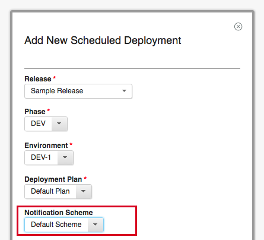](choosescheme.png)

**Configuring the settings of a Notification Scheme**  

[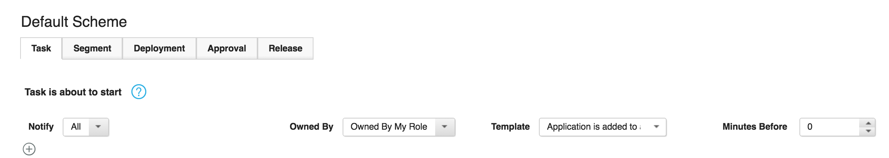](notificationscheme.png)

Notification Templates
----------------------

Notification templates are definitions for the content and format of notification emails that users can now create. Templates can include [Apache Velocity](http://velocity.apache.org/engine/) variables to dynamically populate the email with specifics of the rule (e.g. the name of the task or assigned user). Upgrading will include a default set of notification templates containing one basic template for each rule condition. Additionally, users can preview notification templates in the UI before enabling them.

[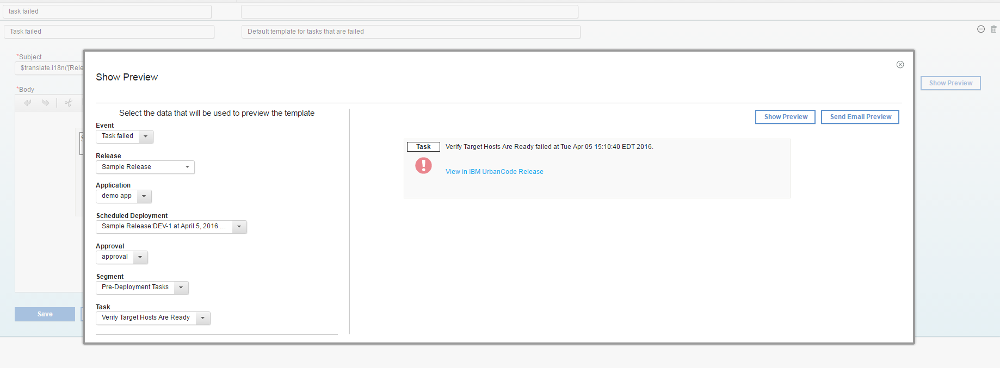](notificationtemplate.png)

New Settings Page
-----------------

The Settings page is home to the new Notification Schemes and Templates tabs as well as various logging and system settings that will make troubleshooting faster and easier.  

–    The **Log4j** file, which contains the logging settings, can now be edited from the Logging tab and the changes take effect without a server restart.  

–    An up-to-date history of the Tomcat **Output Logs** is now viewable and downloadable from the Output Logs tab.  

–    **Audit logs** contain the history of every user action taken on Scheduled Deployments, Releases, and Deployment Plans and can be viewed from the Audit Logs tab.  

–    **The Public URL, SMTP Configuration, License server URL** are now editable from the System Settings Tab. Any feature in the server.properties file that is not displayed in the System Settings tab is still editable from the file itself, but will not take effect without a server restart.  

–    Certain **Feature Flags** can also be changed from the System Settings tab. These changes take effect immediately after saving.  

–    **Authentication Tokens**, which can be used to authenticate log-ins in place of the usual username/password combo, can now be added, edited and removed from the Authentication Tokens tab.  

–    The support package, a collection of log files and system property files that can be used for troubleshooting or support issues, is downloadable from the System Settings tab. This will allow users to quickly share relevant information with support in the case that any problems arise with the product.

**System Settings Tab**  

[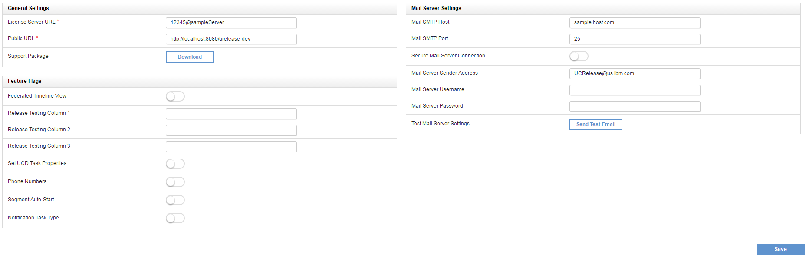](systemsettings.png)

**Output Logs Tab**  

[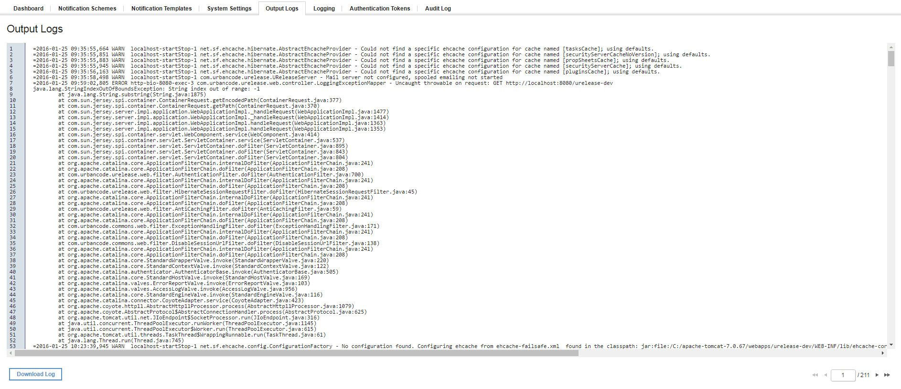](outputlogs.png)

Scheduled Deployment Page
-------------------------

–    The notifications tab displays information on any notifications that will be sent out when certain actions on the scheduled deployment occur.  

–    Individual tasks are now assigned numbers on the scheduled deployment page. The task dependency icon was updated to give users more information on a task’s dependencies and prerequisites.  

–    Individual tasks now display a link that can be used to directly reach a task on a scheduled deployment to facilitate collaboration between users.  

–    Task tags on the overview tab can now be reordered to create a more customized layout.  

–    Information on the dashboard displayed at the top of the scheduled deployment page will now automatically refresh as the scheduled deployment is executed.

**New Notification Tab**  

[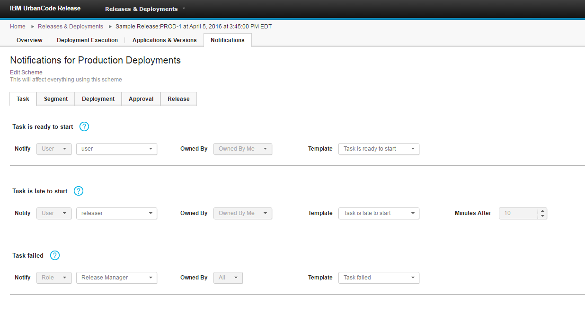](notificationtab.png)

**Design Updates: Updated dependencies and task numbers**  

[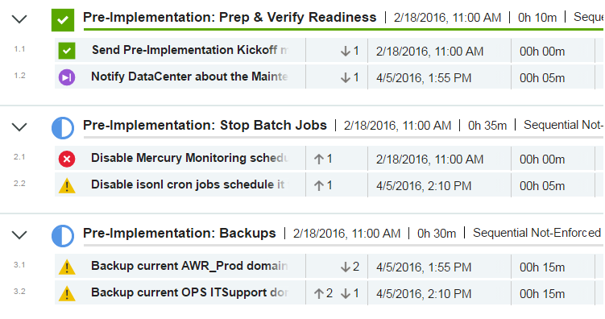](sddesignupdates.png)

**Task Link**  

[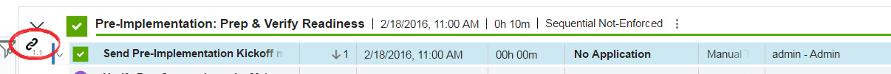](tasklink.png)

**Reordering Tags**  

[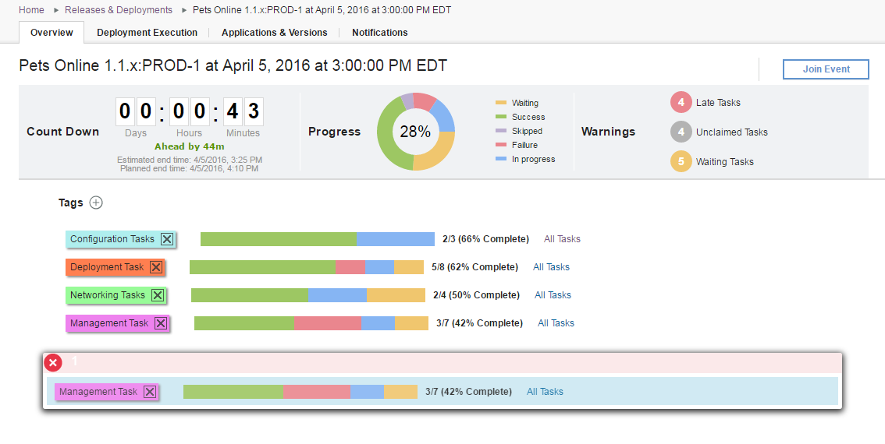](reorderingtags.png)

Event Dashboards
----------------

On the Calendar page, users can now either view the dashboard or create a new dashboard for any existing event.

[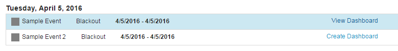](eventdashboard.png)

Security Upgrade
----------------

Authentication Realms can now be mapped to multiple Authorization Realms. Users imported from the Authentication Realm with be members of all of their associated groups from any of the mapped Authorization Realms.

[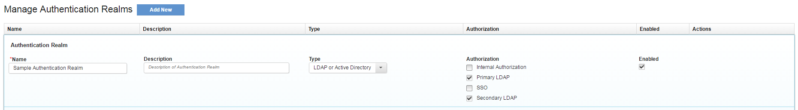](authrealms.png)

Recurring Rules
---------------

Recurring rules can now be temporarily disabled, preventing any additional deployments from being automatically scheduled and removing any pending deployments using the rule.

[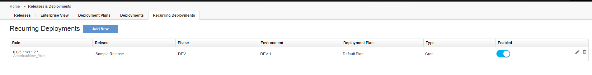](recurringrules.png)

UrbanCode Deploy Plugin
-----------------------

Application processes from application templates in UCD can now be imported into Release.  

Tasks that were previously stuck in an executing state due to an agent being offline, a UCD gate being failed, or components not being mapped to an application will now have their result updated to match their status in UCD.

New Permissions
---------------

**Manage System Settings**: View and edit the values in the System Settings tab of the new Settings page  

**View Audit Logs**: View the Audit Logs tab of the new Settings page  

**Manage Authentication Tokens**: View the authentication tokens tab on the new Settings page and create, delete, or edit authentication tokens  

**Manage Notifications**: Edit the notification schemes and notification templates on the Settings page  

**View Application Environment**: View the new Application Environments tab, where the environment reservations for an application are displayed, on the Environments page  

**Edit Application Environment**: Add or remove tags from Application Environments, either on the Application Environments tab or the Release Environments tab.

Performance Improvements
------------------------

–    Added new SQL indexes on scheduled deployments  

–    Used threading to significantly reduce the amount of time to add or remove tasks from deployments and plans  

–    Updated widgets on menus used to schedule deployments to be filterable and make smaller requests

