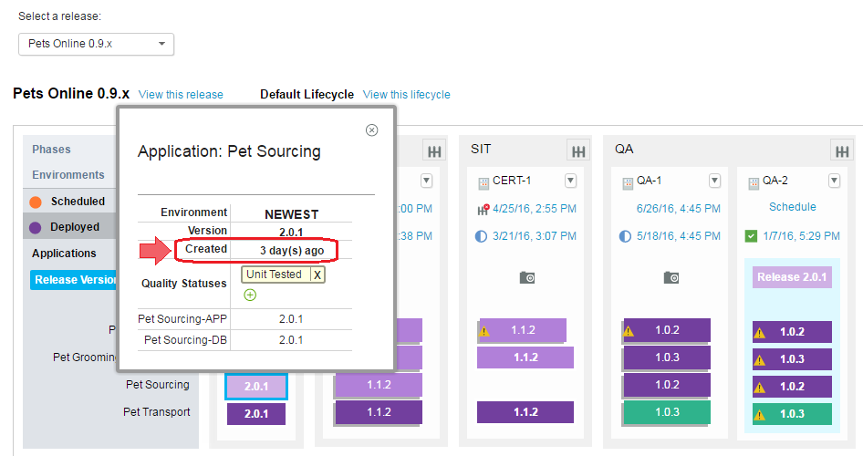

6.2.1.1

**This article was originaly published in 2016.06.17**

6.2.1.1 - June 17, 2016
=======================

IBM UrbanCode Release 6.2.1.1 is a Fix Pack release containing performance improvements and bug fixes.

Force Redeployment Option
-------------------------

A new option is available for both scheduled deployments and recurring deployments called “Force Redeployment”. Deployments that autoselect versions will no longer select a version if the latest version passing gates and matching filters is the currently deployed version. It will now select nothing instead. If you enable the new force redeployment option, the deployment will select the latest version as it did in prior versions of IBM UrbanCode Release. All existing deployments will have force redeployment enabled but this option will be disabled by default for all newly created deployments. Along with this new option when creating a deployment, you can also see who selected each version from the Applications & Versions tab. 

Additional timing information on Scheduled Deployments
------------------------------------------------------

After a deployment is completed, the clock widget displays the end time as well as the total time  

Example dashboard:  

Version Creation Date on Pipeline
---------------------------------

Versions on the pipeline view will now display when they were created.  

Auto refresh on related deployments
-----------------------------------

Widgets on the related deployment dashboard will refresh automatically.

Release Summary
---------------

  
* Force Redeployment Option
* Performance Improvements
* Bug Fixes

Release Notes
-------------

  
For information on documentation and support resources, software and hardware requirements and installation steps, see the [Getting Started](../getting-started/) page.

Installation Notes
No new installation notes.

Behavioral Changes
No major behavioral changes.

Fixes in this Release
A cumulative list of fixes in this release, and any future fix packs will be available.

|  |  |
| --- | --- |
| APAR/defect | Description |
|
| [PI63764](http://www.ibm.com/support/docview.wss?uid=swg1PI63764) | Fix security vulnerabilities |
| [PI61833](http://www.ibm.com/support/docview.wss?uid=swg1PI61833) | Fix failure to execute recurring deployments duplicated in startup |
| [PI63668](http://www.ibm.com/support/docview.wss?uid=swg1PI63668) | Task drop down not displaying after deployment is started |
| [PI15784](http://www.ibm.com/support/docview.wss?uid=swg1PI15784) | Don’t allow deployments to be scheduled to a deleted release environment |
| [PI56148](http://www.ibm.com/support/docview.wss?uid=swg1PI56148) | Don’t display blank page when switching between enterprise views |
| [PI50037](http://www.ibm.com/support/docview.wss?uid=swg1PI50037) | Improved performance on environment reservation creation |
| [PI60638](http://www.ibm.com/support/docview.wss?uid=swg1PI60638) | Load list of environments faster in environment reservation dialog |
| [PI62649](http://www.ibm.com/support/docview.wss?uid=swg1PI62649) | Fix tasks imported from application process templates |
| [PI63585](http://www.ibm.com/support/docview.wss?uid=swg1PI63585) | Prevent list of version quality statuses from being staled due to caching |

Known Problems and Workarounds
To search for additional post-release issues that IBM Rational Support documented, visit the [IBM Support portal.](https://www-947.ibm.com/support/entry/myportal/support?brandind=Rational)

Getting Started
---------------

  

Plan & Prepare
For fixes contained in this release, and any known issues, review the [release notes](../release-notes/). For supported platforms and requirements, see the [system requirements](http://www-03.ibm.com/software/products/en/ucrel#tab_othertab1). To get started quickly to try the software, IBM UrbanCode Release is shipped with an Apache Derby database. Apache Derby deployments are not supported for production environments. As you plan your production topology, review the [installation guide](http://www-01.ibm.com/support/knowledgecenter/SS4GCC_6.2.1/com.ibm.urelease.doc/topics/install_ov.html)

Install the server
This release requires IBM Installation Manager version 1.8.0 or later for installation. See [download document](http://www-01.ibm.com/support/docview.wss?uid=swg24036814) for details on this download. This release is available for download on Fix Central for current customers, requiring authentication. This download is [available here.](http://www-933.ibm.com/support/fixcentral/swg/downloadFixes?parent=ibm%7ERational&product=ibm/Rational/UrbanCode+Release&release=All&platform=All&function=fixId&fixids=6.2.1.1-UrbanCode-Release&includeRequisites=1&includeSupersedes=0&downloadMethod=http) Information for installing the server, see the [Installing server](http://www-01.ibm.com/support/knowledgecenter/SS4GCC_6.2.1/com.ibm.urelease.doc/topics/install_ov.html) section in the product documentation.

Learn
To learn more about new enhancements in this release, see [What’s New](../) To learn more about IBM UrbanCode Release, see the [documentation](http://www-01.ibm.com/support/knowledgecenter/SS4GCC_6.2.1/com.ibm.urelease.doc/ucr_version_welcome.html) For help installing or using IBM UrbanCode Release, post your questions in the [forums](https://developer.ibm.com/answers?community=urbancode) or contact [support](http://www-947.ibm.com/support/entry/portal/support?brandind=Rational) To suggest an enhancement to the product, visit the [RFE Community](http://www.ibm.com/developerworks/rfe/execute?use_case=submitRfe)

Get support
For information from support, including FAQs, visit the [IBM Support portal.](http://www-947.ibm.com/support/entry/portal/support?brandind=Rational) You can configure the support portal to view information about specific products.

