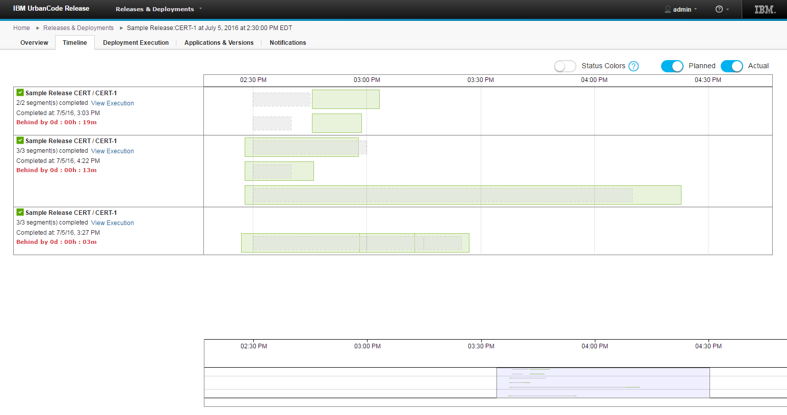
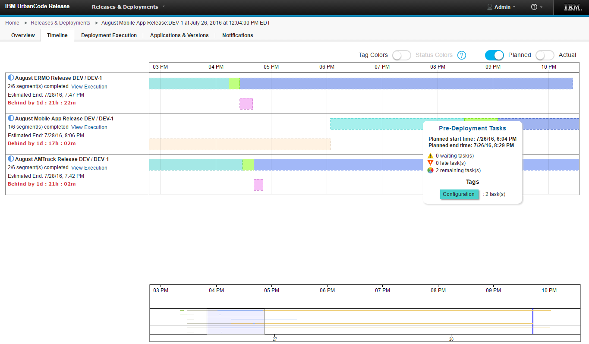
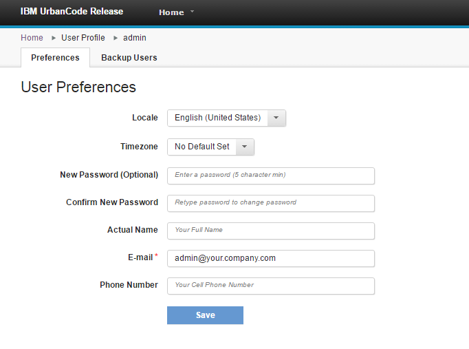
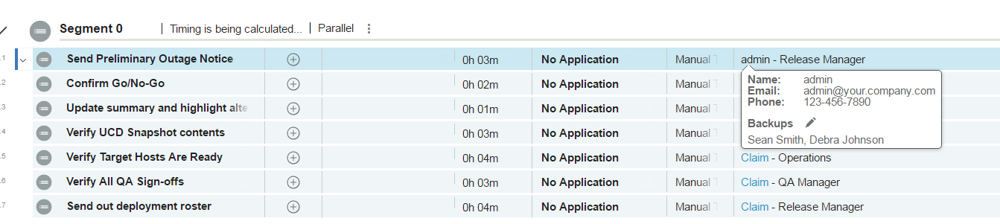
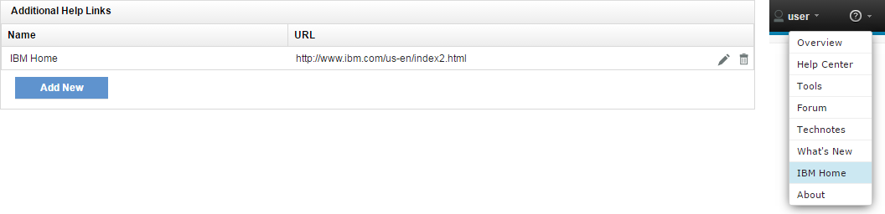
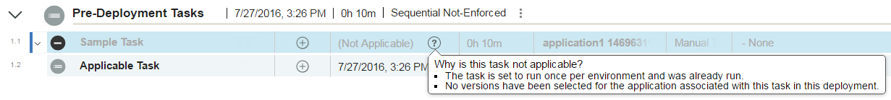
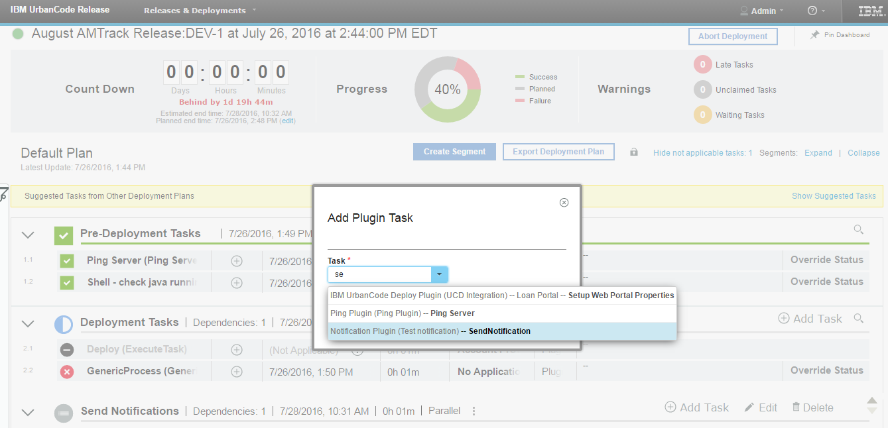
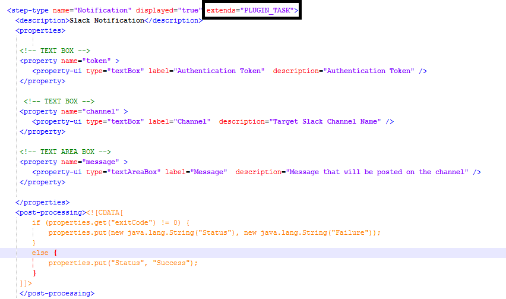
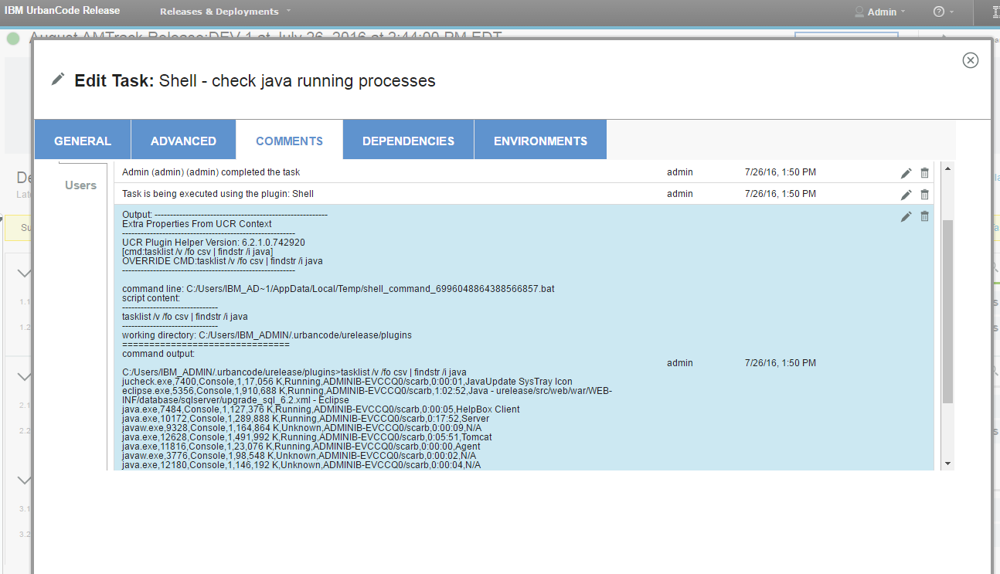
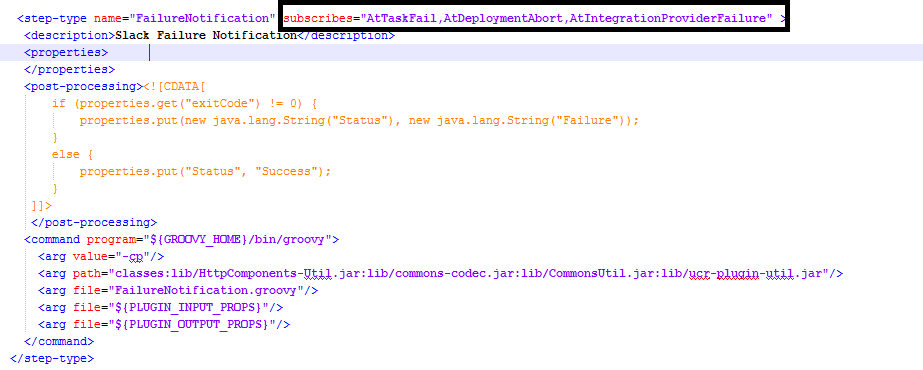

6.2.1.2

**This article was originaly published in 2016.07.27**

6.2.1.2 - July 27, 2016
=======================

IBM UrbanCode Release 6.2.1.2 is a Fix Pack release containing performance improvements and bug fixes.  

Timeline View (Beta Feature)
----------------------------

Previously located under the Federated Deployment Dashboard, the Timeline View of scheduled deployments has been updated and associated with deployments in enterprise events. The Timeline will be displayed as a tab on the Event Page of an Enterprise Event and the individual deployments within an event.   
The Timeline displays timing information for set of scheduled deployments in the event, allowing users to visually compare the planned times start and end times of each segment to the actual times.   

  
Segments can be colored based on their current execution status or on the tags used on the segment’s tasks.  

User Profile and Backups (Beta Feature)
---------------------------------------

Users can now update their contact information, password, and actual name without admin privileges. Users can also add other users as a backup user so that if they were unavailable for any reason it would be easy to find someone else to execute a manual task in their place.  
  
You will be able to easily see contact information about that user and that users backups if you hover over that user for a task they are assigned too.  

Create Additional Help Links (Beta Feature)
-------------------------------------------

Additional links can now be added to the Help drop-down at the top of the page. This feature can be found on the Settings -> System Settings tab, after the “Help Links” Feature Flag has been toggled on.  

Not Applicable Task Reasons
---------------------------

The reasons a task is not applicable are now able to be displayed in the UI. On a not applicable task, simply click on the new help icon for the list of reasons to be displayed. Applicability for this task is recalculated at this moment. So, in the instance that the task’s applicability isn’t updating and the task should really be applicable, clicking the icon will cause it’s applicability to get updated.  
  

Plug-in task types (Beta Feature)
---------------------------------

The plugin framework has been improved to allow use of plugin tasks in deployment plan.

Plugin Steps can now be turned to Plugin Tasks by adding: ***extends=”PLUGIN\_TASK”*** and will be made available as tasks when building a deployment plan.

When those tasks are executed the full context will be passed to the plugin step containing information about: Task, Segment, Deployment, Applications, Versions, Release…  
Then the plugin step will be responsible to update the status of the task using our REST API our the UCR java client.  
Plugin tasks will help to integrate with various external tools like: Ticketing Systems, Notifications, Custom Deployment Automation tools, Approval Systems… They will also help to solve complex scenarios such as Roll Backs.  
Plugin task execution logs will be printed as comments in the task dialog.

Plug-in Event Listeners (Beta Feature)
--------------------------------------

As part of new features introduced with the plugin framework, Plugins can now have steps that listen to specific events generated in IBM UrbanCode Release such as: Application was added to / removed from a release, Deployment Failed, Task Failed, Integration Failed, Deployment Started, Task is late… and be triggered when those events occur.  
When the step is triggered by the event, it will receive the context: Object triggering the event and related information that is relevant for that step execution.  
The plugin steps will have to subscribe to 1 or more events ex:

 

Release Summary
---------------

  
* Plug-in tasks & Listeners
* Timeline view
* Customizable help links
* User Profile
* Bug Fixes

Release Notes
-------------

  
For information on documentation and support resources, software and hardware requirements and installation steps, see the [Getting Started](../getting-started/) page.

Installation Notes
No new installation notes.

Behavioral Changes
No major behavioral changes.

Fixes in this Release
A cumulative list of fixes in this release, and any future fix packs will be available.

|  |  |
| --- | --- |
| APAR/defect | Description |
|
| [PI64006](http://www.ibm.com/support/docview.wss?uid=swg1PI64006) | URL VARIABLES NOT BEING SET IN CUSTOM NOTIFICATION |
| [PI64409](http://www.ibm.com/support/docview.wss?uid=swg1PI64409) | MISSING LIBRARY FOR RTC PLUGIN V3 (RTC SERVER 6.0 AND LATER) CAUSING EXCEPTION DURING AUTHENTICATION |
| [PI64800](http://www.ibm.com/support/docview.wss?uid=swg1PI64800) | RTC PLUGIN ‘RUN INTEGRATION’ FAILS |
| [PI64802](http://www.ibm.com/support/docview.wss?uid=swg1PI64802)  | WHEN ADDING A NEW APPLICATION THE FIELDS FOR ENVIRONMENTS AND  TEAMS ARE SLOW TO LOAD |
| [PI64839](http://www.ibm.com/support/docview.wss?uid=swg1PI64839) | RELEASES DROPDOWN SCROLLS INCONSISTENTLY |
| [PI65928](http://www.ibm.com/support/docview.wss?uid=swg1PI65928) | CHANGES TO AUTOMATIC TASKS IN DEPLOYMENT PLANS AREN’T SUCCESSFULLY SAVED |
| [PI66041](http://www.ibm.com/support/docview.wss?uid=swg1PI66041) | DB2-BASED UCR SERVERS FAIL TO STARTUP WHEN NON-DEFAULT USER IS USED TO ACCESS DATABASE |
| [PI66142](http://www.ibm.com/support/docview.wss?uid=swg1PI66142)  | INTEGRATION WITH DEPLOY FAILS WHEN A SNAPSHOT IS CREATED WITH THE SAME NAME AS ANOTHER RENAMED SNAPSHOT |
| [PI66587](http://www.ibm.com/support/docview.wss?uid=swg1PI66587) | SCHEDULED DEPLOYMENTS CACHE IS NOT SYNCHRONIZED BETWEEN NODES IN HA |
| [PI66488](http://www.ibm.com/support/docview.wss?uid=swg1PI66488) | UCD AND RTC INTEGRATION USING PLUGIN FAILS WITH JAVA.LANG.ASSERTIONERROR |

Known Problems and Workarounds
To search for additional post-release issues that IBM Rational Support documented, visit the [IBM Support portal.](https://www-947.ibm.com/support/entry/myportal/support?brandind=Rational)

Getting Started
---------------

  

Plan & Prepare
For fixes contained in this release, and any known issues, review the [release notes](../release-notes/). For supported platforms and requirements, see the [system requirements](http://www-03.ibm.com/software/products/en/ucrel#tab_othertab1). To get started quickly to try the software, IBM UrbanCode Release is shipped with an Apache Derby database. Apache Derby deployments are not supported for production environments. As you plan your production topology, review the [installation guide](http://www-01.ibm.com/support/knowledgecenter/SS4GCC_6.2.1/com.ibm.urelease.doc/topics/install_ov.html)

Install the server
This release requires IBM Installation Manager version 1.8.0 or later for installation. See [download document](http://www-01.ibm.com/support/docview.wss?uid=swg24036814) for details on this download. This release is available for download on Fix Central for current customers, requiring authentication. This download is [available here.](http://www-933.ibm.com/support/fixcentral/swg/downloadFixes?parent=ibm%7ERational&product=ibm/Rational/UrbanCode+Release&release=All&platform=All&function=fixId&fixids=6.2.1.2-UrbanCode-Release&includeRequisites=1&includeSupersedes=0&downloadMethod=http) Information for installing the server, see the [Installing server](http://www-01.ibm.com/support/knowledgecenter/SS4GCC_6.2.1/com.ibm.urelease.doc/topics/install_ov.html) section in the product documentation.

Learn
To learn more about new enhancements in this release, see [What’s New](../) To learn more about IBM UrbanCode Release, see the [documentation](http://www-01.ibm.com/support/knowledgecenter/SS4GCC_6.2.1/com.ibm.urelease.doc/ucr_version_welcome.html) For help installing or using IBM UrbanCode Release, post your questions in the [forums](https://developer.ibm.com/answers?community=urbancode) or contact [support](http://www-947.ibm.com/support/entry/portal/support?brandind=Rational) To suggest an enhancement to the product, visit the [RFE Community](http://www.ibm.com/developerworks/rfe/execute?use_case=submitRfe)

Get support
For information from support, including FAQs, visit the [IBM Support portal.](http://www-947.ibm.com/support/entry/portal/support?brandind=Rational) You can configure the support portal to view information about specific products.

