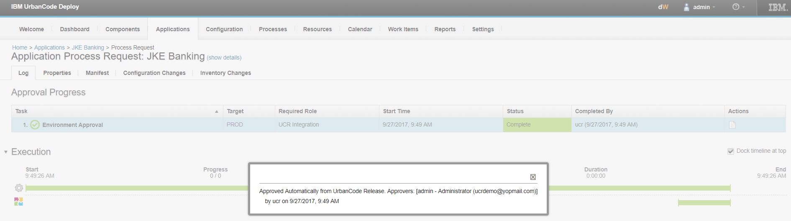

6.2.2.0

**This article was originaly published in 2017.10.31**

6.2.2.0 - October 31, 2017
==========================

This release of IBM UrbanCode Release is a maintenance release and includes various bug fixes and enhancements. This release is recommended for all customers.

**Latest ifix available on version 6.2.2.0 ifix 1:**
Download in Fix Portal: <ftp://ftp.software.ibm.com/software/rational/private/UCR-BYbnykf1TGW6>

Full details on bug fixes, RFEs available here: <ftp://ftp.software.ibm.com/software/rational/private/UCR-BYbnykf1TGW6/Read-Me.txt>

New installation procedure
--------------------------

IBM Installation Manager is not needed to install UrbanCode Release version 6.2.2 and later. The new installation program is included as part of the program image. It is an interactive command-line based installation program that guides you through the installation process.

Android Support For UrbanCode Mobile
------------------------------------

* – Complete UrbanCode Deploy and Release Approvals
* – Execute UrbanCode Release Tasks
* – Real Time Update on Deployment Progress and Health
* – Automatic Push Notifications

Scheduled Deployment / Enterprise Release Event Note
----------------------------------------------------

Free text place holder that can be added to the overview page of a deployment or an enterprise release event.

Enhanced Enterprise Release Event Notifications
-----------------------------------------------

Notifications can be sent on-demand or at a defined interval for enterprise release events.

Release and Deployment Enhancements
-----------------------------------

* – Tasks completed successfully that had failed previously are easily noticeable.

 

 

* – Task Tags can now be edited
* – Pipeline Auto Refresh
* – Approvals in UrbanCode Deploy can now be overridden if the process has been started as an automated task from UrbanCode Release

 

Official Support on the following features:
-------------------------------------------

Service level agreement tasks
-----------------------------

You can use three new task types to manage service level agreements (SLA), such as time-critical events, and planned outages.

### Outage tasks

Use outage tasks to manage systems that can only be down for a specified time period. When you create an outage, a begin task and an end task are inserted into the deployment plan. You can add related tasks between the begin and end tasks, and you are alerted if the total duration exceeds the planned-for time. In the following figure, you can see that the outage of 1 hour is exceeded by 5 minutes due to the duration of the related tasks.

Outage tasks

### Critical event tasks

Use critical event tasks to manage service level agreements that require events to occur at specified times. If tasks are expected to be late, an alert suggests an earlier start time. In the following figure, the server must be back online by 11:30 but the deployment is running behind schedule.

Critical task alerts

### Wait-for-time tasks

Wait-for-time tasks do not complete until a specified time. You can use wait-for-time tasks as buffers to control the deployment pace.

### SLA reports

The scheduled deployment’s Overview tab now lists all outages and critical events, and alerts you when they are running ahead or behind schedule, as shown in the following figure. The Overview tab displays progress bars for tasks that fall within an outage or that are on the path of critical events. You can export reports that compare actual to planned service level agreements.

SLA reports

### SLA notifications

There are four new notification rules for service level agreement tasks that let you know when SLA-related events happen in your scheduled deployments. You can configure notifications to be sent when outages or critical events finish late or if they are estimated to be more than *x* minutes late.

Banner messages
---------------

Messages can be displayed in page headers that notify users about important events. Links can be included in the messages. Banner messages are managed on the **System Settings** page.

User dashboard
--------------

The user dashboard is your IBM UrbanCode Release home page. The dashboard home page displays information that is customized for you. From the dashboard, you can access your applications and tasks, schedule deployments, and provide approvals.

The dashboard organizes information by calendar events and tasks. Today’s important events are displayed in one area, where you can claim and edit tasks. Other areas display the events that are scheduled for later this week or later in the month. Depending on your role, other dashboard areas provide links where you can use product features, such as creating releases and scheduling deployments.

The dashboard’s Getting Started area, as shown in the following figure, contains tutorials about important product features, such as creating releases. Each tutorial step provides a link to an associated topic in the online product documentation for IBM UrbanCode Release in IBM Knowledge Center.

User dashboard

The **Today** section shows your important items for today. Summaries of today’s deployments with links to them are provided. You can access tasks in the **Waiting** section and claim **Unclaimed** tasks.  

  

You can act on pending approvals on the dashboard, which also shows the applications gates statuses, as shown in the following figure.

 

The **Quality Status Signoffs** sections show deployments with missing quality statuses. The **Process Checklists** section displays the process checklists either assigned to you, claimable by you, or all other process checklists in your teams. The last section is the list of deployments for the day.

