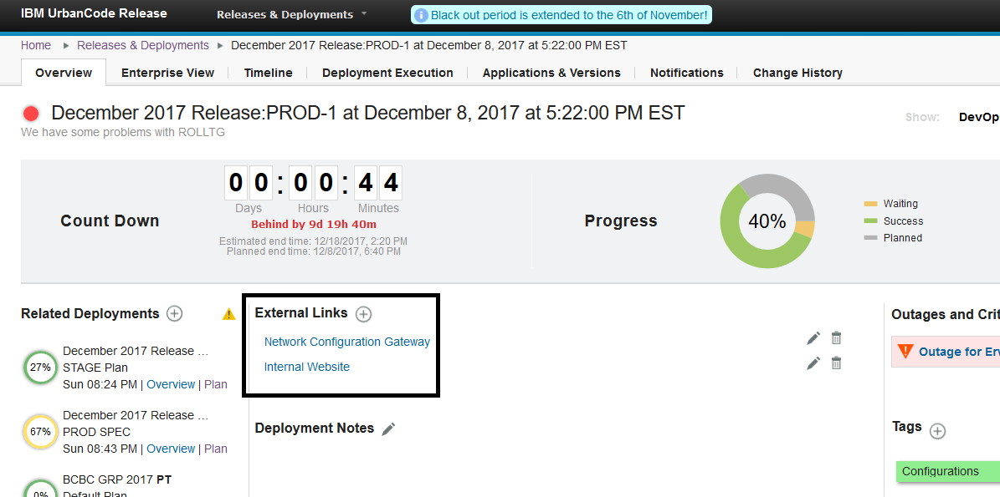
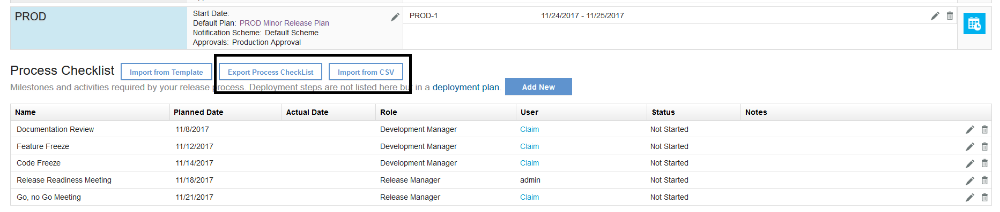

6.2.2.1

**This article was originaly published in 2017.12.13**

6.2.2.1 - December 13, 2017
===========================

This release of IBM UrbanCode Release is a maintenance release and includes various bug fixes and enhancements. This release is recommended for all customers.

Display Segment names on Timeline View
--------------------------------------

Segment names on the Timeline View are now displayed to avoid extra clicks for a user to see the name of segments.

 

 External Links on Scheduled Deployments
----------------------------------------

External Links can be added to the overview page of either scheduled deployments or enterprise release events.

 

Export / Import Process Checklists
----------------------------------

Existing Process Checklists can be exported and completed off line. Then they can be imported from a CSV file and statuses will be updated automatically.

Add Status on Enterprise Release Events
---------------------------------------

Users can add statuses on Enterprise Release Events to notify other users of the overall health or progress of an entire Enterprise Release Event.

 

Show Task Index and Deployment Plan Name on Deployment Dashboard and View More Pages
------------------------------------------------------------------------------------

 

Show descriptions on Outage and Critical Tasks overview dashboard
-----------------------------------------------------------------

 

 

