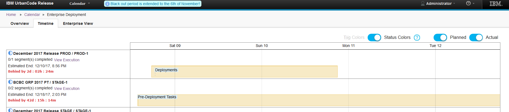
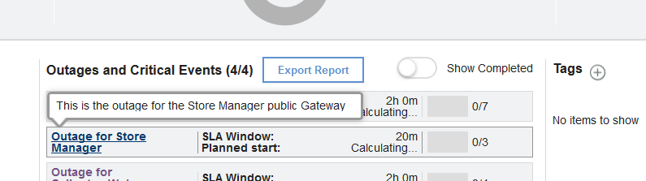

6.2.2.1

**This article was originaly published in 2017.12.13**

6.2.2.1 - December 13, 2017
===========================

This release of IBM UrbanCode Release is a maintenance release and includes various bug fixes and enhancements. This release is recommended for all customers.

Display Segment names on Timeline View
--------------------------------------

Segment names on the Timeline View are now displayed to avoid extra clicks for a user to see the name of segments.

 

 External Links on Scheduled Deployments
----------------------------------------

External Links can be added to the overview page of either scheduled deployments or enterprise release events.

 

Export / Import Process Checklists
----------------------------------

Existing Process Checklists can be exported and completed off line. Then they can be imported from a CSV file and statuses will be updated automatically.

Add Status on Enterprise Release Events
---------------------------------------

Users can add statuses on Enterprise Release Events to notify other users of the overall health or progress of an entire Enterprise Release Event.

 

Show Task Index and Deployment Plan Name on Deployment Dashboard and View More Pages
------------------------------------------------------------------------------------

 

Show descriptions on Outage and Critical Tasks overview dashboard
-----------------------------------------------------------------

 

 

Release Summary
---------------

  
* Performance Improvements
* RFEs & Bug Fixes

Release Notes
-------------

  
For information on documentation and support resources, software and hardware requirements and installation steps, see the [Getting Started](../getting-started) page.

Fixes in this Release

|  |  |
| --- | --- |
| [PI90482](http://www.ibm.com/support/docview.wss?uid=swg1PI90482) | CANNOT INSTALL IBM URBANCODE RELEASE 6.2.2.0 ON AIX |
| [PI90761](http://www.ibm.com/support/docview.wss?uid=swg1PI90761) | UCD INTEGRATION FAILING WITH “QUERY DID NOT RETURN A UNIQUE RESULT |
| [PI89737](http://www.ibm.com/support/docview.wss?uid=swg1PI89737) | ENFORCE SSL COMMUNICATION USING TLS V1.1 AND HIGHER FOR URBANCODE RELEASE SERVER AND ITS INTEGRATIONS |
| [PI90024](http://www.ibm.com/support/docview.wss?uid=swg1PI90024) | UCR PLUGIN INTEGRATION WITH UCD FAILS ON SNAPSHOT IMPORT WITH DB CONSTRAINTVIOLATION EXCEPTION ON UR\_VERSION DB TABLE |
| [PI90522](http://www.ibm.com/support/docview.wss?uid=swg1PI90522) | ENVIRONMENT RESERVATION CONFLICT DIALOG DOES NOT APPLY USERS LOCALE TO DATES |
| [PI87896](http://www.ibm.com/support/docview.wss?uid=swg1PI87896) | CHANGING PUBLIC URL IS NOT SUFFICIENT TO CHANGE IP ADDRESS OF URBANCODE RELEASE SERVER |
| [PI91100](http://www.ibm.com/support/docview.wss?uid=swg1PI91100) | UPDATING APP PROCESS NAME IN IBM URBANCODE DEPLOY DOESN’T REFLECT IN UCR |
| [PI90399](http://www.ibm.com/support/docview.wss?uid=swg1PI90399) | DEPLOYMENT EXECUTION VIEW : COUNTDOWN WIDGET SHOWS SOMETIME 00:00:00 TIME LEFT WITH ESTIMATED END TIME 1/1/1970 |

Known Problems and Workarounds
To search for additional post-release issues that IBM Rational Support documented, visit the [IBM Support portal.](https://www.ibm.com/support/home)

RFEs delivered in this Release

|  |  |
| --- | --- |
| [112475](https://www.ibm.com/developerworks/rfe/execute?use_case=viewRfe&CR_ID=112475) | Display Segment names on Timeline View |
| [113365](https://www.ibm.com/developerworks/rfe/execute?use_case=viewRfe&CR_ID=113365) | Read Only Permission for Enterprise View |
| [112845](https://www.ibm.com/developerworks/rfe/execute?use_case=viewRfe&CR_ID=112845) | External Link on Deployments |
| [114034](https://www.ibm.com/developerworks/rfe/execute?use_case=viewRfe&CR_ID=114034) | Export Import Milestones |
| [113194](https://www.ibm.com/developerworks/rfe/execute?use_case=viewRfe&CR_ID=113194) | Export Task Comments |
| [113786](https://www.ibm.com/developerworks/rfe/execute?use_case=viewRfe&CR_ID=113786) | Migrate off Derby |
| [112477](https://www.ibm.com/developerworks/rfe/execute?use_case=viewRfe&CR_ID=112477) | Show descriptions on Outage and Critical Tasks overview dashboard |
| [112196](https://www.ibm.com/developerworks/rfe/execute?use_case=viewRfe&CR_ID=112196) | Add Status on Enterprise Release Event |
| [112574](https://www.ibm.com/developerworks/rfe/execute?use_case=viewRfe&CR_ID=112574) | Show Task Index and Deployment Plan Name on Deployment Dashboard and View More Pages |

Getting Started
---------------

  

Plan & Prepare
For fixes contained in this release, and any known issues, review the [release notes](../release-notes).

For supported platforms and requirements, see the reports that can be dynamically generated using the [Software Product Compatibility Reports (SPCR)](https://www.ibm.com/software/reports/compatibility/clarity/index.html) tool.

**Note:** Some supported plug-ins have system requirements that vary from the core product. Information on system requirements for individual plug-ins is available on the download page for that plug-in.

To get started quickly to try the software, IBM UrbanCode Release is shipped with an Apache Derby database. Apache Derby deployments are not supported for production environments. As you plan your production topology, review the [installation guide](http://www-01.ibm.com/support/knowledgecenter/SS4GCC_6.2.2/com.ibm.urelease.doc/topics/install_ov.html).

Install the server
This release is available for download from [Fix Central](https://www-945.ibm.com/support/fixcentral/swg/selectFixes?parent=ibm%7ERational&product=ibm/Rational/UrbanCode+Release&release=All&platform=All&function=all&source=fc) and [Passport Advantage](https://www.ibm.com/software/howtobuy/passportadvantage/paocustomer), requiring authentication.

Information for installing the server, see the [Installing server](http://www-01.ibm.com/support/knowledgecenter/SS4GCC_6.2.2/com.ibm.urelease.doc/topics/install_ov.html) section in the product documentation.

For information on installing licenses, see [Managing Licenses](https://www.ibm.com/support/knowledgecenter/SS4GCC_6.2.1/com.ibm.urelease.doc/topics/licenseManage.html).

Learn
To learn more about new enhancements in this release, see [What’s New](../) .

To learn more about IBM UrbanCode Release, see the [documentation](http://www-01.ibm.com/support/knowledgecenter/SS4GCC_6.2.2/com.ibm.urelease.doc/ucr_version_welcome.html).

For help installing or using IBM UrbanCode Release, post your questions in the [forums](https://developer.ibm.com/answers?community=urbancode) or contact [support](http://www-947.ibm.com/support/entry/portal/support?brandind=Rational).

To suggest an enhancement to the product, visit the [RFE Community](http://www.ibm.com/developerworks/rfe/execute?use_case=submitRfe).

Get support
For information from support, including FAQs, visit the [IBM Support portal.](https://www.ibm.com/support/home) You can configure the support portal to view information about specific products.

