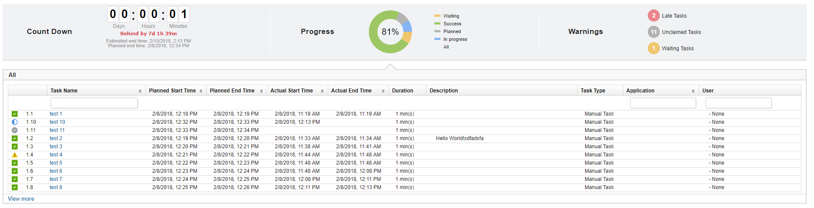

6.2.2.2

**This article was originaly published in 2018.02.15**

6.2.2.2 - February 15, 2018
===========================

This release of IBM UrbanCode Release is a maintenance release and includes various bug fixes and enhancements. This release is recommended for all customers.

### Deployment History Cleanup

Permanently delete deployments that are greater than a specified number or days old either manually or on a schedule.
### Max Deployment Duration

Limit deployments so their end time that cannot exceed a specified number of days from their start. You can also clean up deployments based on their end date by aborting in progress deployments and permanently deleting unstarted deployments, either manually or on a schedule.
### More Tasks View Extra Timing Columns

This feature allows you to see a tasks planned and actual values for it’s start and end times as well as it’s description on the more tasks view.
You can enable this setting by adding feature.more.tasks.view.extra.columns=yes to the installed.properties.

Release Summary
---------------

  
* Deployment History Cleanup
* Max Deployment Duration
* More Tasks View Extra Columns
* Minor Performance Improvements
* RFEs & Bug Fixes

Release Notes
-------------

  
### Fixes in this Release

|  |  |
| --- | --- |
| [PI90399](http://www.ibm.com/support/docview.wss?uid=swg1PI90399) | DEPLOYMENT EXECUTION VIEW : COUNTDOWN WIDGET SHOWS 00:00:00 TIME LEFT WITH ESTIMATED END TIME 1/1/1970 |
| [PI92690](http://www.ibm.com/support/docview.wss?uid=swg1PI92690) | OUTAGE TASKS LOSING REFERENCE TO THEIR SIBLING |
| [PI91614](http://www.ibm.com/support/docview.wss?uid=swg1PI91614) | USERS CAN ADD/REMOVE TEAMS THEY ARE NOT MEMBERS OF FROM APPLICATIONS |
| [PI92694](http://www.ibm.com/support/docview.wss?uid=swg1PI92694) | MILESTONE EXPORT DOES NOT RESPECT USER LOCALE FOR DATE |
| [PI92699](http://www.ibm.com/support/docview.wss?uid=swg1PI92699) | VIEW MORE TASKS TIMING POPUP NOT ON TOP |
| [PI92656](http://www.ibm.com/support/docview.wss?uid=swg1PI92656) | SESSIONS IN UCR NEVER EXPIRE |
| [PI92653](http://www.ibm.com/support/docview.wss?uid=swg1PI92653) | DIALOG WON’T SAVE CHECKBOXES THAT AREN’T ON THE CURRENT PAGE ON SAVE |
| [PI92701](http://www.ibm.com/support/docview.wss?uid=swg1PI92701) | INSTALLER DOESN’T SUPPORT SYMBOLIC LINKS |
| [PI93247](http://www.ibm.com/support/docview.wss?uid=swg1PI93247) | INSTALLER DOESN’T SUPPORT SYMBOLIC LINKS |
| [PI93684](http://www.ibm.com/support/docview.wss?uid=swg1PI93684) | TASK TIMING INCONSISTENCIES |

### Known Problems and Workarounds

To search for additional post-release issues that IBM Rational Support documented, visit the [IBM Support portal.](https://www.ibm.com/support/home)

### RFEs delivered in this Release

|  |  |
| --- | --- |
| [115371](https://www.ibm.com/developerworks/rfe/execute?use_case=viewRfe&CR_ID=115371) | Unformatted Description on Deployment Export |
| [115373](https://www.ibm.com/developerworks/rfe/execute?use_case=viewRfe&CR_ID=115373) | All Task Status View |
| [115341](https://www.ibm.com/developerworks/rfe/execute?use_case=viewRfe&CR_ID=115341) | Delete Old Scheduled Deployments |
| [115272](https://www.ibm.com/developerworks/rfe/execute?use_case=viewRfe&CR_ID=115272) | Default Release Application Risk to Low |
| [115346](https://www.ibm.com/developerworks/rfe/execute?use_case=viewRfe&CR_ID=115346) | Enforce Scheduled Deployment End Time |
| [115158](https://www.ibm.com/developerworks/rfe/execute?use_case=viewRfe&CR_ID=115158) | UCR should have “Edit Application Teams” Permission |
| [115582](https://www.ibm.com/developerworks/rfe/execute?use_case=viewRfe&CR_ID=115582) | Export Top Part of Enterprise View |
| [115673](https://www.ibm.com/developerworks/rfe/execute?use_case=viewRfe&CR_ID=115673) | More Tasks View Extra Columns |

Getting Started
---------------

  

### Plan & Prepare

For fixes contained in this release, and any known issues, review the [release notes](https://github.com/UrbanCode/IBM-UCx-RELEASE-NOTES).

For supported platforms and requirements, see the reports that can be dynamically generated using the [Software Product Compatibility Reports (SPCR)](https://www.ibm.com/software/reports/compatibility/clarity/index.html) tool.

**Note:** Some supported plug-ins have system requirements that vary from the core product. Information on system requirements for individual plug-ins is available on the download page for that plug-in.

To get started quickly to try the software, IBM UrbanCode Release is shipped with an Apache Derby database. Apache Derby deployments are not supported for production environments. As you plan your production topology, review the [installation guide](http://www-01.ibm.com/support/knowledgecenter/SS4GCC_6.2.2/com.ibm.urelease.doc/topics/install_ov.html).

### Install the server

This release is available for download from [Fix Central](https://www-945.ibm.com/support/fixcentral/swg/selectFixes?parent=ibm%7ERational&product=ibm/Rational/UrbanCode+Release&release=All&platform=All&function=all&source=fc) and [Passport Advantage](https://www.ibm.com/software/howtobuy/passportadvantage/paocustomer), requiring authentication.

Information for installing the server, see the [Installing server](http://www-01.ibm.com/support/knowledgecenter/SS4GCC_6.2.2/com.ibm.urelease.doc/topics/install_ov.html) section in the product documentation.

For information on installing licenses, see [Managing Licenses](https://www.ibm.com/support/knowledgecenter/SS4GCC_6.2.1/com.ibm.urelease.doc/topics/licenseManage.html).

### Learn

To learn more about new enhancements in this release, see [What’s New](http://www.urbancodelabs.com/whats-new/) .

To learn more about IBM UrbanCode Release, see the [documentation](http://www-01.ibm.com/support/knowledgecenter/SS4GCC_6.2.2/com.ibm.urelease.doc/ucr_version_welcome.html).

For help installing or using IBM UrbanCode Release, post your questions in the [forums](https://developer.ibm.com/answers?community=urbancode) or contact [support](http://www-947.ibm.com/support/entry/portal/support?brandind=Rational).

To suggest an enhancement to the product, visit the [RFE Community](http://www.ibm.com/developerworks/rfe/execute?use_case=submitRfe).

### Get support

For information from support, including FAQs, visit the [IBM Support portal.](https://www.ibm.com/support/home) You can configure the support portal to view information about specific products.

