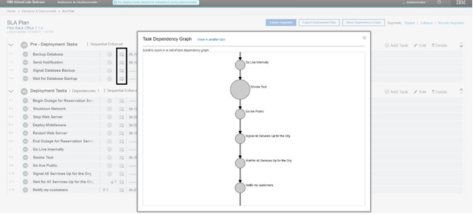
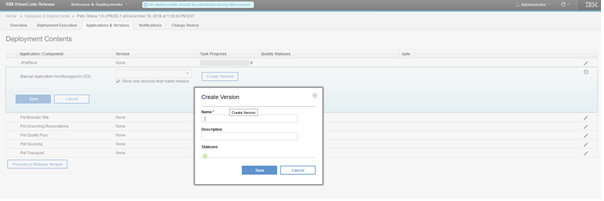
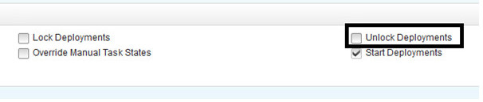
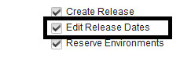
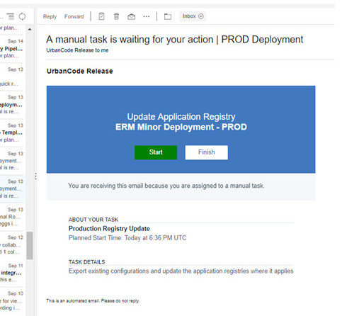

6.2.2.5

**This article was originaly published in 2018.12.11**

6.2.2.5 - December, 2018
========================

This release of IBM UrbanCode Release is a maintenance release and includes various bug fixes and enhancements. This release is recommended for all customers.

New features
------------

---

### Hover help available for initiatives imported from RTC

Hovering over a work item imported from RTC displays in a preview window some details of the work item.
### Task Dependency graph for deployment plans

You can now view a Dependency Graph of a deployment plan. This complements the Scheduled Deployment Dependency graphs that were already available in an earlier release.

### Improved auditing for scheduled deployments

The Change History tab of a scheduled deployment now list more events during the execution of a deployment.
### Allow editing of failed task

Failed task description can be edited allowing you to update instructions that would need to be synced with the deployment plan for future deployments.
### Allow manual versions to be created from the Application and Versions tabs of a scheduled deployment

Manual versions that can be used for manually created applications can be created directly create from the Scheduled Deployment page.

### Task owners can be changed while the task is executing

If multiple users work (for example, a shift change occurs while the task is executing) are working on the same task that is in progress, they can assign the task to each other while the task is in progress. Switching users is audited.
### Permission to lock and unlock deployments

Permissions have been added locking and unlocking deployments. There is one permission to lock and another one to unlock a deployment.

### Permission to edit release dates

New permission available to allow you to edit release dates.

### New notification rules

Additional notification rules are now available. For example: Task Re-Opened or when Comments are added to Tasks.
### Performance and usability improvements

* Search functionality in “Copy From” field in “Create New Deployment Plan” dialog
* Performance improved on the Environment Reservation dialog

---

Beta features
-------------

The following features have been added as a Beta feature. These features require the enabling of a feature flag to use.
### Ability to archive started scheduled deployments using the Rest API

In previous versions, only scheduled deployment not started can be removed from the user interface. This beta feature provides a rest endpoint so that in progress or completed deployments can be be cleaned up.
### Reset Approval On Version Change

If a scheduled deployment has been approved and later versions selected changed then the approval will be reset and a new approval will be required for the deployment to start
### Ability to act on a task from an email

It is now possible to start and complete tasks from emails. Buttons for each action can be added to the email notification templates. It simplifies the user experience and facilitate on-boarding

</h3">

