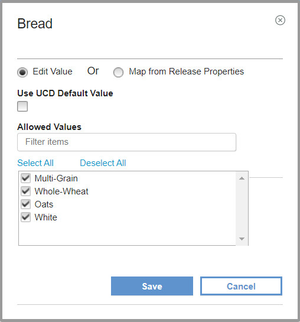

6.2.3.1

**This article was originaly published in 2020.03.25**

6.2.3.1
=======

This release of IBM UrbanCode Release is a maintenance release and includes various bug fixes and enhancements. This release is recommended for all customers.

New Features
------------

 
### Enhancements to UrbanCode Deploy automated task

Viewing process properties has been enhanced to include the value, default, and property type in a table format. There is an action column identifying the action that you can perform on the property. All properties can be edited to change the value. Properties that have been added in UrbanCode Release can be edited and deleted.

Adding properties is done using the new Add Property dialog box. When adding a property you can type in the value or map the value to a release property.

---

### 

---

### Display task tags

Task tags can now be viewed from a deployment plan details. Above the list of task details for a deployment plan, there is a **Show Tags** toggle switch to view a list of tags.

### 

---

### New Calendar format

A grid view has been added. View calendar in grid format by day, 4 days, week and month.

You can now filter by deployments, release target date, team, environment, and release.

---

### 

---

### Copy Task

The new Copy Task reduces the amount of time it takes to create tasks with the same attributes or partially the same attributes. This feature available on the Deployment Execution and Deployment Plan pages.

---

### Software upgrades

The UrbanCode Release server runs on Apache Tomcat. The integrated Apache Tomcat level has been upgraded to version 8.5.51.

The supported DB2 database has been upgraded to version 11.5.

