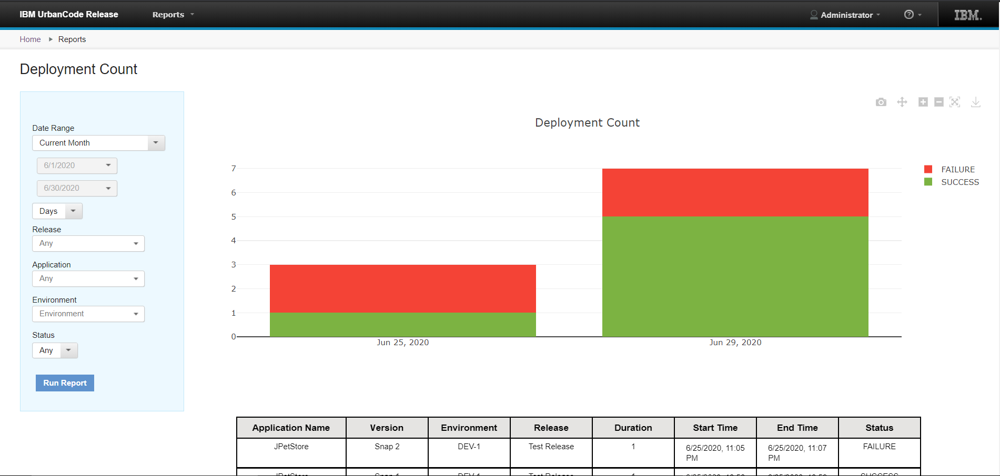

6.2.4

**This article was originaly published in 2020.06.30**

6.2.4
=====

This release of IBM UrbanCode Release is a maintenance release and includes various bug fixes and enhancements. This release is recommended for all customers.

### Sofware updates

This release of UrbanCode Release includes support for upgrading to the following:
* IBM Java 8
* Oracle 19c

**Notes:**
* Do not use the ODBC driver which comes with the Oracle 19c setup. Download the ODBC driver from the Oracle website and placed it in the `*urbancoderelease\_directory*/lib/ext` directory.
* Java 8 is supported for all operating systems except the MAC operating. For the MAC OS only IBM Java 7 is supported.

### Application filter on the Pipeline View

You can now filter applications listed on the Pipeline View page. Using the new drop-down menu, you can select to show all application, only those which have versions, or only those which have changes.

### Deployment Count Report

The Deployment Count report has been added to allow you gather information about the status of deployment successes and failures. Using the report filters you can narrow or broaden the amount of data collected by date, application, release, environment, and status. Create a Deployment Count Report from the Home page. 

### Notification scheme for related deployment

The notification scheme can now be set for a Related Deployment event type using `plugin_util.jar`.Release Summary
---------------

  
* New Deployment Count report
* Filter application list on Pipeline view
* Notification scheme for related deployment
* Support for Java 8
* Support for Oracle 19c

Release Notes
-------------

  
For information on documentation and support resources, software and hardware requirements and installation steps, click the **Getting Started** tab.

### Fixes in this Release

|  |  |
| --- | --- |
| [PH25022](http://www.ibm.com/support/docview.wss?uid=swg1PH25022) | AFTER UPGRADING URBANCODE RELEASE FROM 6.2.2.6 TO 6.2.3.1 FAILED TO START UCR SERVER WITH DATABASE ERROR  |
| [PH23736](http://www.ibm.com/support/docview.wss?uid=swg1PH23736) | AFTER EXCEEDING THE FREQUENCY-TIME UCR DEPLOYMENT IS FAILING WHILE WAITING FOR APPROVAL IN UCD |

Getting Started
---------------

  
### Install the server

This release is available for download from [Fix Central](https://www-945.ibm.com/support/fixcentral/swg/selectFixes?parent=ibm%7ERational&product=ibm/Rational/UrbanCode+Release&release=All&platform=All&function=all&source=fc) and [Passport Advantage](https://www.ibm.com/software/passportadvantage/), requiring authentication.

Information for installing the server, see the [Installing server](http://www-01.ibm.com/support/knowledgecenter/SS4GCC_6.2.4/com.ibm.urelease.doc/topics/install_ov.html) section in the product documentation.

For information on installing licenses, see [Managing Licenses](https://www.ibm.com/support/knowledgecenter/SS4GCC_6.2.4/com.ibm.urelease.doc/topics/licenseManage.html).

### Learn

To learn more about new enhancements in this release, click What’s New..

To learn more about IBM UrbanCode Release, see the [documentation](http://www-01.ibm.com/support/knowledgecenter/SS4GCC_6.2.4/com.ibm.urelease.doc/ucr_version_welcome.html).

For help installing or using IBM UrbanCode Release, post your questions in the [forums](https://developer.ibm.com/answers?community=urbancode) or contact [support](http://www-947.ibm.com/support/entry/portal/support?brandind=Rational).

To suggest an enhancement to the product, visit the [RFE Community](http://www.ibm.com/developerworks/rfe/execute?use_case=submitRfe).

### Get support

For information from support, including FAQs, visit the [IBM Support portal.](http://www-947.ibm.com/support/entry/portal/support?brandind=Rational) You can configure the support portal to view information about specific products.

