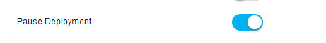

6.2.5.4

**This article was originaly published in 2021.12.15**

6.2.5.4
=======

This release of IBM UrbanCode Release is a maintenance release and includes various bug fixes and enhancements. This release is recommended for all customers.
### Apache Tomcat server upgraded

The Tomcat Server shipped with the product has been upgraded to version 8.5.69. Tomcat upgraded to resolve the following security vulnerabilities.
* CVE-2021-30639
* CVE-2021-30640
* CVE-2021-33037

### Add attachment to approval

Attachments can be added to and downloaded from an approval.

### Pause a deployment

You can pause a process and then resume it. This feature allows you to apply fixes between the pause and resume status without requesting a new process. To use this feature, requires that the new **Pause Deployment** feature flag is enabled.

### Security enhancements

Upgraded to resolve security vulnerabilities related Whitesouce.Release Summary
---------------

  
* Pause a running deployment
* Add attachment to approval
* Upgrade Tomcat version
* Security enhancement

Release Notes
-------------

  
### Fixes in this Release

The following APARs are included in this release.

|  |  |
| --- | --- |
| [PH39559](http://www.ibm.com/support/docview.wss?uid=swg1PH39559) | When a new deployment is created by selecting a specific Release Version value different from 'None' then the 'Deployment Execution' tab shows all tasks as 'Not Applicable |
| [PH35893](http://www.ibm.com/support/docview.wss?uid=swg1PH35893) | UrbanCode Deploy version 7.1 does not respond to HTTP PUT method for deploy applications |
| [PH37750](http://www.ibm.com/support/docview.wss?uid=swg1PH37750) | Login fails when login is done from a browser without internet access. |
| [PH32842](http://www.ibm.com/support/docview.wss?uid=swg1PH32842) | Clash occurs when performing synchronization from Ansible or Nolio. |
| [PH36113](http://www.ibm.com/support/docview.wss?uid=swg1PH36113) | Fixed issue in UrbanCode Release 6.2.5 allowing world-writable files to be created in /var/temp directory |

 
### Known problems and workarounds

To search for additional post-release issues that IBM Rational Support documented, visit the [IBM Support portal.](https://www-947.ibm.com/support/entry/myportal/support?brandind=Rational)Getting Started
---------------

  
### Install the server

This release is available for download from [Fix Central](https://www-945.ibm.com/support/fixcentral/swg/selectFixes?parent=ibm%7ERational&product=ibm/Rational/UrbanCode+Release&release=All&platform=All&function=all&source=fc) and [Passport Advantage](https://www.ibm.com/software/passportadvantage/), requiring authentication.

Information for installing the server, see the [Installing server](http://www-01.ibm.com/support/knowledgecenter/SS4GCC_6.2.5/com.ibm.urelease.doc/topics/install_ov.html) section in the product documentation.

For information on installing licenses, see [Managing Licenses](https://www.ibm.com/support/knowledgecenter/SS4GCC_6.2.5/com.ibm.urelease.doc/topics/licenseManage.html).
### Learn

To learn more about new enhancements in this release, click What’s New.

To learn more about IBM UrbanCode Release, see the [documentation](http://www-01.ibm.com/support/knowledgecenter/SS4GCC_6.2.5/com.ibm.urelease.doc/ucr_version_welcome.html).

For help installing or using IBM UrbanCode Release, post your questions in the [forums](https://developer.ibm.com/answers?community=urbancode) or contact [support](http://www-947.ibm.com/support/entry/portal/support?brandind=Rational).

To suggest an enhancement to the product, visit the [RFE Community](http://www.ibm.com/developerworks/rfe/execute?use_case=submitRfe).
### Get support

For information from support, including FAQs, visit the [IBM Support portal.](https://www.ibm.com/support/home) You can configure the support portal to view information about specific products.

