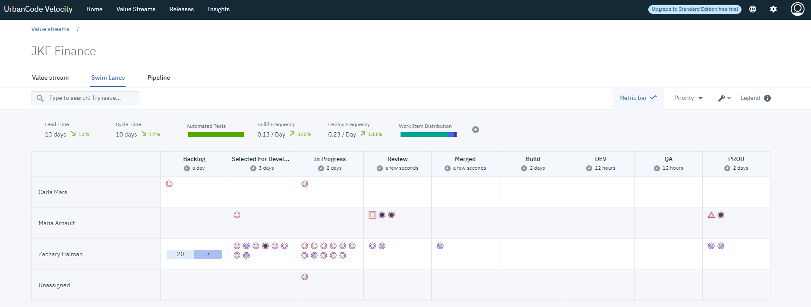

1.5.2

**This article was originaly published in 2020.04.13**

1.5.2
=====

The following enhancements are included in each release. In addition to various bug fixes.
**Key Features in 1.5.2**
-------------------------

 
Bug Fixes
---------

* Fixes a v1.5.1 specific issue where usernames with uppercase lettering that were upgraded from a prior installation would be prevented from accessing deployment plans and reports.

 

---

**Key Features in 1.5.1**
-------------------------

 
### New Deployment Plan Task can "Run a Shell Script"

A new “Shell” plugin brings the powerful flexibility of containerized shell execution as part of deployment plans. Simply add the plugin and integration to Velocity and you will be able to configure deployment plan templates with a new type of task to “Run a Shell Script”.

### Deployment Plan Task Support for UrbanCode Deploy Properties

Velocity can now pass properties to UrbanCode Deploy (UCD) tasks as part of a deployment plan. Property values can be set from Velocity as name-value pairs in the “UCD Properties” text box when creating or editing a task.

### New Value Stream Dot Hover-Over

Dots now display hover-over details making value streams more interactive and data rich. Hover-over is available in all “Dot” views: value stream stage view and value stream swim lanes view.
### Added Sprint and Release Details and Sprint Coloring

Dots now have sprint and release fields displayed in the details panel. Both are also available as view coloring schemes.
### Jenkins Templates are Hidden

The UI has been improved for Jenkins Jobs by hiding CloudBees Jenkins templates which cannot be run on their own.
### Other UI improvements

Other UI improvements include the pipeline deployment version selector and improved spacing for stage names.
Bug Fixes
---------

* Fixed issue where template deployment plans might not be visible to an authorized user.
* Fixed issue where multi-select process did not work for combined apps.
* Fixed issue for dots with long histories.
* Fixed age in stage value for dot overview.
* Fixed an issue to support "latest" as a plugin image tag.

 

---

**Key Features in 1.5.0**
-------------------------

 
### New Value Stream Swim Lanes view

A Value Stream Swim Lanes view is now available for all value streams. The new view reorganizes your original value steam based on assigned user. You can use this view to identify who owns certain work items and how far along these items are in the value steam. The DQL querying is available if you are looking for something specific.

### New Pipeline Executor role

The new Pipeline Executor role allow teams to give developers the ability to push builds through the pipeline, but not modify them. Proper use of this role ensures good division of duties and conformity to each deployment.
### Integration logs

Improvements to integration logs have been made to improve troubleshooting. Now, the last ten integration executions are saved in a log and each can be viewed. The **Logs Modal** dialog has been redesigned to better accommodate the additional information.

### Insights dashboard improvements to the Deployment Count chart

Several improvements have been made to the Deployment Count chart.
* If a links is available for a Deployment Count chart, it links to additional details.
* The chart can be filtered by **User**.
* The **Group By** drop down list now expands to display the selected option.

Bug Fixes
---------

### Problem: Unable to disable SMTP configuration setting

There is now a **Delete** button to remove a SMTP configuration. Prior to this fix, the SMTP configuration could not be unset or deleted.

