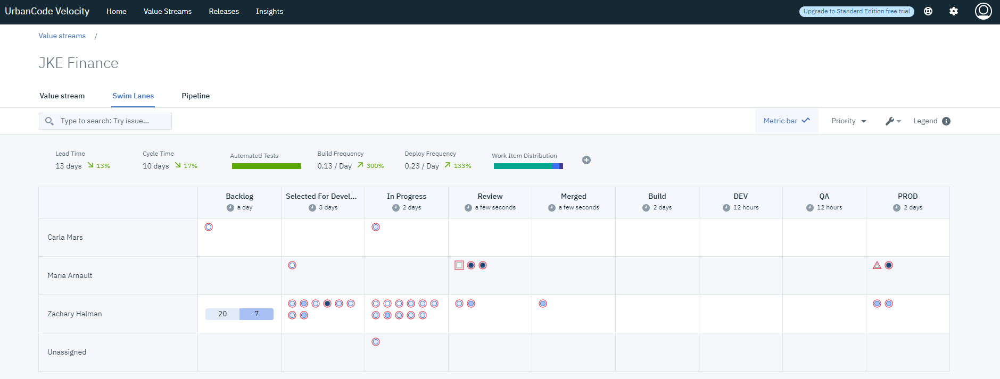

1.5.3

**This article was originaly published in 2020.04.21**

1.5.3
=====

This page provides a summary of enhancements and bug fixes for 1.5.3 and prior 1.5.x releases. To get started with new features checkout out [Velocity resources](https://www.urbancode.com/resources/?search=&product_filter%5B%5D=811).

 
**Key Features in 1.5.3**
-------------------------

 
### Improved LDAP Settings Page

Added ability to import LDAP user groups by entering a username string from the LDAP settings page. The username string can include wildcards.
### Improved Add/Edit Integration Forms

Advanced “hidden” fields can now be toggled from create/edit integration forms. This simplifies form usage while improving configuration.
### Improved UCD Application Naming

UCD application names have better context by having their associated integration names appended.
Bug Fixes
---------

* Fixed partial value stream display when using FireFox and Safari browsers.
* Improved integration forms: always synchronize form fields with plugin version and fixed possible checkbox bug when creating more than one integration.
* Reduced value stream dot (work item) alert noise.
* Improved consistency of value stream navigation from value stream “card” view.
* Fixed the UrbanCode Deploy Status task to correctly identify and ignore all snapshot components that do not specify at least one component version. UrbanCode Deploy statuses can only be applied to components with versions.

 

---

**Key Features in 1.5.2**
-------------------------

 
Bug Fixes
---------

* Fixes a v1.5.1 specific issue where usernames with uppercase lettering that were upgraded from a prior installation would be prevented from accessing deployment plans and reports.

 

---

**Key Features in 1.5.1**
-------------------------

 
### New Deployment Plan Task can "Run a Shell Script"

A new “Shell” plugin brings the powerful flexibility of containerized shell execution as part of deployment plans. Simply add the plugin and integration to Velocity and you will be able to configure deployment plan templates with a new type of task to “Run a Shell Script”.

### Deployment Plan Task Support for UrbanCode Deploy Properties

Velocity can now pass properties to UrbanCode Deploy (UCD) tasks as part of a deployment plan. Property values can be set from Velocity as name-value pairs in the “UCD Properties” text box when creating or editing a task.

### New Value Stream Dot Hover-Over

Dots now display hover-over details making value streams more interactive and data rich. Hover-over is available in all “Dot” views: value stream stage view and value stream swim lanes view.
### Added Sprint and Release Details and Sprint Coloring

Dots now have sprint and release fields displayed in the details panel. Both are also available as view coloring schemes.
### Jenkins Templates are Hidden

The UI has been improved for Jenkins Jobs by hiding CloudBees Jenkins templates which cannot be run on their own.
### Other UI improvements

Other UI improvements include the pipeline deployment version selector and improved spacing for stage names.
Bug Fixes
---------

* Fixed issue where template deployment plans might not be visible to an authorized user.
* Fixed issue where multi-select process did not work for combined apps.
* Fixed issue for dots with long histories.
* Fixed age in stage value for dot overview.
* Fixed an issue to support "latest" as a plugin image tag.

 

---

**Key Features in 1.5.0**
-------------------------

 
### New Value Stream Swim Lanes view

A Value Stream Swim Lanes view is now available for all value streams. The new view reorganizes your original value steam based on assigned user. You can use this view to identify who owns certain work items and how far along these items are in the value steam. The DQL querying is available if you are looking for something specific.

### New Pipeline Executor role

The new Pipeline Executor role allow teams to give developers the ability to push builds through the pipeline, but not modify them. Proper use of this role ensures good division of duties and conformity to each deployment.
### Integration logs

Improvements to integration logs have been made to improve troubleshooting. Now, the last ten integration executions are saved in a log and each can be viewed. The **Logs Modal** dialog has been redesigned to better accommodate the additional information.

### Insights dashboard improvements to the Deployment Count chart

Several improvements have been made to the Deployment Count chart.
* If a links is available for a Deployment Count chart, it links to additional details.
* The chart can be filtered by **User**.
* The **Group By** drop down list now expands to display the selected option.

Bug Fixes
---------

### Problem: Unable to disable SMTP configuration setting

There is now a **Delete** button to remove a SMTP configuration. Prior to this fix, the SMTP configuration could not be unset or deleted.Release Summary
---------------

  
* Improved LDAP user group import
* Improved integration creation/edit forms.
* Added integration names to UCD applications
* Fixed partial value stream display when using FireFox and Safari browsers.
* Fixed the UrbanCode Deploy Status task to correctly identify and ignore all snapshot components that do not specify at least one component version
* Other small bug fixes and improvements...

Release Notes
-------------

  
NoneGetting Started
---------------

  
Known Problems
--------------

* **Significant Velocity Related Performance Issues for UrbanCode Deploy prior to v7.0.5.1**
APAR PI99803 identified a significant UrbanCode Deploy performance issue due to the Velocity UrbanCode Deploy Integration creating a large number of login requests when gathering deployment information. This issue is resolved with UrbanCode Deploy v7.0.5.1. If you are using UrbanCode Deploy v7.0.0.0 or greater, contact the L2 support team to obtain a performance related patch.
* **Velocity 1.5.1 Upgrade could Prevent Access to Deployment Plans and Reports (Fixed with v1.5.2)**
APAR PI99806 only affects upgrades to Velocity 1.5.1, where usernames containing uppercase  lettering can loose access to deployment plans and reports (fully lowercase names/emails are unaffected). If you have users affected by this, contact support for an immediate work around. This issue is fixed with version 1.5.2 and later (upgrading will resolve the issue).

Plan & Prepare
--------------

For supported platforms and requirements you can dynamically generate a system requirements report using the [Software Product Compatibility Reports (SPCR)](https://www.ibm.com/software/reports/compatibility/clarity/index.html) tool.
Install the server
------------------

There are two option to obtaining the installation package: online installer and offline installer. Both options will require a master license key, which can be acquired from:
* [IBM Passport Advantage](https://www.ibm.com/software/passportadvantage/) - Use this option if you have purchased IBM UrbanCode Velocity.
* [Trial Installation](https://www.uc-velocity.com/) - Use this option if you would like to try IBM UrbanCode Velocity.

Online installer
----------------

The online installer option for installing the product requires an internet connection for the entire process. It requires minimum storage for the downloaded package. The downloaded image contains only the Helm charts used to pull the product Docker images from a GitHub location. This is our recommended installation method.

Download the online installer package depending on the platform, the product is being installed.
* [Linux](https://www.urbancode.com/uc-downloads/Velocity/latest/velocity-ibm-install-latest-linux)
* [Mac OS](https://www.urbancode.com/uc-downloads/Velocity/latest/velocity-ibm-install-latest-macos)
* [Windows](https://www.urbancode.com/uc-downloads/Velocity/latest/velocity-ibm-install-latest-win.exe)

After the download completes, start the executable file to begin the install process.
Offline installer
-----------------

Use the offline installer to install Velocity without internet connection. You will still need internet connection at some point to download the installer itself. Once downloaded, the installer will include all containers needed to successfully install the product. For this reason, the offline installer is larger than the online installer and will require more time/bandwidth and disk space when downloading.

The installation package is available from [IBM FixCentral](https://www-945.ibm.com/support/fixcentral/swg/selectFixes?parent=ibm%7ERational&product=ibm/Rational/IBM+UrbanCode+Velocity&release=All&platform=All&function=all). Search and select the installation package appropriate for the installation platform.

After downloading the installation package, decompress the contents into two directories: one for Kubernetes and the other for Docker Compose. See the [documentation section on installation](https://www.ibm.com/support/knowledgecenter/SSCKX6_1.5.x/com.ibm.uvelocity.doc/topics/c_install_se_roadmap.html) for instructions about how to install the server.

A product license key is required to install the product. To obtain a key, you must agree to the terms and conditions provided on Passport Advantage.
Learn
-----

To learn more about UrbanCode Velocity, see [documentation](http://www-01.ibm.com/support/knowledgecenter/SSCKX6_1.5.x).

For help installing or using UrbanCode Velocity, post your questions in the [UrbanCode forums](https://developer.ibm.com/answers/topics/velocity.html). Tag your question with **velocity**.

To suggest an enhancement to the product, visit the [RFE Community](http://www.ibm.com/developerworks/rfe/execute?use_case=submitRfe)
Get support
-----------

For information from support, including FAQs, visit the [IBM Support portal.](https://www.ibm.com/support/home) You can configure the support portal to view information about specific products.

