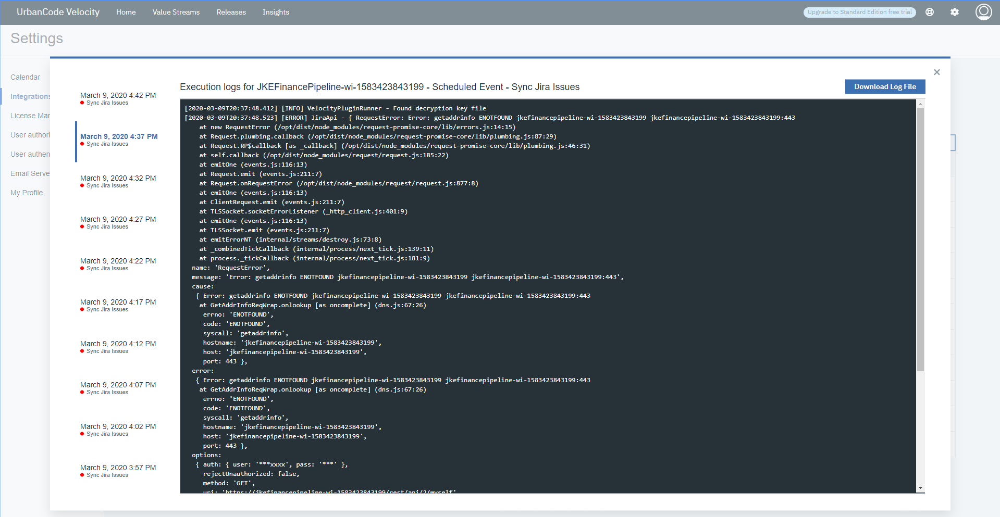

1.5.5

**This article was originaly published in 2020.05.26**

1.5.5
=====

This page provides a summary of enhancements and bug fixes for 1.5.5 and prior 1.5.x releases. To get started with new features checkout out [Velocity resources](https://www.urbancode.com/resources/?search=&product_filter%5B%5D=811).
**Key Features/Enhancements in 1.5.5**
--------------------------------------

### Dynamic Plugin List

It is now easier than ever to get real value out of Velocity's up and coming plugins. The plugin list now dynamically updates to show new plugins the moment they become available. Simply click "Install" to get started. In addition to showing newly available plugins, the list also includes plugins that do not require integration setup/configuration. For example, you now have full visibility into metrics plugins that do not require configuration.
### Multiple UCD Integrations for the Same Pipeline Application

Velocity now fully supports two or more UCD integrations for the same application in a deployment pipeline (same application name, same pipeline row). Pipelines still require unique naming between rows/applications.

Bug Fixes
---------

* Fixed issue where Jenkins data might not update after removing/recreating the Velocity rabbit container.
* Fixed issue with deployment plan duration. After tasks are executed in a plan the actual duration (actual end - actual start) in minutes should be displayed for audit purposes.

**Key Features/Enhancements in 1.5.4**
--------------------------------------

### Easier Scheduling of Release Start Time

Deployment schedulers can now specify start time when joining a release. Previously this required release managers to update the start time after creation. The scheduled deployment time is now defaulted to release start time.
### Snapshots now show Individual Component Versions

Snapshots now show individual component versions from the deployment plan “Version Tab”.
### Pipeline Environments no longer Require Deployment to Leading Environments

A new checkbox has been added to pipeline deployments to allow deployment of any available version. The default list of versions remains the same as before, that is, it only includes versions that have already been deployed to environments left of the target environment. The new checkbox allows this restriction to be circumvented by selecting any version if needed.
### Easier Velocity Trial Extension

Velocity extended trial keys can now be entered from the UI, under settings --> license management. It is still necessary to contact support to obtain a new trial key before extending.
Bug Fixes
---------

* Fixed ability to change log level for several services
* Fixed Jenkins job execution drilldown status to fully complete if the task is manually marked as completed.
* Fixed issue that complicated pipeline deletion if deleted integrations were included in the vsm.
* When a user goes to replace a vsm.json file, the upload form includes a warning to backup the previous vsm.json file. Velocity 1.5.4 fixes a link to download the existing vsm.json file in this warning message.

 
**Key Features****/Enhancements** **in 1.5.3**
----------------------------------------------

 
### Improved LDAP Settings Page

Added ability to import LDAP user groups by entering a username string from the LDAP settings page. The username string can include wildcards.
### Improved Add/Edit Integration Forms

Advanced “hidden” fields can now be toggled from create/edit integration forms. This simplifies form usage while improving configuration.
### Improved UCD Application Naming

UCD application names have better context by having their associated integration names appended.
Bug Fixes
---------

* Fixed partial value stream display when using FireFox and Safari browsers.
* Improved integration forms: always synchronize form fields with plugin version and fixed possible checkbox bug when creating more than one integration.
* Reduced value stream dot (work item) alert noise.
* Improved consistency of value stream navigation from value stream “card” view.
* Fixed the UrbanCode Deploy Status task to correctly identify and ignore all snapshot components that do not specify at least one component version. UrbanCode Deploy statuses can only be applied to components with versions.

 

---

**Key** **Features****/Enhancements** **in 1.5.2**
--------------------------------------------------

 
Bug Fixes
---------

* Fixes a v1.5.1 specific issue where usernames with uppercase lettering that were upgraded from a prior installation would be prevented from accessing deployment plans and reports.

 

---

**Key** **Features****/Enhancements** **in** **1.5.1**
------------------------------------------------------

 
### New Deployment Plan Task can "Run a Shell Script"

A new “Shell” plugin brings the powerful flexibility of containerized shell execution as part of deployment plans. Simply add the plugin and integration to Velocity and you will be able to configure deployment plan templates with a new type of task to “Run a Shell Script”.

### Deployment Plan Task Support for UrbanCode Deploy Properties

Velocity can now pass properties to UrbanCode Deploy (UCD) tasks as part of a deployment plan. Property values can be set from Velocity as name-value pairs in the “UCD Properties” text box when creating or editing a task.

### New Value Stream Dot Hover-Over

Dots now display hover-over details making value streams more interactive and data rich. Hover-over is available in all “Dot” views: value stream stage view and value stream swim lanes view.
### Added Sprint and Release Details and Sprint Coloring

Dots now have sprint and release fields displayed in the details panel. Both are also available as view coloring schemes.
### Jenkins Templates are Hidden

The UI has been improved for Jenkins Jobs by hiding CloudBees Jenkins templates which cannot be run on their own.
### Other UI improvements

Other UI improvements include the pipeline deployment version selector and improved spacing for stage names.
Bug Fixes
---------

* Fixed issue where template deployment plans might not be visible to an authorized user.
* Fixed issue where multi-select process did not work for combined apps.
* Fixed issue for dots with long histories.
* Fixed age in stage value for dot overview.
* Fixed an issue to support "latest" as a plugin image tag.

 

---

**Key** **Features****/Enhancements** **in** **1.5.0**
------------------------------------------------------

 
### New Value Stream Swim Lanes view

A Value Stream Swim Lanes view is now available for all value streams. The new view reorganizes your original value steam based on assigned user. You can use this view to identify who owns certain work items and how far along these items are in the value steam. The DQL querying is available if you are looking for something specific.

### New Pipeline Executor role

The new Pipeline Executor role allow teams to give developers the ability to push builds through the pipeline, but not modify them. Proper use of this role ensures good division of duties and conformity to each deployment.
### Integration logs

Improvements to integration logs have been made to improve troubleshooting. Now, the last ten integration executions are saved in a log and each can be viewed. The **Logs Modal** dialog has been redesigned to better accommodate the additional information.

### Insights dashboard improvements to the Deployment Count chart

Several improvements have been made to the Deployment Count chart.
* If a links is available for a Deployment Count chart, it links to additional details.
* The chart can be filtered by **User**.
* The **Group By** drop down list now expands to display the selected option.

Bug Fixes
---------

### Problem: Unable to disable SMTP configuration setting

There is now a **Delete** button to remove a SMTP configuration. Prior to this fix, the SMTP configuration could not be unset or deleted.

